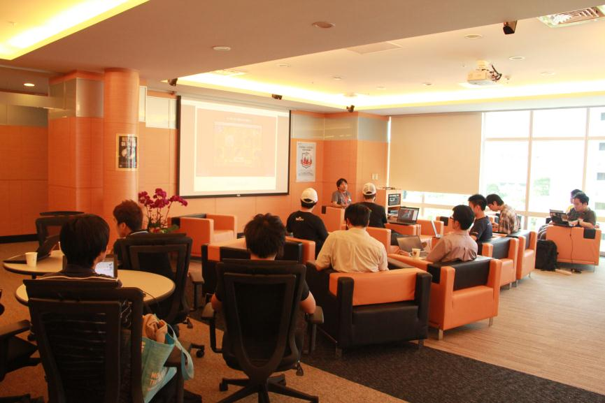
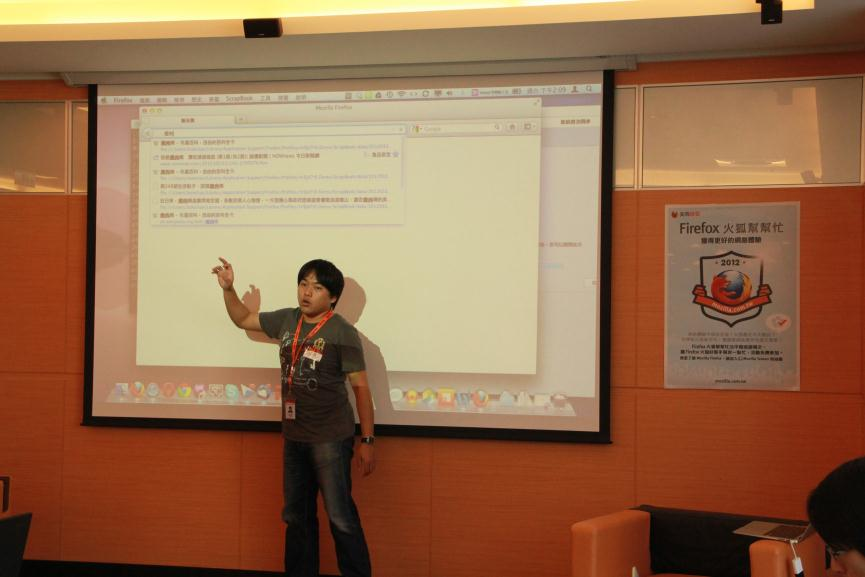
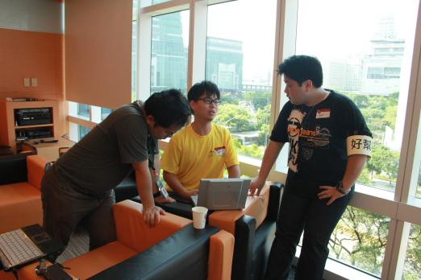

活動時間：2012年5月5日 下午1:00-3:30

活動地點：Mozilla Space

網路體驗不順很苦惱？火狐最近不太聽話？想學點火狐新技巧，讓遨遊網路變得有趣又簡單？5月5日的下午 Mozilla 的辦公室，號召了一批熱血的「火狐好幫手」，提供現場15位 Firefox 使用者最直接、最貼近的立即協助，同場加映 Firefox 新功能與小技巧，協助您了解得更多、用得更開心！想參加但這次沒跟到的朋友，Firefox 與你台中、高雄相約不見不散，詳情請密切注意咱們的動態！

下午1點報到處，參加者陸陸續續抵達～

待大家坐定位，活動即將開始～

首先由 Mozilla Taiwan 的社群經理趙柏強 Bob 和大家介紹新版本的新功能！

接下來由 MozTW 的現任聯絡人Irvin 向大家介紹神秘快速整理分頁好工具

想找幫手請認「好幫手」

所有使用 Firefox 遇到安裝、附加元件、網頁相容、外掛程式等等的疑難雜症，快找「好幫手」來解答！

大家就在輕鬆愉快的氣氛中度過一個快樂的下午，快讓「火狐幫幫忙」為你踢走煩惱，提昇網路體驗！想參加的朋友們，大聲預告下回「台中場」即將出動，詳情可透過[Mozilla Taiwan 訊息中心](https://blog.mozilla.com.tw/)、[FB 粉絲頁](https://fb.me/MozillaTaiwan)和[G+ 專頁](https://plus.google.com/u/0/114653167240123163859/posts)搶先得知，大力歡迎大家加入並關注訊息呦！
