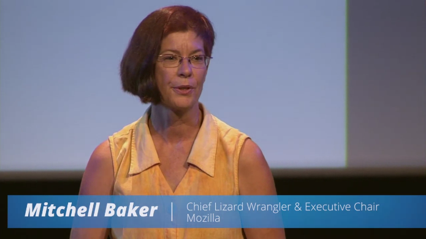

全球性非營利組織 Mozilla 致力於 Web 的美好未來，打造可知、可共同協作、可開放給所有人的網際網路。「可知」代表透明且易於觀察，讓眾人能夠徹底掌握的網路；「可共同協作」代表眾人可擁有更多機會嘗試新的事物；「開放」代表眾人均能擁有的公用資源。從經濟、社會、公共，乃至於個體，Mozilla 將全方位提升大家的日常生活，並能做得更好。

Mozilla 所說的「開放」涉及所有面相，並期待能延伸到網路生活的所有概念。在組織與運作 Mozilla 的同時，也持續遵循著開放的理念。Mozilla 本身就是非營利組織，一直將相關要素擺在第一位。我們將 Web 視為完整的個體，使其能完全由使用者所掌控，強調其開放性卻仍保持應有的責任與信譽，並滿足個人的選擇與自主性。

我們打造產品，如 Firefox 與 Firefox OS，以體現 Mozilla 的核心價值與日常的線上生活。我們協助全球社群成長茁壯，讓所有認同 Mozilla 使命的個人，都能具備相關知識、經驗、公信力，進而與我們一同推動目標前進。我們透過讓志工參與核心產品的開發來強化參與，並鼓勵貢獻者開發出自己的專案。藉由產品開發與無償的教學計畫 (如 Webmaker)，我們傳授已知並學習未知。從網路的消費者體驗到學習環境甚至於公共政策，Mozilla 的終極目標是要塑造出最佳的環境。

Mozilla 的願景與決心在於打造可知、可共同協作、開放給眾人的網際網路，並將核心使命納入基金會運作與決策的基礎，讓 Web 朝著創造與消費的平台演進。不久前我們發佈的 2012 年財務報表，引起了少數對 Mozilla 財務狀況的評論，這也是可想而知的。財務是重要的一環，它支持我們在所需的範圍內能夠運作、持續推動並貢獻給 Web 與眾多網路用戶。然而 Mozilla 一直認為原則比利潤更為重要，Mozilla 的股東就是 Mozilla 的全球社群。不論你是我們產品的使用者，甚或是關心網路開放性與健全度的任何人，都屬於 Mozilla 的股東。這些股東投資所獲得的重要回報，就是讓 Web 朝著可知、可共同協作、開放給眾人的網路生活不斷邁進。

– Mozilla 基金會主席 Mitchell Baker

原文連結：[State of Mozilla and 2012 Financial Statements](https://blog.lizardwrangler.com/2013/11/26/state-of-mozilla-and-2012-financial-statements/)
