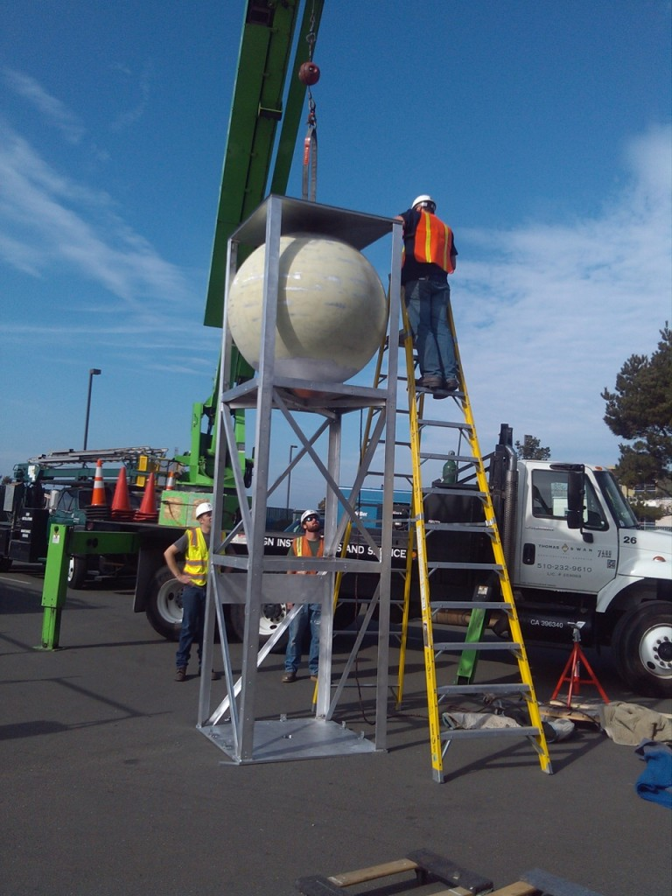
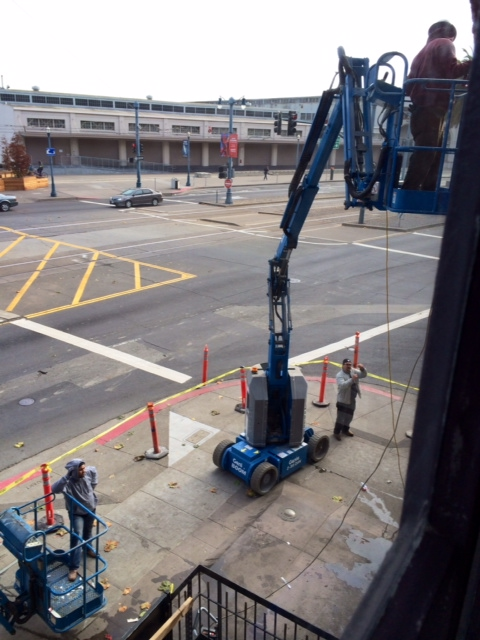
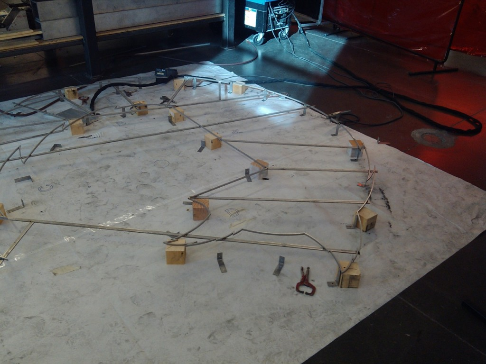
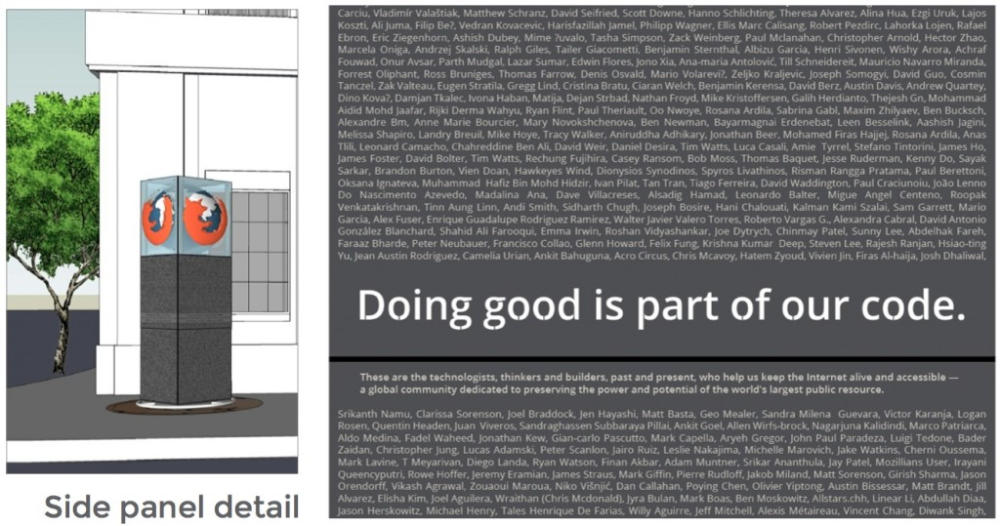
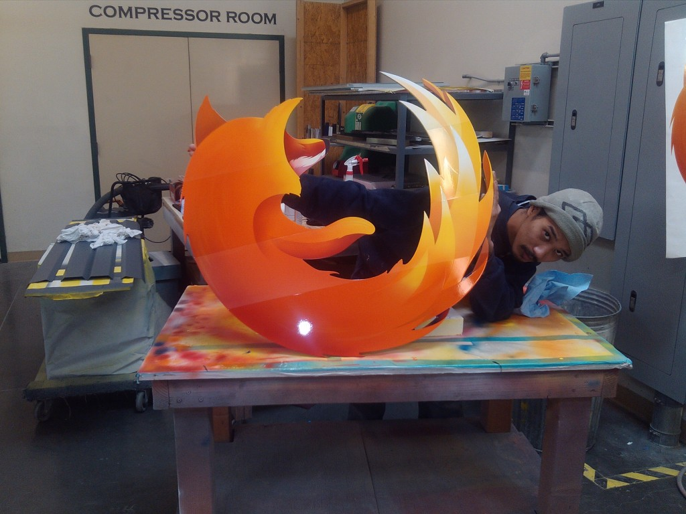

不久前我們才分享了[將座落於 Mozilla 舊金山辦公室之外的 Mozillians 榮譽碑](https://blog.mozilla.com.tw/posts/4016/add-your-name-to-the-monument-to-mozillians-in-san-francisco)，現在要跟大家更新一下進度。目前正在打造整個紀念碑的主結構、混凝土地基已經完成，並預計於十二月中旬正式對外展示榮譽碑。碑體側邊將列上共 4,512 名 Mozilla 貢獻者的姓名。

我們在過去幾個星期裡完成了許多工作，像是拆除了之前的大麥儲槽、榮譽碑的柱狀結構已經大致底定、榮譽碑側邊面板也製造並上色完畢。接著就要刻上大家的姓名、為 Firefox 圖標噴上標準配色，最後再用混凝土固定在基座上。

註：位於建築物外側的大麥儲槽，是原先位於此地的 Gordon Beirsch (GB 鮮釀) 餐廳為了現釀啤酒所搭建。[照片可參閱此文章](https://www.sfcitysbest.com/2012/04/25/gordon-biersch-to-close-this-weekend/) (文中並提及台灣喔)。

接著提供最近工作時的幾張相片：

榮譽碑主結構的框架。

拆掉之前餐廳搭建的大麥儲槽，才有空間來安裝榮譽碑。

榮譽碑頂端的 Firefox 圖標框架。

榮譽碑與側邊刻寫姓名面板的概念圖。

正在噴漆上色的 Firefox 標誌。

我們很高興就快看到榮譽碑成為 Mozilla 舊金山辦公室的一部分。下個月完成之後，我們會儘快分享相片與幕後花絮。當然，Mozilla 舊金山辦公室也將於明年一月舉辦小小的完工慶祝酒會。我們會持續為大家追蹤新進度，敬請期待。

原文連結：[The monument to Mozillians is coming to San Francisco](https://blog.mozilla.org/community/2013/11/26/the-monument-to-mozillians-is-coming-to-san-francisco/)
