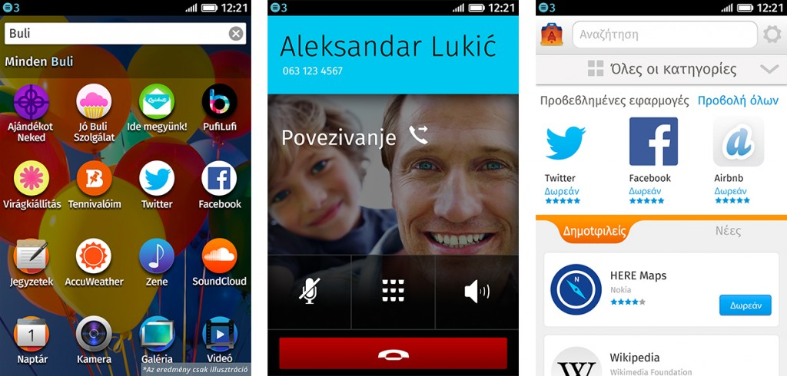

【美商謀智訊息稿】Mozilla 是全球性的非營利組織，以推動網路的平等、自由、開放為宗旨。而其合作夥伴 Deutsche Telekom 透過德國境內的第二品牌 Congstar 電信公司，在今年十月[發表第二波 Firefox OS 裝置](https://blog.mozilla.com.tw/posts/3925/)。而隨著[南美洲的銷售活動](https://blog.mozilla.com.tw/posts/4103/)同樣於十月開跑之後，Firefox OS 智慧型手機最近又將於更多歐洲市場中現身。

過去幾個星期內，Deutsche Telekom 已透過 [Telekom](https://www.telekom.hu/press_room/press_releases/2013/november_05) 與 [COSMOTE](https://www.cosmote.gr/cosmoportal/page/T37b/xml/Company__pressrelease__cosmote-Alcatel-one-touch-firefox/section/Pressrelease_OtherNews/loc/en_US) 電信商 (其分別位於匈牙利與希臘的子公司) 銷售 Firefox OS 智慧型手機。而今年稍早之前，Deutsche Telekom 亦經由[波蘭境內的 T-Mobile 電信商](https://blog.mozilla.com.tw/posts/3092)發售手機。

挪威 Telenor 電信營運商也同樣積極支援 Firefox OS。[從上個禮拜於匈牙利發售首款 Firefox OS 裝置之後，亦從今天起在塞爾維亞 (Serbia) 和蒙特內哥羅 (Montenegro) 境內銷售](https://www.telenor.com/media/press-releases/2013/telenor-launches-mobile-phones-on-firefox-os-in-serbia/)。Telenor 另宣佈將在 2014 年進一步於亞洲推出 Firefox OS 智慧型手機。

Firefox OS 目前已現身於十三個國家，且後續將有更多市場加入。

Firefox OS 在匈牙利 (左邊的自訂性 App 搜尋功能)；塞爾維亞 (中間的電話功能)；希臘 (右邊的 Firefox Marketplace)

Mozilla 正與全球的開發者、硬體製造商、電信營運商合作，要透過 Firefox OS 為消費者與行動產業提供更多選擇。Firefox OS 智慧型手機是首款完全以 Web 技術打造的裝置，帶給你美觀、簡潔、直覺、簡單易用的絕妙體驗，並同時兼顧效能、價格、個人化等所有考量。

若需更多資訊：

- [Firefox Marketplace 展現 Web 的力量，跨平台提供全球性與地方特色 App](https://blog.mozilla.com.tw/posts/4257/)

- [Firefox OS 首頁](https://www.mozilla.com.tw/firefox/os/)

- [塞爾維亞 Firefox OS 新聞中心](https://blog.mozilla.org/press/firefox-os-brosura-za-stampu/)

- [匈牙利 Firefox OS 新聞中心](https://blog.mozilla.org/press/firefox-os-magyar-sajtocsomag/)

- [希臘 Firefox OS 新聞中心](https://blog.mozilla.org/press/greek-press-kit-firefox-os/)

原文連結：[Firefox OS Launches in More Countries Across Europe](https://blog.mozilla.org/blog/2013/11/28/firefox-os-launches-in-more-countries-across-europe/)
