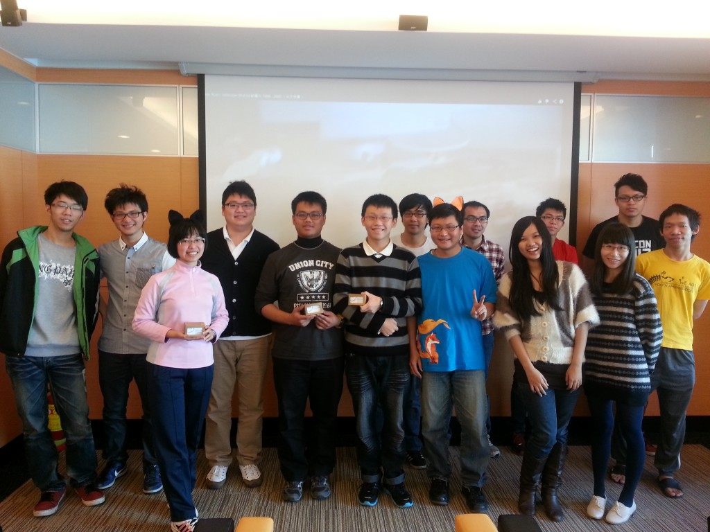

十一月的狐狐工作坊分享會囊括了生活、科技與財經領域，內容精彩有趣，台上大使賣力地分享，台下聽眾也用心地傾聽。

首先出場的大使為大家介紹「雲端資料整理術」。市面上這麼多的雲端服務，哪一家好用? 各有什麼特色? 資料該怎麼整理? 由大使一一為大家圖文解說。接下來則是「Energy micro 的應用與發展」，這個充斥在我們日常生活中的技術，我們可以如何運用它、未來又有多大的發展，透過大使的講解讓大家都有了進一步的認識與了解。聽完了科技，來點輕鬆的。「Postcrossing」教你如何透過寄明信片和世界做朋友！如何開始，可以怎麼做，大使透過分享自身經驗為大家開啟一扇走向世界的門。最後，身為校園大使，對於 Mozilla 的財務狀況也該清楚一二，「火狐財報知多少」以深入淺出的說明與生動的簡報，帶大家一步一步看懂 Mozilla 的財務報表，了解基金會的財務結構與狀況。

十一月的分享會就在歡樂的有獎徵答中順利落幕，十二月的狐狐工作坊將由校園大使展示 Firefox OS APP 校園創意競賽的活動成果，敬請期待！

充滿趣味與知性的分享會，大使們戴著分享會上有獎徵答獲得的獎品「火狐耳朵」一同入鏡。

「狐狐工作坊」由 Mozilla Taiwan 規劃，每月推出各式不同主題，內容涵蓋行銷推廣、演講技巧、程式開發、網頁製作、活動執行…. 等，教學與互動相長，提供給歷屆曾任 Firefox 校園大使的學生參與，也歡迎青年學子一同加入，在互動中與我們一同成長。
