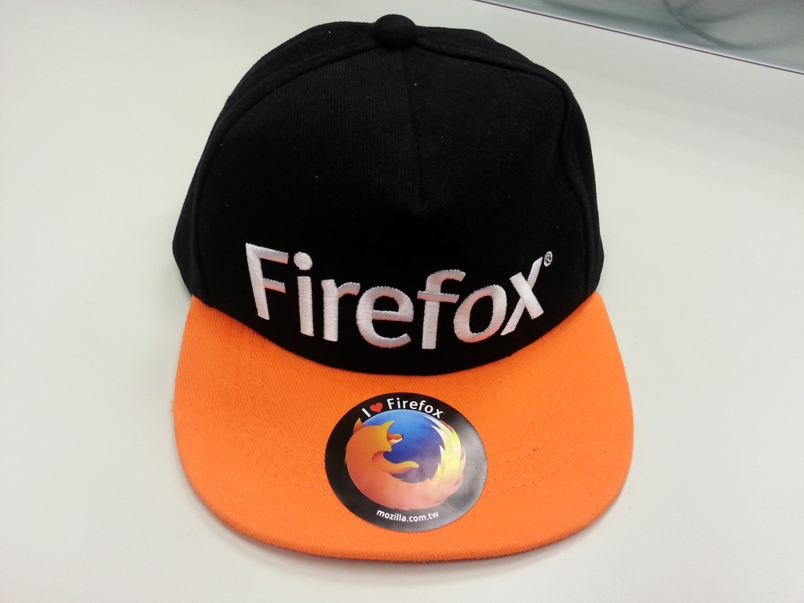

感謝大家熱情參與「11 月電子報有獎徵答」活動，共有 3 位幸運的得獎者，可以獲得 Firefox 限量潮帽一頂！

本期電子報有獎徵答題目：

Firefox 介面長期以來最重大的更新，其專案名稱為?

A. Australis

B. Click to Play

C. Lightbeam for Firefox

正確答案為 A. Australis

恭喜以下 3 位幸運的得獎者，再次謝謝您對 Firefox 的支持！

liuchw***u@outlook.com

bary***e@gmail.com

dcat***6@gmail.com

主辦單位會在本週透過 Email 和您聯繫，並請在 12/22 (日) 前回覆您的真實姓名、地址和 Email 資訊，若沒有收到主辦單位的通知，請寫信至 tw-mktg@mozilla.com 主動聯繫，獎品會在 12/23 當週統一寄出，恭喜所有得獎的狐友們！

