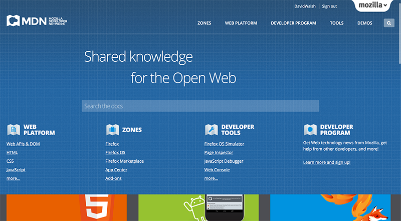
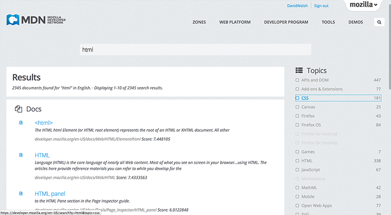
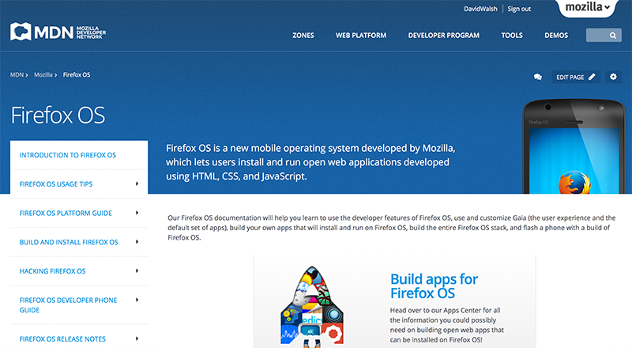
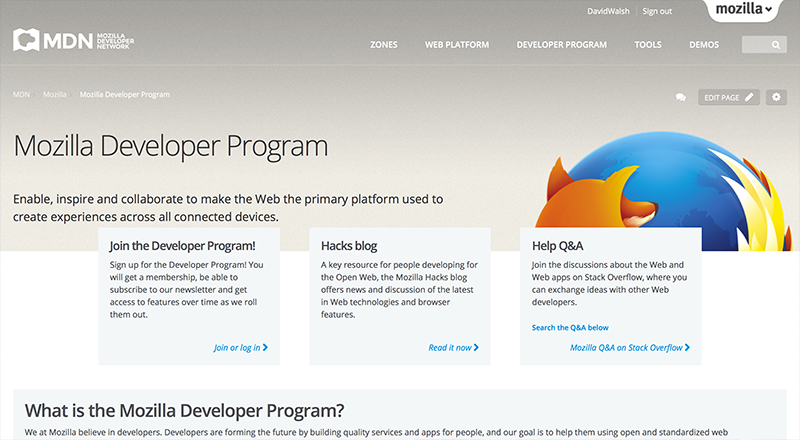
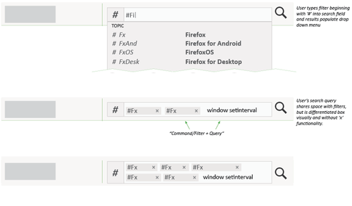
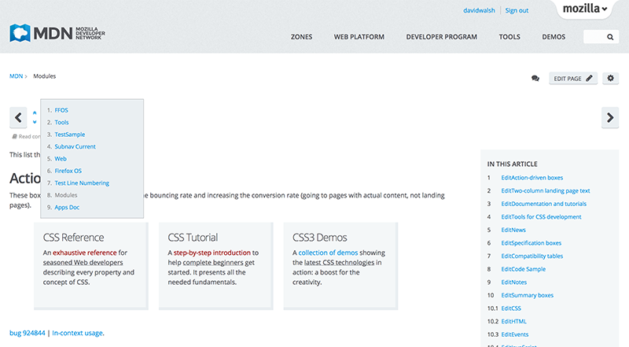

早在去年夏天，Mozilla 開發者社群網站 (Developer Network，MDN) 平台就開始醞釀大幅改版，目的在將托管於第三方的解決方案，轉移到我們自訂的 Django 應用。Mozilla 將本次平台改動專案稱為「[Kuma](https://github.com/mozilla/kuma)」，是 MDN 後續重大升級的基礎。此外，完全重新設計的前端介面，除了新增多項功能之外，亦強化其可用性與簡單易用等特性。接著讓我們快速介紹 MDN 的新版介面，還有未來即將添增的新功能！

## MDN 新功能

### 強化搜尋功能

絕大多數的使用者在進入 MDN 首頁之後，會先尋找自己所需的說明文章。也因此，Mozilla 這次將搜尋功能改置於網頁的正中央：

我們同時為搜尋作業添增了篩選機制，讓使用者可根據自己的特殊需求，縮小可能的搜尋結果：

從技術面的角度來看，我們改以 Elasticsearch 引擎提供搜尋功能。除了持續強化檢索與篩選功能之外，並可隨時添增新的搜尋功能。Mozilla 也將根據所收到的反饋意見來微調搜尋功能，讓大家都能更快找到最適合自己需求的說明文件。

### 瀏覽更簡單

在前一代的 MDN 設計中，要從目前文件中再找出另一份文件極不容易，因此我們以二種方式修正了此情況。第一就是預先分為不同的內容區塊，第二再針對使用者輸入的主題來建立瀏覽方式。我們先依據 MDN 最重要的主題而分為六大內容：[Persona](https://developer.mozilla.org/en-US/Persona)、[Firefox](https://developer.mozilla.org/en-US/Firefox)、[Firefox OS](https://developer.mozilla.org/en-US/Firefox_OS)、[Firefox Marketplace](https://developer.mozilla.org/en-US/docs/Mozilla/Marketplace)、[附加元件 (Add-ons)](https://developer.mozilla.org/en-US/Add-ons)、[應用程式中心 (App Center)](https://developer.mozilla.org/en-US/Apps)。

#### 內容分類專區 (ZONES)

新的 MDN 內容分類，將完整蒐集使用者所需主題的相關文章，其中涵蓋該主題的基本說明、API 詳細資訊，直到相關進階技術應有盡有。Mozilla 將先從下列分類開始逐漸擴增：

##### [Firefox OS](https://developer.mozilla.org/en-US/Firefox_OS)

Firefox OS 分類之下再分為：

- 詳細平台指南

- 建構與安裝細節

- 協助開發 Firefox OS

- App 設計與開發

##### [Firefox Marketplace](https://developer.mozilla.org/en-US/Marketplace)

Marketplace 分類之下再分為：

- App 提交與審查

- App 發佈與後續款項

- Marketplace API 資訊

##### [應用程式中心 (App Center)](https://developer.mozilla.org/en-US/Apps)

應用程式中心分類之下再分為：

- 快速入門指南

- 設計與建構秘訣

- App 發佈指南

- API 參考

##### [Persona](https://developer.mozilla.org/en-US/Persona)

Persona 分類之下再分為：

- 在自己網站上使用 Persona 的相關說明

- 成為身分識別服務供應者

- Persona 專案細節

##### [Firefox](https://developer.mozilla.org/en-US/Firefox)

Firefox 分類之下再分為：

- Firefox 附加元件完整概述

- Firefox 內部機制資訊

- Firefox 開發與貢獻的詳細說明

##### [附加元件 (Add-ons)](https://developer.mozilla.org/en-US/Add-ons)

附加元件區塊之下再分為：

- XUL 擴充套件資訊

- 最佳實作秘訣

- 佈景主題設計

- 附加元件發佈指南

#### 「另請參閱 (See Also)」連結

任何 Wiki 形式的頁面，均可能出現 Mozilla 另外設計的「另請參閱 (See Also)」連結。此功能將根據使用者目前檢視中的文件，再提供可能的相關文章。

各個區塊中的附屬瀏覽與「另請參閱」側邊欄，都是根據 Wiki 文件所列的基本連結所設立。只要你想為 MDN 貢獻任何內容，都可輕鬆添增連結並進行瀏覽。另外亦可透過 MDN 的巨集語言 ─ Kumascript ─ 建立這些連結列表。針對「另請參閱」連結的自動產生機制，Mozilla 撰文團隊另付出了許多心力，讓貢獻者不需手動操作也能找出其他相關文章。

#### 頂層瀏覽 (Top level navigation)

使用者可於頂層瀏覽中看到五大區塊：

- 上述的內容分類「專區」

- [Web 平台 (Web Platform)](https://developer.mozilla.org/en-US/docs/Web)，針對技術、參考、指南，提供更多資訊的相關連結

- [Developer Program](https://developer.mozilla.org/en-US/docs/Mozilla/Developer_Program) ─ 為了協助開發者，並進一步建立長期的合作關係與管道，我們另外創立了 Mozilla 開發者方案 (Mozilla Developer Program)。我們還有許多能不斷延伸方案的酷炫計畫與想法，也期待你的加入！快來報名以獲得會員資格並訂閱電子報。往後你就可立即嘗鮮 Mozilla 所發佈的新功能

- [工具](https://developer.mozilla.org/en-US/docs/Tools) ─ 進一步了解 Firefox 開發者工具與其功能

- [Demo](https://developer.mozilla.org/en-US/demos/)─ 直接連至 Demo Studio

### 強化 Kumascript 巨集功能

[Kumascript](https://github.com/mozilla/kumascript) 是 MDN 所使用的動態巨集語言，專為讀取外部 RSS 內容所配置。目前StackOverflow 與 Mozilla Hacks 部落格的文章，就是透過閱讀器功能而進一步推播到 MDN 上。你可參閱 [MDN:Common macro](https://developer.mozilla.org/en-US/docs/Template:mdn:common) 並檢視 fetchJSONResource 與 fetchHTTPResource 函式 (用於 Wiki 文章中協助顯示 RSS 內容)。

## 未來功能

重新設計的 MDN 視覺外觀，不過是 Mozilla 要讓 MDN 更動態、更簡單易用的起頭而已。MDN 開發團隊與使用者經驗 (UX) 團隊另將於 2014 年推出更多新功能。接著簡述其中幾項讓你一睹為快！

### 動態搜尋篩選 (Dynamic Search Filtering)

為了提高搜尋效率，Mozilla 規劃建構「#」前綴字元的文字篩選機制，並將之添增到最基本的搜尋功能中。在使用者進入搜尋結果頁面之後，將可避免額外的篩選動作。

Holly Habbstritt 在自己的[部落格](https://hollyhabstritt.com/blog/)中[介紹此查詢系統](https://hollyhabstritt.com/blog/2013/11/5/command-query-a-better-filter-and-search-for-developers-on-mdn)。可到她的部落格了解建構細節。

### 文件導覽器 (Docs Navigator)

假設你完成了某個搜尋作業，點擊頁面所列出來的第一個連結之後，你還想繼續往下觀看頁面中的其他文章。將來你不需要退回結果頁面再找其他文章，而能透過 Wiki 頁面 (如果使用者根據搜尋結果所導來) 顯示的文件導覽器，直接觀看上一個/下一個結果；使用者亦可透過原來的搜尋作業，檢視完整的結果清單。

又是一個可讓你迅速找到自己所需主題的簡單方法！

### 重新設計的 Demo Studio 與 Dev Derby

緊接著將重新設計 MDN 上的 [Demo Studio](https://developer.mozilla.org/en-US/demos) 與 Dev Derby。我們現在已經開始[審核絕佳的設計外觀](https://bugzilla.mozilla.org/show_bug.cgi?id=925893)，希望能在 2014 年初正式運作。

如果你對新版 MDN 有任何建議或發現任何錯誤，[請儘快通知我們](https://bugzilla.mozilla.org/form.mdn)。

從 2014 年起，Mozilla 期待能提供更豐富的 MDN 內容。針對說明文件與 Web 技術的查閱、撰文、使用經驗等要素，MDN 平台將持續擴充並強化相關機制，為使用者提供更完整的資訊。

原文連結：[The Mozilla Developer Network has a New Face](https://hacks.mozilla.org/2013/12/the-mozilla-developer-network-has-a-new-face/)
