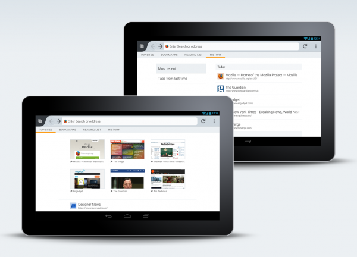

【美商謀智訊息】Mozilla 是全球性的非營利組織，以推動網路的平等、自由、開放為宗旨，旗下的 Firefox 瀏覽器、Firefox for Android 行動瀏覽器、Firefox OS 開放行動作業系統廣受全球市場喜愛。美西時間 12 月 10 日正式釋出最新版 (26) Firefox for Android 行動瀏覽器。新版 Firefox for Android 提供全新設計的開始頁，除了協助你迅速瀏覽 Web 之外，使用者只須輕點一下即可輕鬆取得自己的瀏覽記錄。Mozilla 持續為大家提供更多選擇、更高自訂性、更能自行掌握的多種 Web 瀏覽方式。

在啟動 Firefox for Android、開啟新分頁，或點擊網址列時，便會進入全新的開始頁 (即所謂的首頁)。此時也能透過滑動式選單，看到自己的「書籤 (Bookmark)」、「歷史記錄 (History)」、「閱讀清單 (Reading List)」、「最常瀏覽 (Top Sites)」等分類，提供最快速、最簡易上手的行動瀏覽經驗。Firefox 將協助取得你曾瀏覽過的、儲存過的、目前想搜尋的任何網頁。不論是在行動電話或平板電腦上，都讓你能輕鬆進行瀏覽、購物、公務、收發電子郵件、更新社交狀態，或任何所需的作業。

Firefox for Android 另新增了 Bing 與 Yahoo! 搜尋引擎，讓你在行動裝置上有更多 Web 搜尋選擇。只要進入瀏覽器設定中的「自訂 (Customize)」選項，即可輕鬆更改自己喜愛的預設搜尋功能。

從今天起，[Firefox for Android 亦可用於搭載了 Intel x86 處理器的智慧型手機上](https://blog.mozilla.com.tw/posts/4471/)，將為全球數百萬組行動裝置帶來強大、直覺、個人化的使用經驗。

更多資訊：

- [下載 Firefox for Android](https://mozilla.com.tw/firefox/mobile/features/)

- [Firefox for Android 版本說明](https://www.mozilla.org/en-US/mobile/26.0/releasenotes/)

- Firefox for Android 支援 Intel x86 Chipsets 的[更多資訊](https://blog.mozilla.org/futurereleases/2013/12/10/firefox-for-android-optimized-for-devices-that-support-intel-x86-chipsets)

- [下載 Windows、Mac、Linux 版 Firefox](https://mozilla.com.tw/firefox/new/)

- [Windows、Mac、Linux 版 Firefox 版本說明](https://www.mozilla.org/en-US/firefox/26.0/releasenotes/)

原文連結：[New Home Screen in Firefox for Android: Access Your Information in a Single Tap](https://blog.mozilla.org/blog/2013/12/10/new-home-screen-in-firefox-for-android-access-your-information-in-a-single-tap/)
