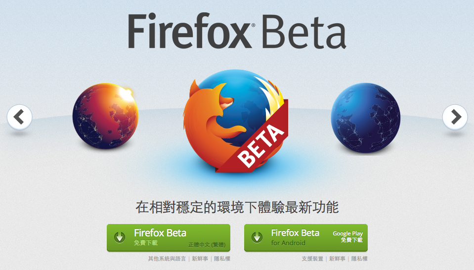

#### Mozilla 與 Goo 舉辦的遊戲開發競賽

Mozilla 與 Goo 透過[《Game Creator Challenge》遊戲開發競賽](https://blog.mozilla.com.tw/posts/4401)，積極號召對遊戲懷抱熱情並想展現創造天份的人。不論是從未開發過遊戲的業餘玩家，或是經驗老到的遊戲開發者與 JavaScript 工程師，都能報名參加競賽。參賽者限定使用 Goo 平台，並需搭配 Goo Engine 與 Goo Create。我們提供的誘人獎品包含現金，並將招待優勝者參加如遊戲開發者大會 (GDC) 的知名遊戲大展。作品提交期限到 2014 年 1 月 14 日為止。快來[這裡](https://blog.mozilla.com.tw/posts/4401/)了解參賽資格、評分項目、優勝獎項、專業評審團等資訊。

#### Firefox Beta 測試版

適用於 Windows、Mac、Linux 的 Firefox Beta 測試版亦已於今天更新完畢。新功能之一，就是 Social API 現可讓多個社交服務供應商同時發送通知。在此之前，使用者必須先在 Firefox 工具列中指定社交服務供應商，才能看到特定供應商的通知訊息。

Firefox for Android 另新支援泰文、立陶宛文、南非英文、斯洛維尼亞文等語系。

更多資訊：

- 下載 [Windows、Mac、Linux 版 Firefox Beta](https://www.mozilla.org/en-US/firefox/beta/)

- Windows、Mac、Linux 版 Firefox Beta [版本說明](https://www.mozilla.org/en-US/firefox/27.0beta/releasenotes/)

- 下載 [Firefox for Android Beta 測試版](https://play.google.com/store/apps/details?id=org.mozilla.firefox_beta&hl=en)

- Firefox for Android [版本說明](https://www.mozilla.org/en-US/mobile/27.0beta/releasenotes/)

原文連結：[Calling Firefox Beta Testers: Create an Interactive HTML5 Game for the Holidays](https://blog.mozilla.org/blog/2013/12/12/calling-firefox-beta-testers-create-an-interactive-html5-game-for-the-holidays/)
