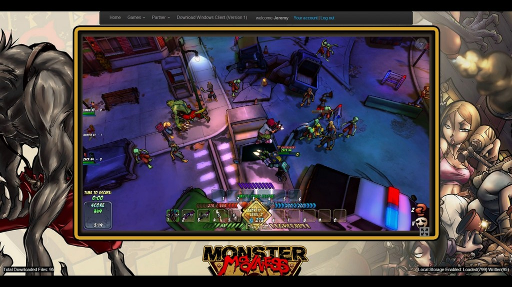

當 Trendy Entertainment 與 Nom Nom Games 二大公司的工程團隊，決定開發跨平台的 Unreal Engine 3 新遊戲之一《[Monster Madness Online](https://monstermadness.com/)》並擬定策略之時，我們就知道「多人同時連線」與「玩家使用不同版本的瀏覽器」會是這次的開發主軸。此外，為了順利將遊戲移植到 Web 平台，我們亦必須決定該利用何種關鍵技術。

身為 C++ 的開發者，我們立刻意識到不可能重新撰寫整個遊戲引擎。而必須透過某項技術，將現有程式碼以高效率方式移植為瀏覽器可用的格式…

寫到你都懶得看了？那直接先看影片吧！

### 挑選現有的遊樂設施

我們審慎評估了眼前的多個選擇：Google 的 [NaCl](https://developers.google.com/native-client/)、[FlasCC](https://www.adobe.com/devnet-docs/flascc/docs/Reference.html) (GCC Flash 編譯器)、自訂的原生 C++ 擴充套件，或 Mozilla 的 [Emscripten](https://github.com/kripken/emscripten) 與 [asm.js](https://asmjs.org/)。

根據測試結果，Flash 執行速度緩慢，且在 Pepper (Chrome) 與 Adobe 外掛程式版本之間會產生不同的行為，另外又需整合越來越多的外掛程式，所以我們再評估其他更妥善的方式。

NaCl 發送中心必須為受控制的環境 (Walled-garden)，因此會阻擋我們和使用者之間的直接交流，而且也須搭配特定的處理器。pNaCL 可省去控制環境的需要，並支援動態程式碼編譯，但當我們以特定裝置測試時，特定處理器仍需要其專屬的程式碼。第一次執行遊戲時，程式碼連結步驟將造成冗長的啟動時間，最後也只能在 Chrome 中運作。如此並無法滿足我們要讓所有主流瀏覽器都能執行遊戲的目標，也讓我們不得不放棄此方法。

如果是以 C++ 自訂的外掛程式 (Plugin)/擴充套件 (Extension)，又需要進行大量的測試與維護作業，才能跨不同的瀏覽器、作業系統、處理器架構而順利執行，而且相關安裝需求又可能嚇跑許多潛在的玩家。

就我們團隊的目標而言，只有 Emscripten 編譯器與 asm.js 可順利解決這些難題。而一旦整合其他新的 Web API，即可迅速讓瀏覽器成為高階 3D 遊戲的完整功能平台。我們僅需反覆進行一些測試並發現錯誤，即可找出正確的整合方式 ─ 緊接著就來談談相關重點！

### 勇敢踏入新世界

Trendy 公司內主要都還是老派的 C++ 程式設計師。所以在發現 Emscripten 居然能針對現有的應用程式 (以 Epic Game 的 Unreal Engine 3 所建構)，將之轉譯為 asm.js (簡言之就是最佳化的 JavaScript) 卻又幾乎不需進行其他修改時，對這些人來說就像是中了樂透一樣。

為了讓此專案能以 Emscripten 編譯並執行，因此針對 Unreal Engine 3 的主要程式碼修改為以下 1、2、3 點：

1.
// Esmcripten needs 4 byte alignment
FNameEntry* Allocate( INT Size )
{
    #if EMSCRIPTEN
       Size = Align( Size, 4 );
    #endif

    ......
}

2.
// Script execution: llvm needs aligned data
#if EMSCRIPTEN
    #define XFER(T)
    {
        T Temp;

        if (!Ar.IsLoading())
        {
            appMemcpy(&Temp, &Script(iCode), sizeof(T));
        }

        Ar << Temp;

        if (!Ar.IsSaving())
        {
            appMemcpy(&Script(iCode), &Temp, sizeof(T));
        }

        iCode += sizeof(T);
    }
#else
    #define XFER(T) { Ar << *(T*)&Script(iCode); iCode += sizeof(T); }
#endif

3.
// This function needs to synchronously complete IO requests for single-threaded Emscripten IO to work, so added a ServiceRequestsSynchronously() to the end of it which flushes & blocks till the IO request finishes.
FAsyncIOSystemBase::QueueIORequest()

					123456789101112131415161718192021222324252627282930313233343536373839

						1.// Esmcripten needs 4 byte alignmentFNameEntry* Allocate( INT Size ){    #if EMSCRIPTEN       Size = Align( Size, 4 );    #endif     ......} 2.// Script execution: llvm needs aligned data#if EMSCRIPTEN     #define XFER(T)    {        T Temp;         if (!Ar.IsLoading())        {            appMemcpy(&Temp, &Script(iCode), sizeof(T));        }         Ar << Temp;         if (!Ar.IsSaving())        {            appMemcpy(&Script(iCode), &Temp, sizeof(T));        }         iCode += sizeof(T);    }#else    #define XFER(T) { Ar << *(T*)&Script(iCode); iCode += sizeof(T); }#endif 3.// This function needs to synchronously complete IO requests for single-threaded Emscripten IO to work, so added a ServiceRequestsSynchronously() to the end of it which flushes & blocks till the IO request finishes.FAsyncIOSystemBase::QueueIORequest()

經過一天的奮戰，我們就將遊戲 JavaScript 的可執行檔編譯完畢，並已經能在瀏覽器上執行。雖然因為尚未建構繪圖 API 而當機，但執行過程卻同樣能記錄輸出情形！幸好我們已將繪圖子系統 (為 Unreal Engine3 的 OpenGL ES2 版本) 準備完畢，所以將繪圖器 (Renderer) 移植到 [WebGL](https://developer.mozilla.org/en/WebGL) 也只需要一天而已。

與 OpenGL ES2 相較，WebGL 本身就具備所有的相關功能，因此只要更改某些 API 呼叫，即可匹配使用中的著色器 (Shader) 與函式。另外針對特定的後處理 (Postprocessing) 效果 ─ 如輪廓繪製 (Edge outlining) 與動態陰影 (Dynamic shadows)，我們都已經能利用 WebGL 浮點數的 Render Target 而進一步將之強化之。

後處理作業讓所有東西看起來更漂亮！

看完前半段對《Monster Madness》遊戲的簡介，你已經感覺到自己的遊戲熱血沸騰了吧？後半段將簡略說明遊戲的音效、連網等數個開發重點。趕快接著看《[Monster Madness – 透過 Emscripten 建構 Web 遊戲 (下)](https://blog.mozilla.com.tw/posts/4557/monster-madness-creating-games-on-the-web-with-emscripten-2)》！

原文連結：[Monster Madness – creating games on the web with Emscripten](https://hacks.mozilla.org/2013/12/monster-madness-creating-games-on-the-web-with-emscripten/)
