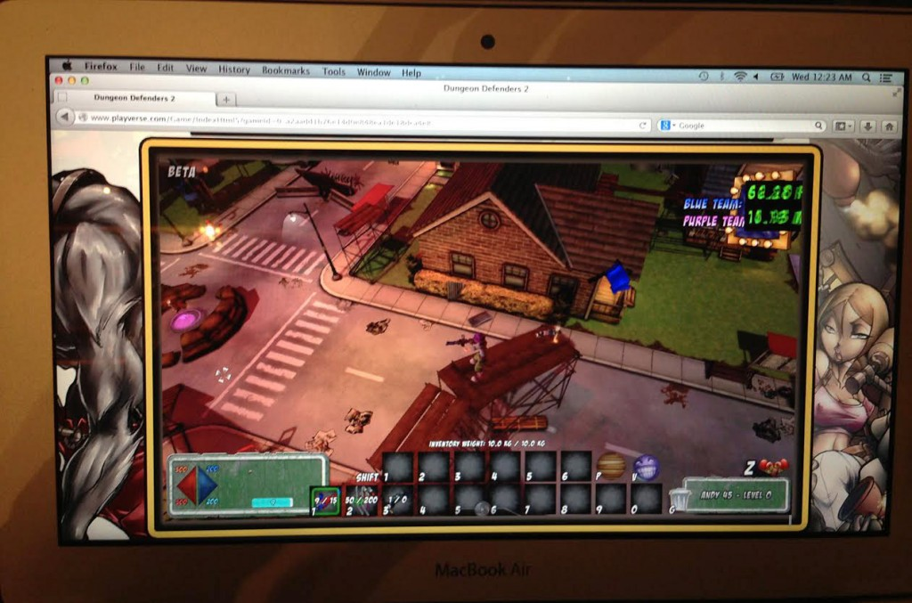

你之前聽過酷炫的《Monster Madness》遊戲嗎？只要你對 Emscripten 的相關資訊有興趣，就絕對不能錯過這一篇文章。在看下半篇之前，當然應該先複習一下《[Monster Madness – 透過 Emscripten 建構 Web 遊戲 (上)](https://blog.mozilla.com.tw/posts/4541)》。

### 遊戲執行效果如何？

現在我們已經在瀏覽器中繪製某些物件，而只需要小幅度修改而取得使用者的輸入之後，就能開始玩遊戲並分析其效能了。相關結果讓我們開心又大感意外。在 Firefox 中，遊戲 asm.js 版本可達到原生程式 33% 的效能。但這是拿「單執行緒的 Web 應用」去比「多執行緒的原生應用」，其實不很公平。若再與我們短時間內完成的 Flash 移植應用相較，asm.js 版更可達幾乎二倍的效能 (這仍將用於未支援 asm.js 的舊版瀏覽器中，但我們希望最終能完全不用此版本)。

用 Chrome 測得的結果就稍微差一點，僅達原生應用 20% 的效能，不過還是我們預設的可接受目標區間之內。最後我們找到 2011 年版的 Macbook Air 測試，想知道能否跑出 45-60 FPS 的效果 (且是未啟用 Vsync 的狀態)？結果是可以！所以我們希望 Google 能持續提升 asm.js 在 Chrome 瀏覽器上的效能。就目前的情形來看，除非你要用 asm.js 技術弄出《末日之戰 (Crysis)》的瀏覽器版本 (可能時間也快了)，否則 Chrome 已足可應付大多數的 Web 遊戲。

舊款 Macbook Air 達到 60+ FPS

### 把各項功能兜起來

從動手開始才不到一個禮拜，我們就把 Unreal Engine 3 的電腦版遊戲移植成畫面漂亮且能順利執行的 Web 遊戲。那接下來還有哪些要處理的？其實還必須處理音效、連網、串流、儲存等作業。接著就談談這些系統所使用的多樣技術吧。

#### 音效

其實用膝蓋想也知道，除了 Flash 之外，也就只有 [Web Audio API](https://developer.mozilla.org/en-US/docs/Web_Audio_API) 是唯一且完整的標準 Web 音訊系統。同樣的，Web Audio API 能媲美自己的行動版近親 OpenSL (我們已有整合過的版本)。所以只要切換不同的呼叫，就能達到所需的整合效果。

如果在 Mac 中把 Chrome 聲音設成「循環播放 (Looping)」，將導致資源不時無法釋放的問題。也因此我們專為 Chrome 開發出手動的循環播放方式，並已將此問題提交給 Google 解決。我們另外發現瀏覽器 API 的一個問題，就是並非所有瀏覽器均能完全相容於標準規格，但仍能夠完成必要的工作！

#### 連網功能

連網功能有點棘手。我們先研究過《[BananaBread Demo](https://developer.mozilla.org/en/demos/detail/bananabread)》中所使用的 [WebRTC](https://developer.mozilla.org/en-US/docs/WebRTC)。雖然 WebRTC 主要用於瀏覽器對瀏覽器之間的通訊機制，但這並非我們所需的功能。我們的線上遊戲服務將使用「主從式 (Client-server)」架構搭配中控式的基礎設施 (Centralized infrastructure)。我們也因此採用了 [WebSockets](https://developer.mozilla.org/en/docs/WebSockets) API。而棘手的部份在於，我們必須在 JavaScript 緩衝區中處理所有 WebSockets 進出的資料，接著再將資料一路傳送至 Emscripten 所轉譯過的「C++」遊戲。

雖然可透過某些回呼 (Callback) 達成上述作業，但我們仍必須將 TCP 形式的 WebSockets 協定層疊加於既有的 UDP 遊戲伺服器程式碼之上。此時經過額外手續，讓封包符合 WebSockets 所需的格式之後，瀏覽器遊戲即可其專屬的 Linux 後端伺服器順利進行通訊作業！

#### 串流與儲存

使用 Web 的優點之一，就是可輕鬆使用瀏覽器的非同步化下載功能，以串流下載內容。我們當然會在遊戲中充分利用此一特性，而且初始的下載作業還不到 10 MB 檔案容量。當你透過標準瀏覽器的 http下載請求 (材質、音效、音樂、Skeletal Meshes、Level Packages 等) 進行遊戲時，所串流進來的所有資料都是隨選而得。這時應如何穩定儲存這些內容，就是接下來必須傷腦筋的問題了。因為瀏覽器的快取並無法迅速載入遊戲資料，而我們也不能預先查詢「磁碟的現有資料，現在是否在常態的瀏覽器快取之上」，所以我們不想只依賴瀏覽器的快取。

因此我們使用了 [IndexedDB API](https://developer.mozilla.org/en/docs/IndexedDB)，可針對資料物件進行非同步的儲存與檢索作業。雖然 Firefox 與 Chrome 均可使用此 API，但資料庫不時會崩潰 (可能是在非同步寫入期間中斷) 且必須重新產生，所以仍需謹慎使用之。有時發生最糟糕的狀況，就是使用者接收過的內容均必須重新下載。

我們目前已經著手研究此問題。除此之外，[IndexedDB](https://developer.mozilla.org/en/IndexedDB) 運作得還算不錯，並可為我們的應用程式提供標準的檔案輸出/入功能，適於儲存我們所下載的內容。(後續狀況更新：在 12/10 釋出的 Firefox Nightly 版本，似乎可自動重設 IndexedDB 儲存，且不會再發生上述此問題。)

### 立刻試玩，擁抱未來趨勢！

目前仍有許多需改進或研究的地方，而我們也剛開始使用 Firefox 的 VTune，以期能在瀏覽器中對應asm.js 的效能。即使如此，我們還是對目前已經完成的部份感到振奮不已。你可別只是看完這篇文章而已。希望你也能立刻加入體驗的行列，而且不需其他安裝或註冊程序：

[馬上在瀏覽器中體驗我們的 Demo！](https://www.playverse.com/Anonplayer/0-a2aadd1b76e14d0e848ea1de18dca4e8)

(請忍耐遊戲伺服器的存取流量限制。我們仍在測試後端並設法擴充！)

我們在 Trendy 的每一天，都希望能讓大家能在不受干擾或限制的情況下，讓玩家能隨時以任何裝置/平台享受到任何遊戲。只要能正確整合這些最先進的技術，可能明天就能發表完整的遊戲。我們希望其他專業的遊戲開發者能加入我們，經由 Web 直接了解玩家的需求。但這些都必須歸功於Emscripten 與 asm.js，並可能讓 Web 成為最強大、影響最深遠的遊戲平台！

原文連結：[Monster Madness – creating games on the web with Emscripten](https://hacks.mozilla.org/2013/12/monster-madness-creating-games-on-the-web-with-emscripten/)
