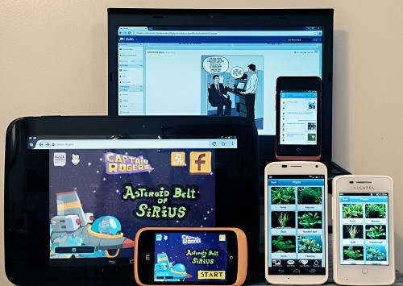
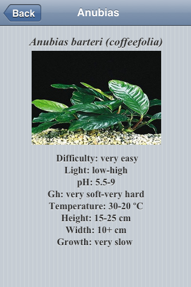
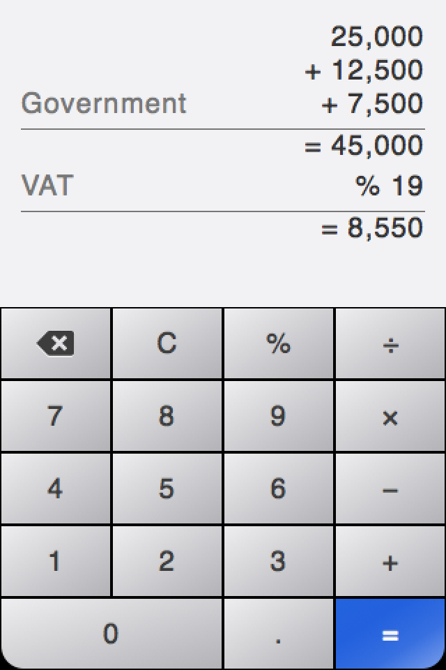
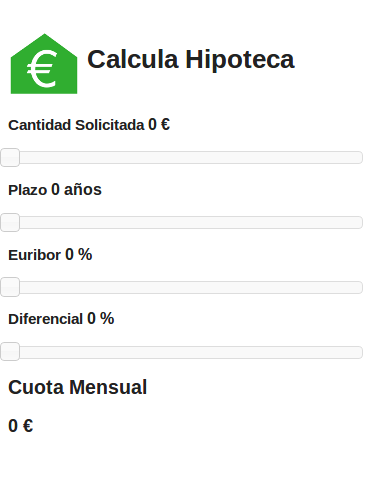

我們過去一年來不斷招募開發者。這些開發者均已於不同的 Open Web 與 [HTML5](https://developer.mozilla.org/en/html/html5) 平台上開發過 App，如以 PhoneGap wrapper 建構的原生 App；針對 Amazon、Blackberry、Chrome、Microsoft、WebOS，甚至手寫的原生程式碼 wrapper 而建構的 HTML5 App；用 [Emscripten](https://developer.mozilla.org/en-US/docs/Emscripten) 編譯過的 C++ 等等。我們已於全球寄出多款裝置而支援了數百名開發者，以利大家測試並展示 Firefox App。

如果你本身擁有成功且高評價的 HTML5 App (任何平台均可)，Mozilla 熱切希望你能將之移植到 Firefox OS 之上。我們保證不會佔用你太多時間而且絕對值得。今年十一月，Firefox OS 已於希臘、匈牙利、塞爾維亞、蒙特內哥羅等國現身，本月稍早亦於義大利發表。在 2014 年，Mozilla 另將與新合作的電信營運商發表新語系的 Firefox OS，也會有新規格的新款裝置。我們預期會出現更強大的跨平台工具，對 PhoneGap 與 Firefox 開發者工具的整合度也更高。現在正是你跨則搶占先機的最好時間點。

現來看看 Mozilla 注意到的幾個 App 成功移植案例。這幾位技巧嫻熟的 HTML5 App 開發者均參加過 App 移植專案與相關工作坊 (需受邀才能參加)。在與他們會談之後，我們也請他們寫下自己的 Firefox App 移植經驗。除了要和你們分享之外，也希望能激發各位更多的靈感。

Andrzej Mazur 撰寫的 Captain Rogers；Dimitry Vinogradov 與 David Zorycht 撰寫的 Reditr；Diego Lopez 撰寫的 Aquarium Plants

#### Aquarium Plants – 以 Android 搭配手寫的原生 wrapper

App 名稱：[Aquarium Plants](https://marketplace.firefox.com/app/aquarium-plants)

開發者：Diego Lopez

原始平台：[Google Play Store](https://play.google.com/store/apps/details?id=com.golgorz.aquariumplantsfree)

耗時：

我們用自己現成的 JavaScript 程式碼搭配簡單的 HTML5 程式碼，撰寫出 Aquarium Plants。而且我們也只用了二個常見的 JavaScript 框架 (Zepto.js 與 TaffyDB.js)。大概花不到三個小時吧？而且大部分的時間都在看論壇文章與說明文件。

建議：

為 Firefox OS 建構/移植 App 真的很簡單。絕妙之處在於，我們只需要 Web 工具與框架，即可建構出 Firefox OS 適用的 App。我建議大家立刻開發 Firefox App，幾乎不耗任何功夫又能有絕妙經驗。

遇上的困難：

要先了解 App 封裝的方式，對我來說比較麻煩一點。但當我發現「撰寫 Firefox OS 的 App，只需要建立 App 與其 manifest 檔案，再將二者存為 zip 檔」之後，一切就變得輕鬆又好玩。

####

#### Calc ─ 以 iOS 搭配手寫的原生 wrapper

App 名稱：[Calc](https://marketplace.firefox.com/app/calc-by-lancio/)

開發者：Markus Greve

平台：iOS 搭配手寫的原生 wrapper

耗時：

移植作業很簡單，也因此我願意為《Write Elsewhere, Run on Firefox OS》撰文。我只花了大概二個晚上。第一個晚上就讓 App 能順利執行，隔天就再針對 Keon 與 Firefox OS 模擬器 (Firefox OS Simulator) 的顯示畫面進一步微調而已。

再一個晚上的時間，我設計完 App 圖示就發佈到 Marketplace 上了。

建議：

我建議開發者只管試著移植 App 就對了。你試過才會發現有多麼簡單。我認為 [Mozilla.org](https://mozilla.org/) 確實以絕妙理念在做很酷的事，而且一直全力支援開發者。

根據自己的 Firefox OS App 創作經驗，我完成了《[A Firefox OS app in five minutes](https://de.slideshare.net/markusgreve/20131130-firefoxosappin5minutes) (英文)》簡報。我也用德文寫了《[App Entwicklung für den Feuerfuchs](https://www.kochan.de/blog/20131208-app-entwicklung-firefox)》部落格文章。

遇上的困難：

- 我使用 OSX 10.9 Mavericks，所以模擬器會因為舊版外掛程式而當機。若選用Firefox 1.26b 與應用程式管理員 (App Manager) 就比較穩定。

- 每個 App 都需要一組子網域 ─ 這應該是共通的問題。

- JSON Manifest 檔案中的資料型態。我嘗試以 “fullscreen”: true 取代 “fullscreen”: “true”。其實這是我自己造成的錯誤；解決之後也已經收錄在簡報中。

- 我覺得自己簡報所寫的圖示尺寸，其實並不符合 Marketplace 所規定的尺寸。而當你需要比較大的檔案時 (例如某個商城需要 256×256)，僅 60×60 像素的 Photoshop 範本圖示根本不夠。你最好能提供 1024 的範本，讓後來的使用者自行縮小即可。

- 個人建議：應更詳細說明 navigator.mozApp.checkInstalled() 與 .install() 之間的關連性。

####

#### Calcula Hipoteca – Amazon Appstore

App 名稱：[Calcula Hipoteca](https://marketplace.firefox.com/app/calcula-hipoteca)

開發者：Emilio Baena

原始平台：[Amazon Appstore](https://www.amazon.com/liodevel-Calcula-Hipoteca/dp/B00F2GDV94)

耗時：

很簡單。我只花了幾小時。

#### 建議：

只要使用這平台，一切順利。

遇上的困難：

我在處理 manifest.webapp 時發生一點問題。但我想只要看一看這類檔案型態的說明文件就能解決。

這幾張 App 的精采截圖已經引起你的興趣了嗎？是不是看著也手癢想寫出自己的 App 呢？我們將接著提供更多開發者的心得與作品。可別錯過接下來的《撰寫平台隨你選，Firefox 都「行」(中)》與《(下)》 篇。

原文連結：[Write Elsewhere, Run on Firefox OS](https://hacks.mozilla.org/2013/12/write-elsewhere-run-on-firefox/#Aquarium%20Plants)
