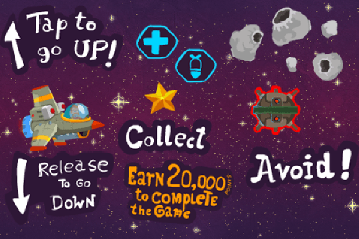
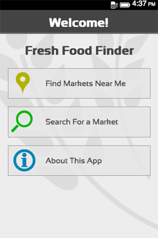

你已經動手開發 App 了嗎？曾覺得自己早已熟悉某個平台，懶得再學新的 App 開發方法嗎？Firefox OS 都行！可先來看看《[撰寫平台隨你選，Firefox OS 都「行」(上)](https://blog.mozilla.com.tw/posts/4571/)》，看看其他開發者提供的精采心得與建議喔！

#### Captain Rogers (HTML5 Desktop)

App 名稱：[Captain Rogers](https://marketplace.firefox.com/app/reditr/)

開發者：Andrzej Mazur

原始平台：HTML5 Desktop

耗時：

我只花了二個星期的開發時間，就將 [Captain Rogers](https://enclavegames.com/games/captain-rogers/) 移植到 Firefox OS 平台，再用二個星期進行測試與錯誤修正。遊戲的核心概念很簡單，所以我能專心針對 Firefox OS 裝置而優化遊戲，再將之發佈到 Firefox Marketplace 上。

遇上的困難：

為 Firefox OS 建構 App，基本上就是為 Web 建構 App，所以沒什麼大問題。Firefox OS 裝置本身就是以 JavaScript 與 HTML5 所打造，也就是行動 Web 所引頸企盼的硬體。

為了讓遊戲能在 Firefox OS 裝置上運作，我主要都在處理 manifest 檔案。但我遇到不少問題才讓 orientation 能正確運作。幸虧在華沙舉辦的 Firefox OS App Workshop 上，我遇到 [Jason Weathersby](https://twitter.com/jweathersby) 並獲益良多。活動的最後一天，我設計的第一版遊戲已能順利運作，幾天之後就通過 Firefox Marketplace 的審核。

針對程式碼最佳化，我建議大家參閱 [Louis Stowasser 與 Harald Kirschner 所撰寫的這篇文章](https://hacks.mozilla.org/2013/05/optimizing-your-javascript-game-for-firefox-os/)；我也從中獲得不少靈感。另外，Audio API 仍算是行動裝置的大問題之一。目前 Captain Rogers 的音效已能正確運作，並已發佈至 Firefox OS 手機上。

建議：

我想傳達的訊息很簡單：為 Firefox OS 設計 HTML5 遊戲，其實就是為 Open Web 設計 HTML5 遊戲。Firefox OS 就是 Web 所需的硬體平台。如果能將 Firefox OS 作為標準，再搭配數百萬人在實際裝置上千錘百鍊而得的 API，則長遠來看，所有人都能受益於 Web 與 API。如果你想進一步了解 HTML5 遊戲開發細節，那我推薦可先參考我的《[Preparing for Firefox OS article](https://mobile.tutsplus.com/tutorials/firefox-os/preparing-for-firefox-os/)》與《[HTML5 Gamedev Starter list](https://html5devstarter.enclavegames.com/)》二篇文章。你也可參考 [Austin Hallock 的絕佳介紹文章](https://hacks.mozilla.org/2013/09/getting-started-with-html5-game-development/)。社群也很樂於協助你。只要有任何問題，都能前往 [HTML5GameDevs](https://www.html5gamedevs.com/) 討論區找到答案。開發 HTML5 遊戲有趣極了！快來享受這有趣的過程吧！

#### Cartelera Panamá – Appcelerator Titanium

App 名稱：[Cartelera Panamá](https://marketplace.firefox.com/app/cartelerapanama/)

開發者：Demóstenes Garcia

原始平台/wrapper：[Appcelerator Titanium](https://www.cartelera.com.pa/)

耗時：

Cartelera 的開發流程很簡單，速度也蠻快的。開發 Firefox OS 版的 App 就更簡單了。相關程序都已經有完整的說明文件，而且 HTML5+JavaScript 更能輕鬆寫出 App。

遇上的困難：

我們 [Pixmat Studios](https://www.pixmatstudios.com/) 的使用者經驗 (UX)/使用者介面 (UI) 團隊，特別注意可用性/易用性。也因為如此，我們選用 [Titanium](https://www.appcelerator.com/titanium/) 而非 PhoneGap (可得較佳的 UX)。所以我們遇上的主要難題，就是要讓 App 看起來就是真正的 Firefox OS App。

最後我們決定搭配真正的 Firefox OS Building Blocks，取代 Titanium 所設計的 UI：

- 取出 App 的所有商業模組 (Business logic，用以處理如電影、行事曆、列表清單等)，並放到 App 的 Git Repository/module 中。接著可於 Titanium 與 Firefox OS 上重複使用 App 的所有元件。只要是我們所接受此三個平台的原生 UX，也同樣續用。

- 另一個問題，就是要能順利將 OAuth 用戶端實際建構在手機之上。但根據 [Jason Weathersby](https://hacks.mozilla.org/author/jasonweathersby/) 說過的，「資源的品質」對我們而言更重要。

建議：

對一般的 Web 開發者來說，Firefox OS 與相關環境 (如除錯環境) 簡單又友善。我們不需再研習額外知識，即可創作出真正的行動 App。

- 使用 Firefox OS Building Blocks 設計 UI。可輕鬆取得原生的 UI 使用經驗。

- Mozilla 開發者社群網站 (MDN) 上的 Firefox OS 文章，都是你最好的朋友。

- GitHub 也有許多值得學習的專案，所以快點建立帳號去找找展示專案吧。

#### Fresh Food Finder (PhoneGap)

App 名稱：[Fresh Food Finder](https://marketplace.firefox.com/app/fresh-food-finder/)

開發者：Andrew Trice

原始平台：PhoneGap

耗時：

PhoneGap 即將支援 Firefox OS。而我希望能更熟悉 Firefox OS 開發環境與平台的生態系統，因此我決定移植 Fresh Food Finder，並拿掉 PhoneGap 才能使用的 API。其中最有趣的部份 (同時展現了 Web 當做開發標準的強大威力)，就是我能將現有的 PhoneGap 程式碼轉為 Firefox OS App，並提交到 Firefox Marketplace。整個過程還不到一天！

建議：

基本上，我先註解掉 PhoneGap 專屬的 API 呼叫、修正幾個小錯誤，再更改幾項 Firefox OS 才能執行的配置/樣式 (真的只有幾項小幅度修改)，讓我的 App 能正常顯示於裝置之上。接著加入 mainfest.webapp 檔，封裝之後提交到 Marketplace 即可。

如果你也有興趣，可以參考 Cordova 專案目前對 Firefox OS 的支援進度。等到正式發佈之後，亦可到 [PhoneGap.com](https://phonegap.com/) 找到該專案 (編按：預計 2014 年初發佈後續消息)。

#### Picross (WebOS)

App 名稱：[Picross](https://marketplace.firefox.com/app/picross/)

開發者：Owen Swerkstrom

原始平台：WebOS

耗時：

在我拿到裝置之後，馬上就把 Picross 安裝到 Firefox OS 之中並執行了。

遇上的困難：

我必須調整某些觸控 API，但其實也就是很快看過某些文件找出答案即可。

建議：

我自己最愛如此詮釋：「不要覺得你在把 App 移植到 Firefox OS，卻是移植到 Web！」而 Firefox OS (加上 Firefox 瀏覽器) Canvas 的支援功能也極為完善。我一定會用 Canvas 開發下一個遊戲。

就我的案例來看，移植作業真的很簡單。我的遊戲本就能在瀏覽器上執行，而原來是為了能讓 Palm Pre 執行此遊戲所設計。Palm Pre 本身就是具備相同解析度的最初階 Firefox OS 手機。而「安裝 App」的概念也不過是瀏覽網站而已，所以整個都是無痛過程，也是 Firefox OS 獨特之處。不同於其他的智慧型手機，Firefox OS 雖然擁有自己的「官方」Marketplace，但其實根本不需要。消費者可自由從任何喜歡的網站上，安裝任何 Web App。而對開發者來說，我根本不需要 Mozilla 的任何授權，就能在此平台上發佈 App。我不需將裝置調整為特殊的開發模式、不需購買任何工具組，也不需建構於任何特定平台之上。只要我會寫網站，也就會寫 App。

即使我剛提到 Firefox Marketplace 是「不必要」的功能，但我仍從中獲得許多愉快的經驗。我再不需綁定、簽署、上傳任何封包，卻只要輸入網址並提供某些說明性質的簡介即可。審核時間也不長。與我剛開始接觸的時候相較，現在審核作業更快了。上次我提交 [Halloween Artist](https://marketplace.firefox.com/app/halloween-artist) 之後，幾乎是馬上就通過審核，而且審核人員還詢問我是否能為 [hacks.mozilla.org](https://hacks.mozilla.org/) 寫一篇文章，說明自己整合這些圖素的方法。Firefox Marketplace 就是內含精選 App 的傳統「商城」，同時也是屬於科技狂的社群，隨時都有一群人對有趣的程式碼與天馬行空的想法發出讚嘆。我自己如果是 App，一定會想住在 Firefox Marketplace 裡。

在我參加 Mozilla 工作坊活動之前，我還在考慮要用哪種方式撰寫仍在構思中的動作冒險遊戲。本先想用 C OpenGL 程式碼來寫遊戲，但當時尚未發表 SDL 2.0。另外就是用 HTML5 的 Canvas 先設計原型出來 (這種方法比較像賭博)。在 Firefox OS 手機上操作 Canvas 時，其執行結果就是直接進入幀像緩衝區 (Framebuffer)；而且我自己也親身體驗到低價位的小型 ARM 裝置，居然能達到超乎想要的效能。這時我就決定捨棄 C 並撰寫 Web App 遊戲了。如果你已經在規劃下一個遊戲，甚至使用 Flash 或 SDL 並已接近完成階段，我還是強烈建議你可花一點點時間先了解 Canvas。

這些 App 開發心得分享是不是很精采呢？你看著也想自己動手開發 App 了吧？還有精采的《撰寫平台隨你選，Firefox OS 都「行」(下)》可別錯過了。

原文連結：[Write Elsewhere, Run on Firefox OS](https://hacks.mozilla.org/2013/12/write-elsewhere-run-on-firefox/#Aquarium%20Plants)
