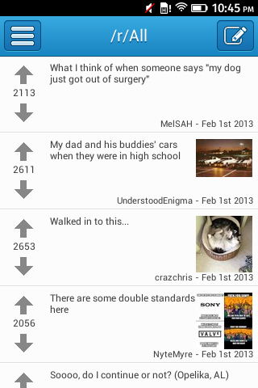

你已經動手開發 App 了嗎？曾覺得自己早已熟悉某個平台，懶得再學新的 App 開發方法嗎？Firefox OS 都行！可先來看看《[撰寫平台隨你選，Firefox OS 都「行」(上)](https://blog.mozilla.com.tw/posts/4571/)》與《[(中)](https://blog.mozilla.com.tw/posts/4584/)》篇，看看其他開發者提供的精采心得與建議喔！

#### Reditr (Chrome Dev Store)

App 名稱：[Reditr](https://marketplace.firefox.com/app/reditr/)

開發者：Dimitry Vinogradov 與 David Zorycht

原始平台：Chrome Dev Store

耗時：

我們花了幾乎一個禮拜，將完整 App 從 Chrome 移植到 Firefox OS。

遇上的困難：

我們在建構 Firefox OS 版 Reditr 時遇到的難題，就是[內容安全政策 (CSP)](https://developer.mozilla.org/en-US/docs/Security/CSP)。Web App 的優勢之一，就是能讓使用者預覽某個 App 所需的權限。但開發者必須先花點時間了解 CSP 的建立方式。我們就花了幾天的時間反覆測試，藉以了解 CSP 如何影響 App。

建議：

開發者必須確實了解 App 將如何處理 CSP。由於 oAuth 可協助解決 CSP 方面的問題，因此請檢查自己所使用的 API 是否支援 oAuth。

#### Speed Cube Timer – Blackberry Webworks

App 名稱：[Speed Cuber Timer](https://marketplace.firefox.com/app/speed-cube-timer-1/)

開發者：Konstantinos Mavrodis

平台：Blackberry Webworks

耗時：

我花了大概半個小時，就讓移植的 Web App 可相容於 Firefox OS 了。真的很快！

遇上的困難：

回想起來，其實沒有真正讓我感覺到困難的地方。似乎所有步驟都輕鬆完成！

建議：

我能給其他開發同好的建議，就是儘快把自己的 HTML5 App 移植到 Firefox OS 吧！移植 Web App 真的有夠簡單。Firefox OS 真的是能展現 Web 強大開發功能的作業系統！

#### Squarez (C++)

App 名稱：[Squarez](https://marketplace.firefox.com/app/squarez?)

開發者：Patrick Nicolas

平台：C++ 搭配 Emscripten

Emscripten 與 C++ 的用法：

我一直偏好靜態型別 (Statically typed) 與編譯式 (Compiled) 的程式語言，符合我自己建構軟體的方式。其實除了 Emscripten 之外也有許多選擇，但我選用 C++ 撰寫遊戲邏輯，用 html/css/javascript 撰寫使用者介面。

所有遊戲邏輯相關的程式碼都是 C++。而針對多人玩家模式，伺服器可重複使用之前所有的程式，因此我只需要額外再寫 500 行程式碼即可。

耗時：

遊戲本身就是 Web 專案。從最初的開發到完成大概是一個月。再把遊戲移植為Firefox 應用不過是幾天的功夫，而且主要都耗在 manifests 檔案與圖示的設計上。效能微調比較複雜，幾乎佔掉後期的所有開發時間。

遇上的困難：

Squarez 是我嘗試撰寫的第一個遊戲，也是我第一次使用 Emscripten (這就是我感覺困難之處)。因為現在已有許多高品質的說明文件，所以撰寫 Web App 一直不算難。其二就是效能微調的部份。在我收到 Geeksphone Keon 並安裝 App 之後，我才發現遊戲執行速度有夠慢，幾乎是不能玩的狀態。

我使用過的效能檢測工具，包含編譯過的原生程式碼，也有 Firefox 桌面版與 Chromium，都為了找出效能瓶頸。因為這段 JavaScript 是透過 Emscripten 而產生，所以不容易追蹤有瑕疵的函式。在檢測期間，我必須透過部分混亂的命名而找出錯誤來源。下一步就是進行 CSS 最佳化，但這時我找到的工具只能檢查各個選擇器 (Selector) 所花費的時間。如此根本不可能找出最耗時的動畫。我必須很「搞剛」的手動逐一停用各個函式，就如瞎子摸象一樣猜出耗時的函式再修改之。

建議：

我建議開發者只管選用自己喜歡的技術就好。我愛用完善架構的靜態型別程式碼，所以 Emscripten/C++ 就是不錯的解決方案。另外一提，我不建議大家設計出「只能在 Firefox OS 上運作」的 App。大家應該要利用各種標準，讓自己的 App 能用於所有瀏覽器，並透過 Web API 來強化 App。

如果你想把連結加入程式碼的 Repo 內，都可以在 [http://git.meumeu.org/?p=squarez.git;a=summary](https://git.meumeu.org/?p=squarez.git;a=summary) 找到。裡面全部都是 GPLv3+。喜歡就挾去配吧！

#### Touch 12i ( Windows Phone )

App 名稱：[Touch 12i](https://marketplace.firefox.com/app/touch-12i)

開發者：Elvis Pfutzenreuter

平台：HTML5 for Windows Phone (與其他平台)

耗時：

就我記憶所及，大概開發作業只花了一天，其他最後細節 (包含到 Marketplace 裡註冊) 再一天。

最後還有付款收據檢查作業。因為開發者必須徹底測試此機制，所以再加上不到一天的時間。但此機制只要確認無誤之後，就可讓其他 App (如我自己的 Touch 11i) 重複使用。

遇上的困難：

移植作業其實很簡單，只花了我一天的時間。最耗心力的是「viewport」，不同平台 (都屬 Webkit 架構) 都會發生不同的情況。針對 Firefox，我必須採用 CSS 的變形 (Transform) 方法，才能讓計算機符合畫面的尺寸。

Touch 12i 是在 Windows Phones 上執行的 HTML5 App，其運作方式就與 Android/iOS 的 App 完全相同：以 Web 元件架出主程式，再搭上原生程式碼的「外殼」。目前可於 Firefox 上運行的 Touch 12i 版本，是唯一真正的 HTML5 App (我曾設計過純 Web 架構的 iOS 版本，但仍須針對 iOS 微調)。

我另外寫了一篇《[Playing With Firefox OS](https://epx.com.br/logbook/entries/firefoxos.php)》部落格文章，其中提及我參與 App 移植專案的相關經驗。

就先說到這裡了。謝謝你看了這麼多人分享的經驗。如果你正在負責 Firefox OS App 的移植作業，Mozilla 亟需你的任何意見。請隨時透過 [appsdev@mozilla.com](mailto:appsdev@mozilla.com) 聯絡我們。

原文連結：[Write Elsewhere, Run on Firefox OS](https://hacks.mozilla.org/2013/12/write-elsewhere-run-on-firefox/)
