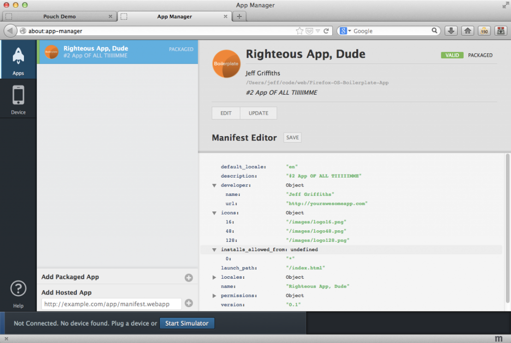
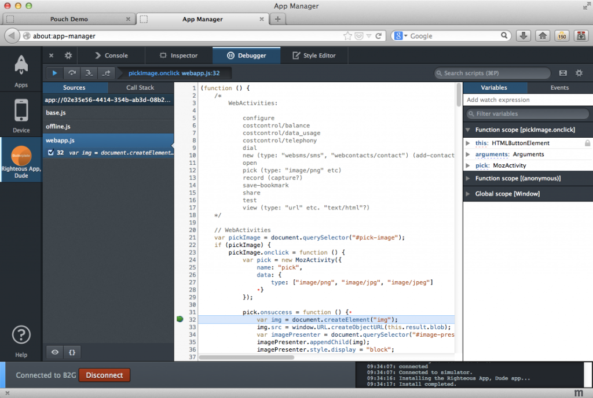
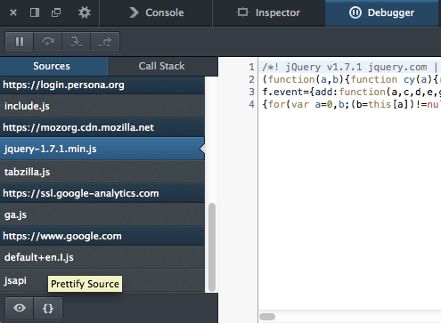
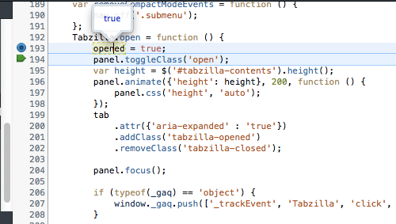
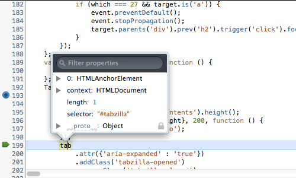
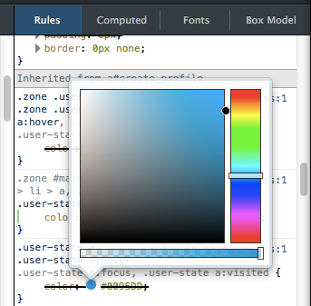
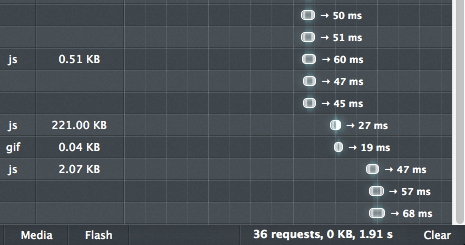
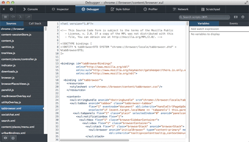

### 分割主控台、美化的壓縮 JavaScript ，還有更多功能

[Firefox 開發者工具](https://developer.mozilla.org/en/docs/Tools)團隊正好趕上休假之前提供嶄新功能，讓你在休假期間也能順利開發專案。東西還不少，立刻來看看吧！

#### 應用程式管理員 (App Manager)

[應用程式管理員 (App Manager)](https://developer.mozilla.org/en-US/Firefox_OS/Using_the_App_Manager) 仍是 Firefox 28 與開發者工具團隊的首要重點。除了修正多個小錯誤並提升數個功能之外，現在更針對行動裝置添增二大功能：「安裝資訊檔編輯器」與嵌入式的工具箱。

安裝資訊檔編輯器 (Manifest Editor) 可讓開發者直接編輯自己 App 的 manifest 檔案。開發者可添增、刪除、編輯 manifest.webapp 內的欄位，再將之儲存回磁碟中。使用者再也不需離開工具亦可繼續改善 App 或進行除錯，獲得更全面的使用經驗。

應用程式管理員的另一項新功能，就是嵌入式的工具箱。現在不論是在 Firefox OS 模擬器 (Firefox OS Simulator) 或實體 Firefox OS 裝置上進行 App 除錯，工具箱就會以垂直的獨立「分頁」形式出現在管理員中，並顯示該 App 圖示以利開發者輕鬆辨別：

#### 網頁主控台 (Web Console)

網頁主控台 (Web Console) 最大的改變，就是我們所稱的「分割主控台 (Split console)」功能。現位於除錯器 (Debugger) 內的任何頁面均可呼叫網頁主控台。如果你現正使用其他工具，又恰好需要主控台功能，則只要按下鍵盤的「Esc」，或點擊「切換分割主控台 (Toggle split console)」按鈕即可。下列短片即說明此功能：

我們不只強化主控台功能，同時也變更下列數個特色：

- 現已預設關閉 CSS 警告功能 ─ 在載入頁面時，CSS 警告現可為主控台新增數百條訊息。

- 針對除錯器目前所在的程式碼範圍內，主控台現可自動完成建議字串。

- 現可開啟/關閉訊息的時間戳記 (預設為關閉)。

- console API 現已新增 console.exception() 與 console.assert() 。

- 主控台另新增了暗色調主題。

#### 除錯器 (Debugger)

因應多位開發者的要求，我們又為除錯器添增了二項功能。其一就是可美化 (包含上色並壓縮) JavaScript 檔案：

如果你想壓縮 JavaScript，或想從遠端網站取得壓縮過的函式庫，那絕對該使用此功能。只要點擊上圖所示的「Prettify Source」按鈕，即可獲得較佳、較易讀的檔案。

除錯器新增的第二項功能，就是可在除錯期間檢測變數的值。現在只要將滑鼠游標移至變數之上，就會彈出視窗並顯示目前的數值：

彈出視窗不僅可檢視簡單類別 (如上圖的 Boolean 值)，亦可顯示物件與 DOM 節點：

#### 檢測器 (Inspector)

除了 Firefox 27 所提供的檢測器 (Inspector) 工具提示之外，現在又新增了其他功能：

- 規則檢視模式現在提供選色器 (Color picker) 工具提示對話框

- 我們另更新了工具文字的風格，更符合暗/亮主題

- 另根據開發者反應的意見，現在可調整工具文字的顯示時間

下圖即為選色器工具提示對話框：

#### 好多新功能

新功能太多了，這裡先列出其中幾項報給你知：

- 網路監測器 (Network Monitor) 現在提供「清除 (Clear)」鈕。如果你極度依賴 Web API 來開發 App，則清除鈕對你應該特別有用：

- 針對平台與附加元件的開發者，我們現在擴充瀏覽器除錯器 (Browser Debugger) 的功能，並將之改名為「瀏覽器工具箱 (Browser Toolbox)」。開啟工具箱後即可看到多樣工具，如除錯器、主控台、檢測器、樣式編輯器、效能分析器、網路監測器、程式碼速記本：

原文連結：[Split console, pretty-print minified JS and more – Firefox Developer Tools Episode 28](https://hacks.mozilla.org/2013/12/split-console-pretty-print-minified-js-and-more-firefox-developer-tools-episode-28/)
