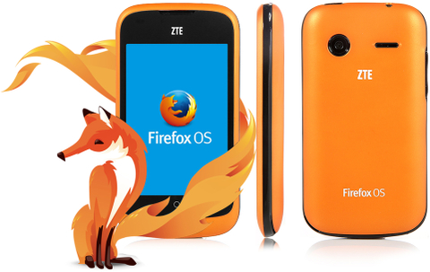
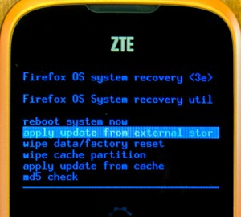
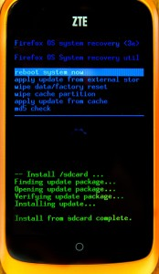

ZTE Open 的美國與歐洲版本搭載了 Firefox OS 1.0。但由於手機目前尚未支援 Over the Air (OTA) 更新功能，因此中興通訊 (ZTE) 稍早在官方網站上發佈了新版本作業系統與相關說明，讓你能順利把手機刷成 Firefox OS 1.1 ─ 最新版本 Firefox OS。接著就來看看該如何刷機吧！

(注意：在刷機之前，請先準備 microSD 記憶卡以儲存軟體。)

#### 下載韌體

根據你購買手機版本的不同，韌體也同樣分為美國或英國 (歐洲) 版本。先到 ZTE 支援網站的[美國版](https://www.ztedevices.com/support/smart_phone/b5a2981a-1714-4ac7-89e1-630e93e220f8.html)或[英國版](https://www.ztedevices.com/support/smart_phone/cba40ed6-d3ab-44c0-bdee-3a15803dc187.html)之一，進入「Downloads」分頁即可下載檔案。所下載的壓縮檔案即內含軟體升級說明文件。

#### 拿出自己的手機

升級過程將清除所有使用者的資料 (如聯絡人資訊在內)，且目前尚未提供備份聯絡人的功能。如果你想保留聯絡人資訊，請先到 Firefox Marketplace 中找到 [Con Backup app](https://marketplace.firefox.com/app/contacts-backup/) 安裝並執行之，即可將聯絡人資訊備份到自己的 microSD 記憶卡中。

接著按照下列步驟準備自己的手機：

- 手機必須充電達至少 50% 的電力，確保有足夠的電力完成升級程序。

- 將下載的壓縮檔解壓縮之後，可在資料夾中看到 a.) PDF 格式的說明文件與 b.) 韌體壓縮檔。說明文件的內容基本上與本篇文章相同。

- 關閉手機電源，取下電池即可找到 microSD 記憶卡。將 microSD 記憶卡抽出。

- 將 microSD 記憶卡接上電腦。

- 把「US_DEV_FFOS_V1.1.0B04_UNFUS_SD.zip」或「EU_DEV_FFOS_V1.1.0B04_UNFUS_SD.zip」(根據你下載的版本而定) 搬到 microSD 記憶卡的根目錄中。此時不要解壓縮檔案。

- 中斷電腦與 microSD 記憶卡的連線，將 microSD 記憶卡插回手機。

#### 升級到 1.1

完成下列步驟：

- 同時按下「音量加大」與「電源」鍵。「音量加大」鍵即是手機左側長型鍵的上半部。如果成功同時按下雙鍵，就會進入 Firefox OS 的恢復 (Recovery) 模式。 另請注意：在進入恢復模式之前，可能會看到畫面短暫顯示 Firefox OS 標誌。

- 現可使用音量調整鍵，移動選單上的反白選項。先找到「apply update from external storage」。

- 按下電源鍵即確認執行該選項。這時可看到畫面列出 microSD 記憶卡中的檔案。

- 同樣再以音量調整鍵選到所要刷的韌體：「US_DEV_FFOS_V1.1.0B04_UNFUS_SD.zip」或「EU_DEV_FFOS_V1.1.0B04_UNFUS_SD.zip」(根據你下載的版本而定)。按下電源鍵確認執行。

一直到這邊執行無誤，就會看到後續的狀態訊息。出現最後一則訊息「Install from sdcard complete」之後，手機隨即自動重新開機。接著會看到第一次啟動手機時的相同設定畫面。

完成刷機程序之後，即可刪除 microSD 記憶卡上的韌體壓縮檔以節省空間。如果手機不知原因變磚 (只要刷機過程時的電力充足，你也確實依照上述刷機方式，應該是不致於變磚)，就另請參閱[此說明文件](https://developer.mozilla.org/en-US/Firefox_OS/Developer_phone_guide/ZTE_OPEN#I_bricked_my_phone)恢復手機。

恭喜你！現在你的手機正執行 Firefox OS 1.1 版！現在即可享受最新版 Firefox OS 已修復的錯誤、[給使用者的新功能](https://www.mozilla.org/en-US/firefox/os/notes/1.1/)、[給開發者的新功能](https://developer.mozilla.org/en-US/Firefox_OS/Releases/1.1)。

原文連結：[Upgrading your ZTE Open to Firefox OS 1.1](https://hacks.mozilla.org/2013/12/upgrading-your-zte-open-to-firefox-os-1-1/)
