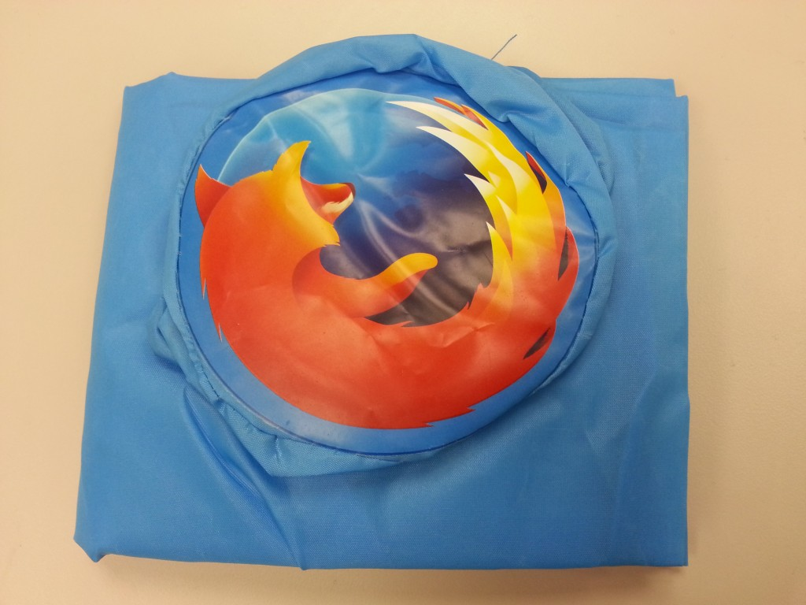

感謝大家熱情參與「12 月電子報有獎徵答」活動，共有 3 位幸運的得獎者，可以獲得 Firefox 環保購物袋一個！

本期電子報有獎徵答題目：

Mozilla 在不斷推出新技術，推動 Web 成為真正平台的同時，也努力讓 Firefox 更快、更安全，提供更有趣的自訂功能。2013 年 Firefox 再度提升了多少百分比的速度?

A. 66%

B. 77%

C. 88%

正確答案為 C. 88%

恭喜以下 3 位幸運的得獎者，再次謝謝您對 Firefox 的支持！

guavaking200***m@gmail.com

s832***4@yahoo.com.tw

tzengsh***u@gmail.com

主辦單位會在本週透過 Email 與得獎者聯繫，恭喜所有得獎的狐友們！

