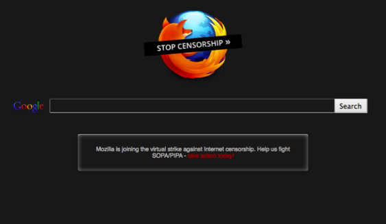

1 月 18 日發文當天，正值反 SOPA/PIPA 活動的二週年紀念。由於美國起草的該法案將傷害全球網路的開放性與自由性，因此 Mozilla 在 2012 年的今天將美國 Firefox 首頁塗黑，以[全力支持](https://blog.mozilla.com.tw/posts/107/)此虛擬的抗議行動。此黑色熄燈網頁在當天映入全美[數千萬名 Firefox 使用者](https://blog.mozilla.org/blog/2012/01/19/firefox-users-engage-congress-sopa-strike-stats/)的眼簾，其中有數百萬人更進一步了解 SOPA/PIPA 事件的來龍去脈並採取行動，更有數十萬人直接向國會發聲。

在 2012 年 1 月 18 日，Firefox 塗黑了預設開始頁面以表抗議。

這個結果對美國與全世界的立法官員來說，都是「著作權法案將影響網路開放性」的戲劇性例證。

透過此反 SOPA/PIPA 活動，網路社群也對此網路自由的主要威脅展開反擊。但即使行動成功，卻仍未能改變我們過去幾十年來所看到著作權法案的演變。著作權條款現已從原本二十八年的期限，延長到[作者生年再加上整整七十年](https://www.arl.org/focus-areas/copyright-ip/2486-copyright-timeline)。我們也看到因[過度指控線上拷貝活動](https://en.wikipedia.org/wiki/Sony_BMG_v._Tenenbaum)侵權而導致法定賠償激增；像是因規避數位版權管理 (DRM) 所造成的新型態負債；[誤控五十三歲的阿嬤盜拷《南方公園 (South Park)》卡通](https://news.cnet.com/8301-31001_3-10444879-261.html)而撤銷執法活動；而自動化移除 (Takedown) 系統普及之後，也曾發生[反過來告知系統本身侵權](https://www.tweaktown.com/news/32015/microsoft-files-dmca-takedown-with-google-against-itself/index.html)的案例。

隨著 Mozilla 不斷對 Web 與行動技術提出嶄新理念，我們也極重視著作權法在這幾年內的演變 ─ 不論是我們的產品開發心血，抑或是擴及創新者與使用者的全球社群皆然。

對目前自由且開放的網際網路來說，[「將著作權導向正軌」](https://www.eff.org/copyrightweek)是未來能否保有現今成果的關鍵。Mozilla 也將繼續為捍衛 Web 而努力。

原文連結：[Remembering SOPA/PIPA](https://blog.mozilla.org/blog/2014/01/18/remembering-sopapipa/)
