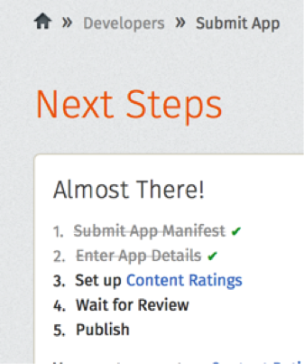
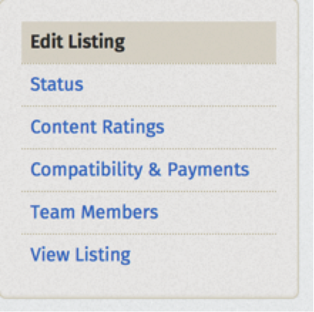
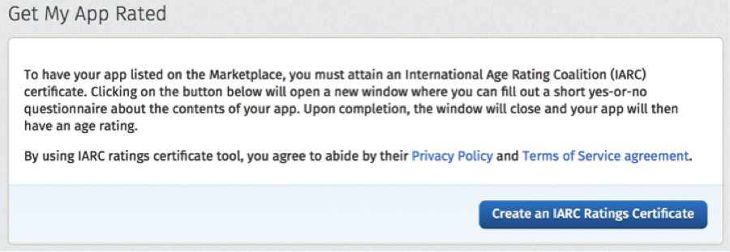
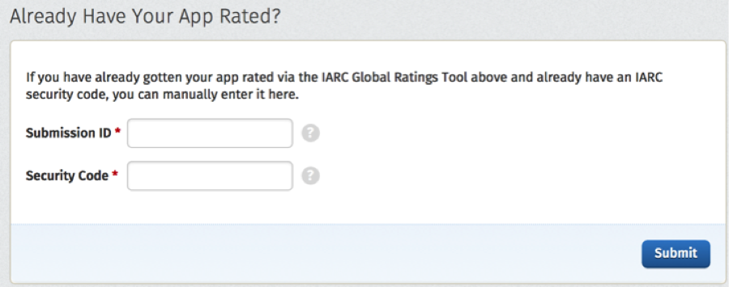
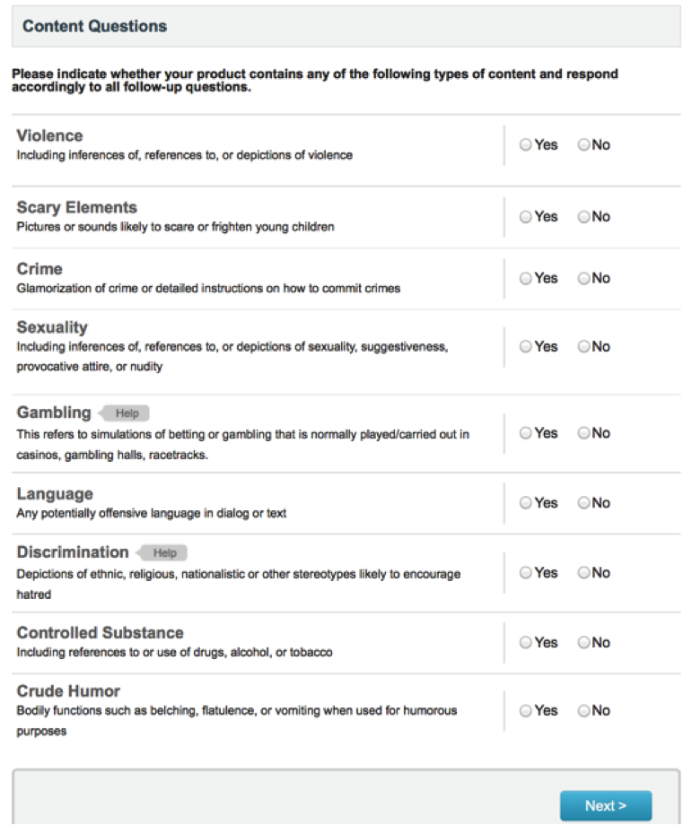
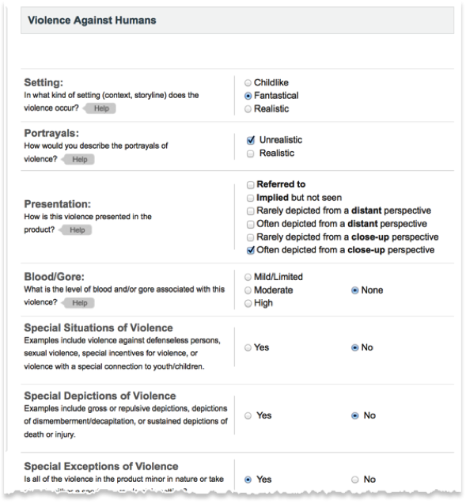
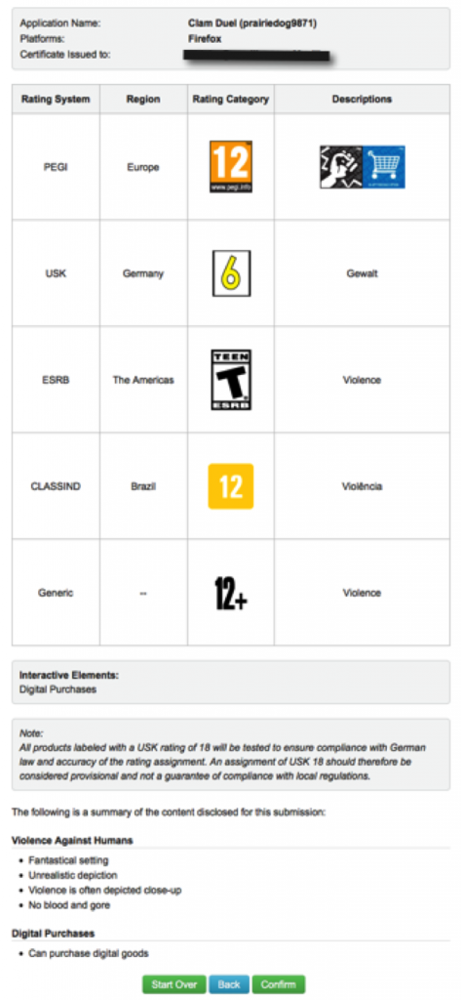

你是熱血的 Firefox OS 開發者，而且早已設計了許多 App 準備大展身手嗎？在透過 Firefox Marketplace 推銷自己的 App 之前，務必先完成 App 的適用年齡分級！否則在今年 4 月 15 日之後，消費者就沒辦法在 Marketplace 上看到你的 App 了！

Mozilla 與[國際年齡分級聯盟 (International Age Rating Coalition，IARC)](https://globalratings.com/) 合作，將所有 App 均納入適用年齡分級規範。Mozilla 關心使用者，並認為使用者應能自行選擇適合自己的內容。而從 2014 年 4 月 15 日起，凡 Firefox Marketplace 內的所有 App 均必須完成 IARC 分級。Mozilla 絕對在乎、愛護所有的 App，也必須要求所有 App 或遊戲完成內容分級。在 2014 年 4 月 15 日之後，只要是未完成內容分級的 App 均將強制從 Marketplace 下架。而 IARC 另提供免費工具讓開發者進行內容分級。

#### 有關 IARC 分級工具

IARC 是由多間國際級的分級委員會合力運作，針對以數位方式發佈於全球的 App 與遊戲，提供了相關工具作為內容分級的基準。只要填寫簡單表格，就會立刻收到所有分級委員會所制定的分級規範。此份規範不僅可協助消費者了解 App 的內容，亦可讓開發者不需個別取得各國的內容分級，進而大幅縮減成本與不便。

#### 支援國際分級系統

透過單一分級精靈功能，即可產生不同系統、國家、地區的內容分級。

分級系統
支援國家

[Classificação Indicativa](https://portal.mj.gov.br/classificacao/data/Pages/MJ6BC270E8PTBRNN.htm)
Brazil

[ESRB](https://www.esrb.org/)
Canada, Mexico, United States

[PEGI](https://www.pegi.info/)
Austria, Denmark, Hungary, Latvia, Norway, Slovenia, Belgium, Estonia, Iceland, Lithuania, Poland, Spain, Bulgaria, Finland, Ireland, Luxembourg, Portugal, Sweden, Cyprus, France, Israel, Malta, Romania, Switzerland, Czech Republic, Greece, Italy, Netherlands, Slovak Republic, United Kingdom

[USK](https://usk.de/)
Germany

通用
其他所有國家適用

#### 內容分級包含哪些項目？

分級系統將提供消費者三種資訊：

- 建議最小年齡 (The recommended minimum age) ─ 可能因各國民情風俗而有所差異

- 內容說明 (Content descriptors) ─ 該項資訊將說明 App 的所有內容，讓消費者了解自己關心的要點。其內可能包含暴力、酒/藥品使用參考、驚悚指數、實際/模擬博奕行為等資訊。

- 互動要素 (Interactive Elements) ─ 該項資訊將提供 App 與消費者互動功能的相關細節，如分享個人資料、分享所在地理位置、應用程式內部付費機制、可下載的內容，或社交網路工具。

分級程序僅需幾分鐘且完全免費，並已整合至 Firefox Marketplace 提交程序與開發者主控板中。任何 App 必須先完成分級才能進行審查。消費者可在 App 說明頁面上看到 App 對應其所在地區的分級，並取得自己想進一步了解的相關資訊。

#### 讓自己的 App 完成內容分級

IARC 即提供免費的遊戲分級工具，且大多數的 App 都能輕鬆又快速的完成分級。接著來看看分級程序。

注意：Mozilla 並不接受其他系統的分級認證。即使 App 已經完成其他系統的內容分級，開發者仍需要完成 IARC 認證程序。

- 登入 Firefox Marketplace 開發者網站。你必須以開發者身分登入，才會看到分級工具。

- 在 App 提交程序期間，就會進入 IARC 分級工具：  或可從 Dev Dashboard 找到分級工具： 

- 開始分級程序：  或可輸入現有分級的資訊： 

- 填寫簡單的問卷： 

- 為自己的 App 添加額外資訊： 

- 預覽並確認分級資訊： 

- 回到 Dev Dashboard 就會看到分級資訊。接著就可準備上架！

注意：開發者接著會收到電子郵件，內含分級認證與安全碼。請自行保留相關記錄備查。

Mozilla 開發者社群網站 (MDN) 原文連結：[Obtaining a Rating for Your App](https://developer.mozilla.org/en-US/Marketplace/Submission/Rating_Your_Content)

你也可參閱中文版：[取得 App 內容分級](https://developer.mozilla.org/zh-TW/docs/Mozilla/Marketplace/Submission/Rating_Your_Content)；並參閱 MDN 的更多 Firefox OS 或 Marketplace 相關文章。
