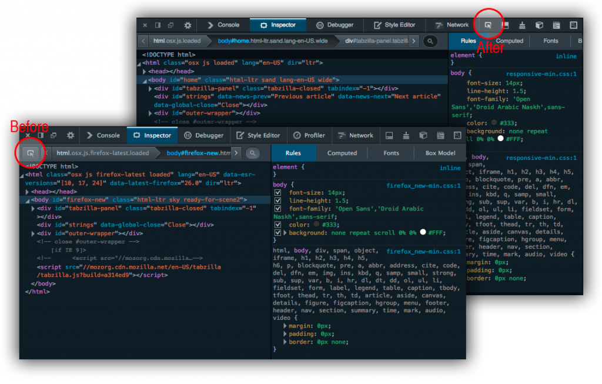

如果你常用到 [Firefox 開發者工具 (Firefox Developer Tools)](https://developer.mozilla.org/en-US/docs/Tools/)，那很快就會發現[檢測器](https://developer.mozilla.org/en-US/docs/Tools/Page_Inspector)元件中的「選取元素」功能將有所異動。

根據 [Bugzilla 的紀錄](https://bugzilla.mozilla.org/show_bug.cgi?id=916443)和 [Patrick Brosset](https://twitter.com/patrickbrosset) 的說明，這些「異動」包含：

- 在開發者工具中的「使用滑鼠選取元素」按鈕 (即節點檢測鈕)，將從目前檢測器面板工具列的左邊，搬到右邊的工具箱工具列之上： 

- 在檢測器面板內的 HTML 中，只要將滑鼠游標移至節點上方，就會出現該節點所對應的虛線框 (本來必須點擊節點才會出現對應的虛線框)。

- 未來將取消資訊框的「鎖定」狀態。目前只要在檢測器面板中選取了任一節點，或按下檢測按鈕並點擊頁面之後，就會出現該節點的資訊框。這個「鎖定」狀態有時會擋到開發者想看的元素，所以我們將之取消。異動之後，如果開發者沒有選取其他節點，節點資訊框就會跟著消失。

可到 YouTube 觀看[實際操作新功能](https://www.youtube.com/watch?v=zBYEg40ByCM)的影片。

這項異動可讓開發者更順暢的使用開發者工具。即使你選錯了節點，也能輕鬆查看其他節點。

你還希望 Firefox 開發者工具加入什麼樣的功能呢？[儘管告訴我們並協助回報錯誤](https://wiki.mozilla.org/DevTools/GetInvolved)。

原文連結：[Upcoming changes to the Firefox Developer tools node picker](https://hacks.mozilla.org/2014/01/upcoming-changes-to-the-firefox-developer-tools-node-picker/)
