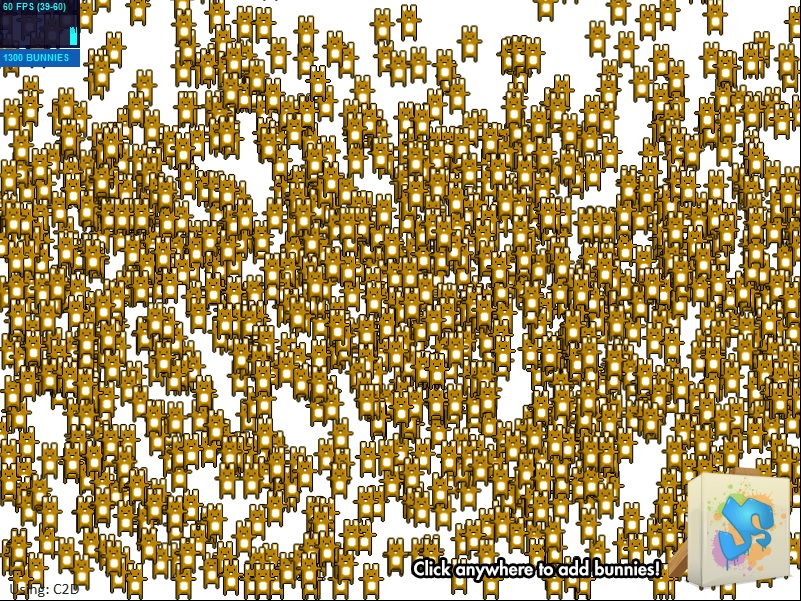
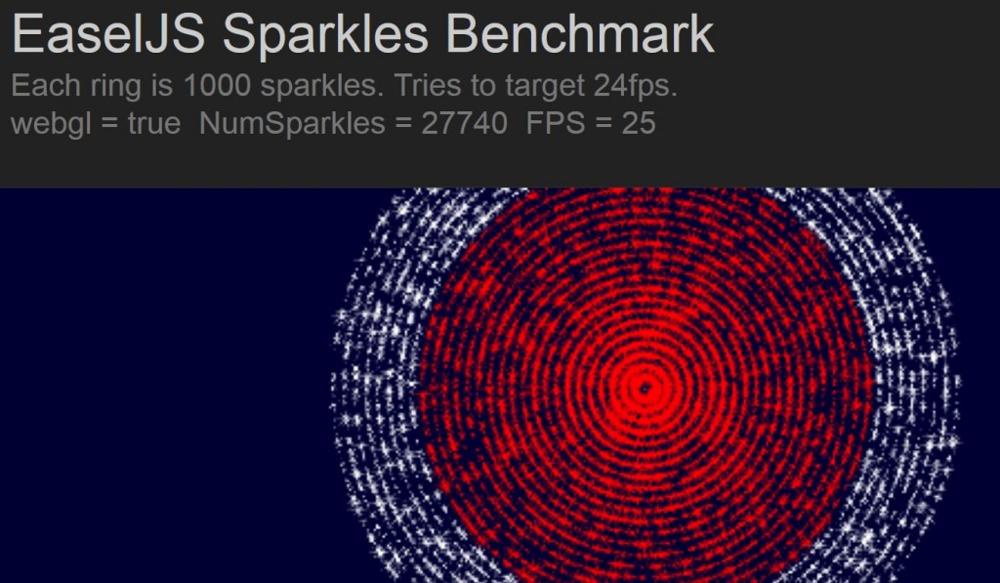
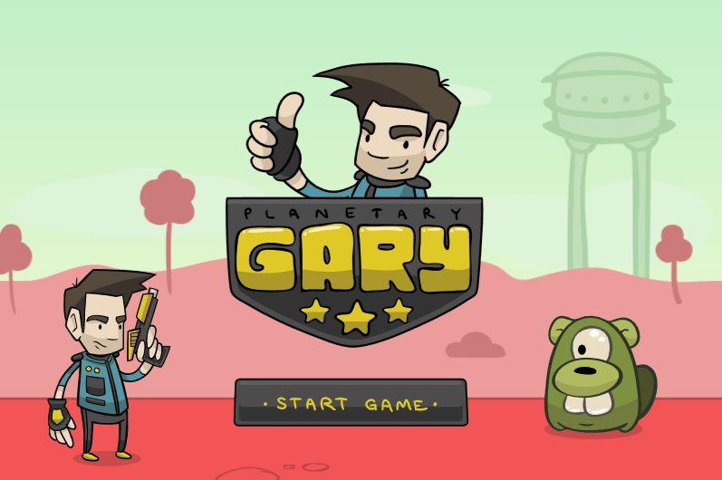

你對 Firefox OS 的遊戲開發，特別是 WebGL 與 CreateJS 的繪圖功能感興趣嗎？那你絕對不能錯過《[Firefox OS 適用的 WebGL 與 CreateJS (上)](https://blog.mozilla.com.tw/posts/4853/)》。

接著為大家介紹繪圖效能展示與小遊戲。

#### 範例 1： Bunnymark

Web 圖形處理的高人氣 (但限於特定族群) 效能量測基準就是 Bunnymark。此基準將測試任一繪圖器在 60fps 時，所能處理最多數量的跳躍小兔點陣圖動畫 (測試之後約達五倍快)。

- [Canvas 2D Bunnymark](https://createjs.com/Demos/EaselJS/bunnymarkEasel/?c2d=1)

- [WebGL Bunnymark](https://createjs.com/Demos/EaselJS/bunnymarkEasel/?c2d=0)

- [Firefox OS Installer](https://createjs.com/Demos/EaselJS/bunnymarkEasel/install.html)

下表即常見 Context2D 繪圖器與新 WebGL 繪圖器的 Bunnymark 效能比較分數。數字越高代表效能越好。

作業環境
Context2D
WebGL
變化量

2012 Macbook Pro, Firefox 26
900
46,000
51x

2012 Macbook Pro, Chrome 31
2,300
60,000
26x

2012 Win 7 laptop, IE11 (x64 NVIDIA GeForce GT 630M, 1 GB VRAM)
1,900
9,800
5x

Firefox OS 1.2.0.0-prerelease (early 1.2 device)
45
270
6x

Nexus 5, Firefox 26
225
4,400
20x

Nexus 5, Chrome 31
230
4,800
21x

這些數字顯示的最高 sprites 都在 60fps，所以只要降低幀率 (Framerate) 都能大幅提升上面的數字。另外值得注意的是，我們手邊的 Firefox OS 裝置雖然只是搶鮮版的 Firefox OS 1.2 裝置 (採用相對較低的 GPU 功率)，但我們還是看到效能大幅提升。

#### 範例 2： Sparkles Benchmark

這個簡單的展示頁面，即是在瀏覽器達到 24fps 的情況下，畫面所能顯示的最多顆粒數量。

- [Sparkles Benchmark](https://createjs.com/Demos/EaselJS/sparklesBenchmark)

- [Firefox OS Installer](https://createjs.com/Demos/EaselJS/sparklesBenchmark/install.html)

#### 範例 3： Planetary Gary

我們常透過 Planetary Gary 遊戲測試 CreateJS 函式庫的新功能。而針對本文所提到的要點，我們將現有遊戲翻新，以能順利使用新的 SpriteStage 與 SpriteContainer 類別，再於 WebGL 中繪製遊戲。

- [Planetary Gary](https://createjs.com/Demos/EaselJS/planetaryGary/)

整個過程只要修改三行程式碼或添增其他程式碼，真是出乎意料的簡單；而且確實展現新 API 的一致性、簡單易用等特色。此絕佳範例是以 Context2D 繪圖器的完整功能搭配 WebGL 繪圖器 (如遊戲本身) 的絕佳效能，進而架構出使用者介面的元素 (如開始畫面)。

而且此遊戲的美術部分均屬於向量圖形，可於執行時間 (使用 EaselJS 的 [SpriteSheetBuilder](https://www.createjs.com/Docs/EaselJS/classes/SpriteSheetBuilder.html)) 透過 Context2D 繪圖器畫為 sprites，接著再傳送到 WebGL 繪圖器。因此可調整圖形而達到最小檔案容量 (約傳輸 85kb 的容量)，獲得絕佳的效能！

### 未來規劃

我們已經把 WebGL 新繪圖器的[公開預覽版](https://github.com/CreateJS/EaselJS)放上 GitHub，讓社群能盡情測試並[提供意見](https://community.createjs.com/discussions/easeljs)。且不久之後就會納入下一個主要版本。

請在推特上持續追蹤 [@createjs](https://twitter.com/createjs) 與 [@gskinner](https://twitter.com/gskinner)，跟我們說你的想法並獲得最新消息。感謝你閱讀本文！

原文連結：[WebGL & CreateJS for Firefox OS](https://hacks.mozilla.org/2014/01/webgl-createjs-for-firefox-os/)
