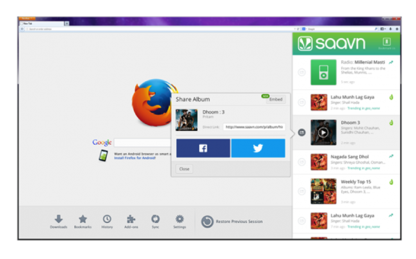

Firefox 完全針對使用者瀏覽 Web 的習慣而打造，如今 Firefox 更嘗試整合更多社交功能，讓使用者能輕鬆聯繫自己的親友。Facebook 在去年成為 Firefox 的第一位社交整合夥伴之後，又緊接著加入了 Cliqz 與 Mixi。而我們今天很高興能提供更多社交整合選擇，讓你能在 Firefox 中自由使用。

Firefox 新整合的社交服務包含：

#### Delicious:

透過 Delicious for Firefox，你就能在 Web 上隨時對自己的 Delicious 網路分享連結。在使用者瀏覽 Web 時，Delicious 就會儲存並整理你最愛的所有內容。使用者可輕鬆在 Firefox 側邊欄中找到這些內容。可到[這裡](https://delicious.com/tools)參閱 Delicious 帳號相關細節，並點擊下方的「[Tools](https://delicious.com/tools)」即可啟用 Delicious for Firefox。

#### Saavn:

Saavn 則是印度地區極受歡迎的音樂播放器，現在也整合進 Firefox 了。在你瀏覽 Web 時，Saavn for Firefox 可讓你輕鬆找到自己最愛的寶萊塢 (Bollywood) 或其他印度音樂。透過Firefox 的 Saavn 側邊欄，就會看到各地區的歌曲排行榜、最新發行的唱片、高人氣的歌曲點播清單、最受歡迎的無限電台。現在就到[這裡](https://www.saavn.com/firefox/?etype=tiny&usertoken=firefox)啟用 Saavn for Firefox。

我們很高興 Firefox 又加入了新的社交功能與服務，讓使用者擁有更完整的 Web 經驗。Mozilla 將繼續為 Firefox 導入更多絕妙服務。

更多相關資訊：

- [下載](https://mozilla.com.tw/firefox/new/) Windows、Mac、Linux 版 Firefox

- Windows、Mac、Linux 版 Firefox 的[版本說明](https://www.mozilla.org/firefox/27.0/releasenotes/)

- [下載](https://mozilla.com.tw/firefox/mobile/features/) Firefox for Android

- Firefox for Android [版本說明](https://www.mozilla.org/en-US/mobile/27.0/releasenotes/)

原文連結：[Firefox Adds New Social Partners](https://blog.mozilla.org/blog/2014/02/04/firefox-adds-new-social-partners/)
