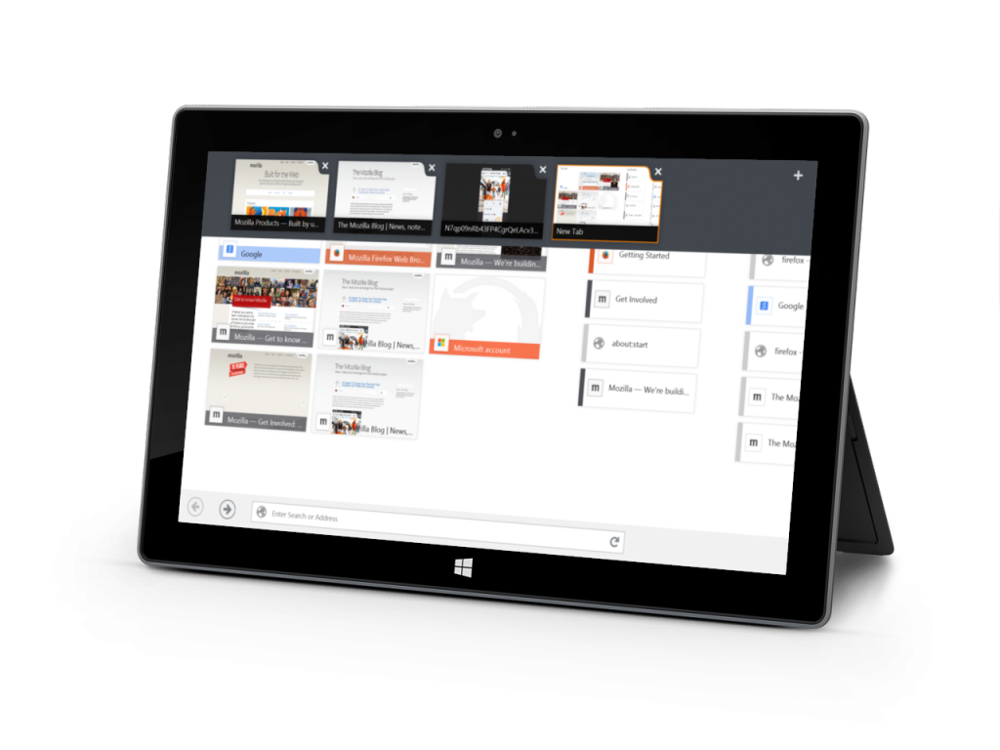

### 專為「動態磚」所設計 具備完善觸控介面

Firefox for Windows 8 Touch Beta 現已供下載並進行測試。此「動態磚」架構的 Firefox 具備更友善的觸控介面，並針對 Windows 8 Modern UI 進行最佳化。只要是搭載 Windows 8 的平板電腦、具備觸控螢幕的筆記型電腦，或其他相容的裝置，使用者均將透過 Firefox 獲得最佳的瀏覽經驗。

Firefox for Windows 8 Touch Beta 現具備新的動態磚 Firefox 啟動畫面，只要輕點一下即可進入書籤 (Bookmarks)、瀏覽記錄 (History)、常開網站 (Top Sites)。當然，你也可續用自己所熟悉的既有功能，如智慧位址列 (Awesome Bar)。

Firefox for Windows 8 Touch Beta 現可支援觸碰與滑動的手勢，如二指捏合以縮放畫面，或單點滑動以切換畫面。其他重要功能還有：

- 「全螢幕」、「貼齊」、「填滿」檢視模式 ─「全螢幕 (Full)」模式，可根據使用者的需求而以全螢幕檢視 App；「貼齊 (Snapped)」模式，則是將 App 置於螢幕的特定區域 (即如同一般側邊欄置於畫面左側)；「填滿 (Fill)」模式則是在其他 App 進入「貼齊」模式的同時，讓目前執行的 App 填滿主畫面區塊。

- 視覺領航 (Visual Navigation)：在開始畫面中的大型動態磚，將提供更豐富的瀏覽視覺經驗，以利使用者更輕鬆的辨識並觸控。動態磚式的介面可簡化 URL 的自動補完功能，讓搜尋作業更快更順暢。

- Windows 分享功能整合：針對使用者已安裝的任何社交網路，均可輕鬆分享完整網頁或網頁的部份內容。

在開始測試之前，請先將 Firefox Beta 設為 Windows 8 的預設瀏覽器。接著就可以[分享回饋意見](https://input.mozilla.org/feedback)並[提報錯誤](https://bugzilla.mozilla.org/enter_bug.cgi?product=Firefox&component=General&op_sys=Windows%208%20Metro&rep_platform=x86_64&version=unspecified&comment=Issue%3A%0D%0A%0D%0ASteps%20to%20Reproduce%3A%20%0D%0A%0D%0AActual%20Results%3A%20%0D%0A%0D%0AExpected%20Results%3A&status_whiteboard=%5BMetro%20Preview%5D)。

如果你正使用 Windows 8，則可進入 Windows 的「開始」畫面中找到 Firefox 動態磚。若是使用Windows 8.1，則請進入「應用程式」畫面，再將 Firefox 動態磚釘選到開始畫面之上。[可參閱本文進一步了解細節](https://support.mozilla.org/en-US/kb/good-news-firefox-now-touch-friendly)。最後請別忘了[分享你的意見](https://input.mozilla.org/feedback)並[提報錯誤](https://bugzilla.mozilla.org/enter_bug.cgi?product=Firefox&component=General&op_sys=Windows%208%20Metro&rep_platform=x86_64&version=unspecified&comment=Issue%3A%0D%0A%0D%0ASteps%20to%20Reproduce%3A%20%0D%0A%0D%0AActual%20Results%3A%20%0D%0A%0D%0AExpected%20Results%3A&status_whiteboard=%5BMetro%20Preview%5D)。祝測試愉快！

- [下載](https://www.mozilla.org/beta/) Firefox for Windows 8 Touch Beta

- Firefox for Windows 8 Touch Beta [版本說明](https://www.mozilla.org/en-US/firefox/28.0beta/releasenotes/)

原文連結：[Firefox for Windows 8 Touch Beta is Ready for Testing](https://blog.mozilla.org/futurereleases/2014/02/07/firefox-for-windows-8-touch-beta-is-ready-for-testing/)
