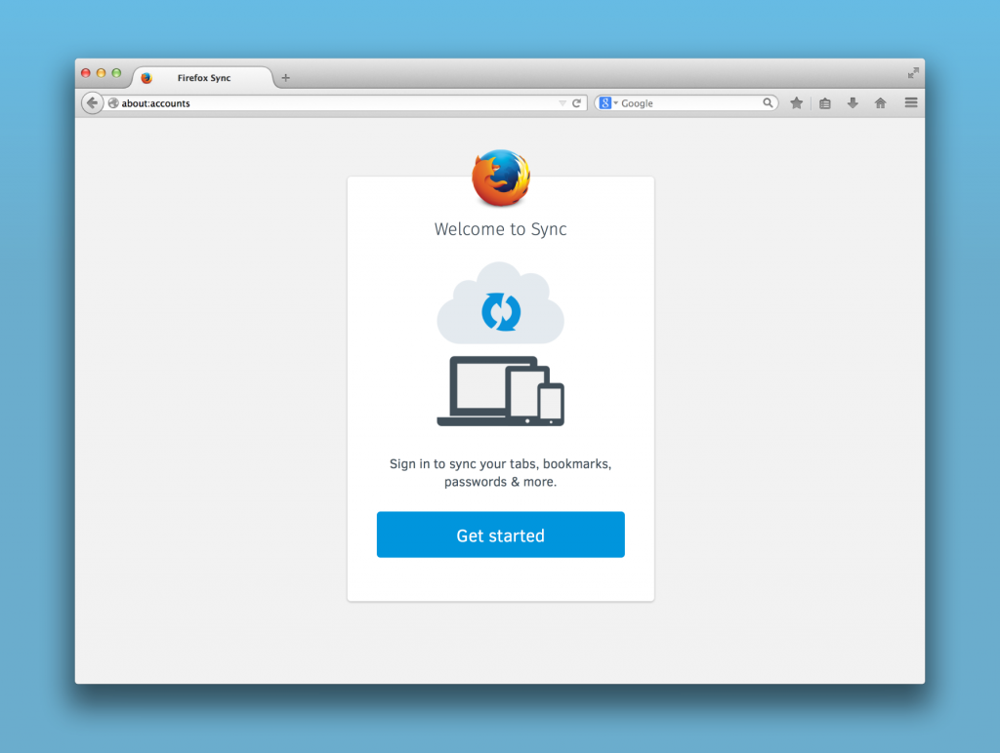
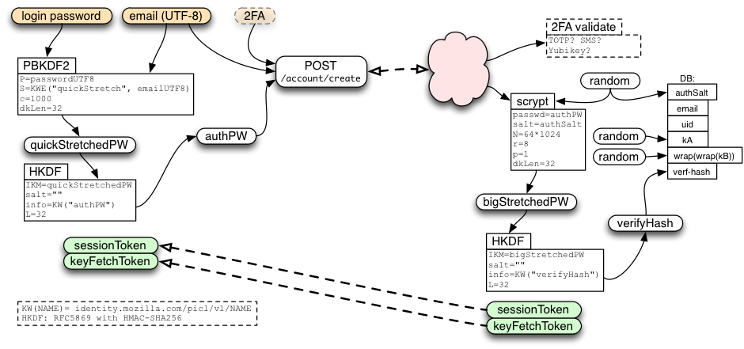

Mozilla 很高興能發表新版 Firefox Sync 同步功能，現已能於 Firefox 曙光版 (Aurora) 上進行測試。現有 Firefox Sync 使用者當然愛用這項服務，但也反應說相關設定仍稍嫌繁瑣，要新增其他裝置並不是很輕鬆；若要從遺失的裝置恢復設定資料更是困難。我們聽到了這些意見，也設計出更簡單的方式，期待能在 Firefox 桌面版與行動版之間安全同步資料。

新版 Firefox Sync 的初始設定更簡單，也可輕鬆添增其他裝置。如果想測試新的 Firefox Sync 功能，則只要在Windows、Mac，或 Linux 版 Firefox 中輸入電子郵件位址，再選用高強度又好記的密碼即可。接著就能輕鬆添增更多電腦或 Android 裝置進行同步。

#### 我要如何使用新的 Firefox S ync？

新的 Firefox Sync 功能現已可在 Firefox Aurora 上使用。若要進一步了解 Firefox Sync 的測試方式，可先參閱[本篇 Sumo 文章](https://support.mozilla.org/en-US/kb/how-sync-works-old-version-firefox?as=u&utm_source=inproduct)。

#### 安全性更高

Mozilla 一直是以透明的流程獲得大家的信任。也因為如此，我們這次仍同樣透過開放的方式，開發新同步功能所需的強大安全系統。

雖然 Firefox Sync 的設定與登入流程更為簡化，但對於使用者資料的安全性卻未曾妥協。新版同步功能具備與現有產品相同的端點對端點加密 (End to end encryption) 機制，但設定步驟更簡單。

讓新版 Firefox Sync 更簡單易用的關鍵，即在於我們根據使用者自己所設定的密碼，將之抽取而成資料加密所用的金鑰。也就是說，使用者設定的密碼強度越高，對自己的保障也就越完整。Mozilla 再從三個方向強化此基本方法：

第一，「Client side key stretching」這項技術可抵擋中間人攻擊 (man-in-the-middle attack，MITM)；就算 SSL 憑證遭到破解也能達到特定程度的防護效果。

第二，即使 Mozilla 伺服器遭到入侵，端點對端點加密機制也讓人難以存取使用者的資料。

第三，公開金鑰密碼系統 (Public key cryptography) 與 BrowserID 協定，可確實區隔出「驗證 (Authentication)」、「授權 (Authorization)」、「資料儲存 (Data storage)」伺服器，藉以減少經手驗證資料的伺服器數量並降低受攻擊的機會。

另可參閱 [Github 上的本篇技術文件](https://github.com/mozilla/fxa-auth-server/wiki/onepw-protocol)，以進一步了解新版同步功能的安全架構。

如同前一版的 Firefox sync 同步功能，使用者仍可選擇保留自己的資料，並透過[開放源碼的伺服端軟體](https://github.com/mozilla/fxa-auth-server)托管自己的同步服務。

Mozilla 仍不斷透過此新的安全架構汲取更多經驗，相信很快就能兼顧安全性與便利性的資料存取作業。

#### 接著下一步？

Mozilla 現正準備將新的 Firefox Sync 同步功能導入 Firefox 瀏覽器。緊接著就會讓 Firefox OS 整合此新的同步功能。

最後，為了能更輕鬆設計出更多的 Firefox Sync 附加功能，我們也為 Firefox 使用者建立了完整的帳號系統。Mozilla 將積極透過此系統提供新的服務，讓 Firefox 使用者享受有趣的新功能。

原文連結：[A Better Firefox Sync](https://blog.mozilla.org/services/2014/02/07/a-better-firefox-sync/)
