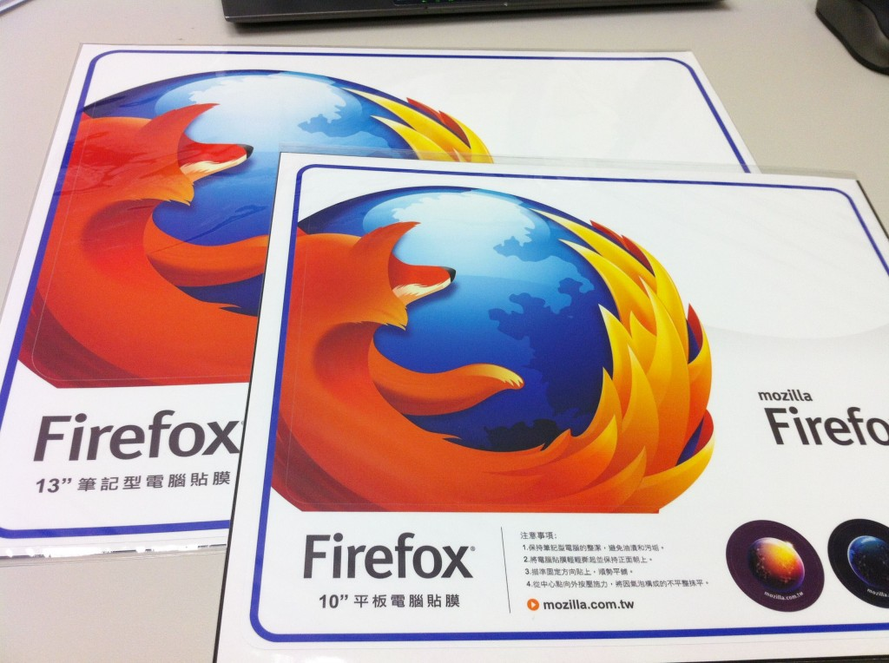

感謝大家熱情參與 2014 年「1 月電子報有獎徵答」活動，共有 3 位幸運的得獎者，可以獲得 Firefox 電腦貼一組！

本期電子報有獎徵答題目：

松下電器公司 (Panasonic Corporation) 與 Mozilla 共同宣佈合作關係，將攜手打造搭載 Firefox OS 的何種產品?

A. 智慧型電視 (Smart TV)

B. 個人電腦

C. 平板電腦

正確答案為 A. 智慧型電視 (Smart TV)

恭喜以下 3 位幸運的得獎者，再次謝謝您對 Firefox 的支持！

chaolong.***n@gmail.com

mars***g@gmail.com

chiencho***0@gmail.com

主辦單位會在本週透過 Email 與得獎者聯繫，恭喜所有得獎的狐友們！

