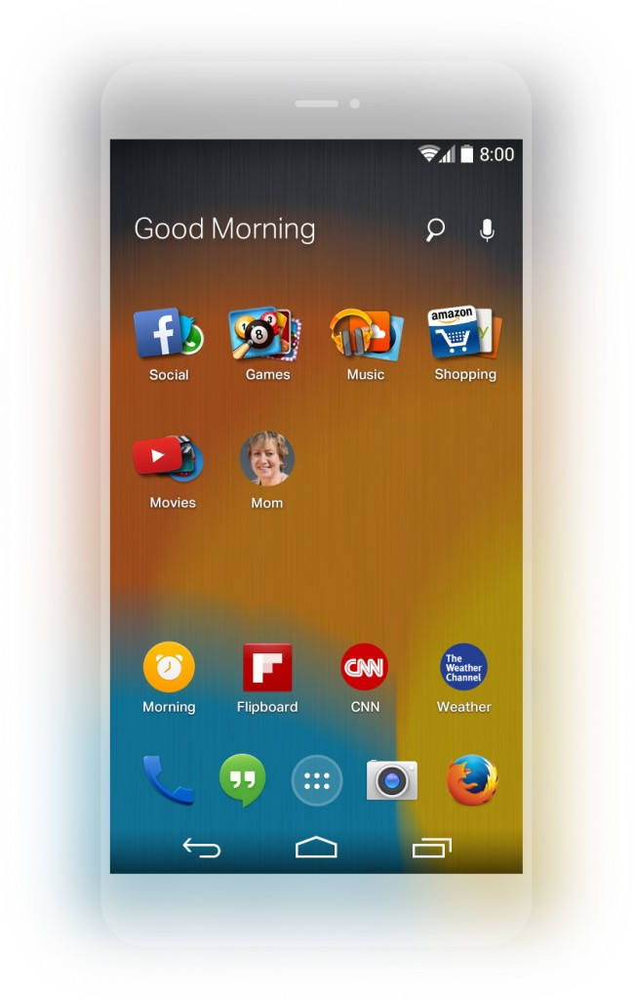

日前 Mozilla 與 EverythingMe 在 [InContext Conference](https://incontext2014.com/)，共同宣佈並提供預覽即將發表的 Firefox Launcher for Android。

Mozilla 與 EverythingMe 雙方攜手合作，期待讓所有人在不受地點、平台、裝置等的限制之下，都能擁有最佳的行動 Web 體驗。此外，我們也很高興能透過 Firefox Launcher for Android 此新產品共同拓展本身的工作，提供更聰明、更簡單、更新奇的方式，讓大家能依自己的需求而自訂 Web 經驗。

Firefox Launcher for Android 可讓使用者隨時輕鬆找出所需的內容，並已針對你的手機使用方式進行最佳化。此 App 整合了 EverythingMe 隨使用者情境調適的 App 搜尋功能，以及 Mozilla 的 Firefox for Android 瀏覽器，將為使用者提供有趣且直覺的個人化 Web 經驗。

產品完成開發並準備開始測試之前，Mozilla 將立刻分享相關消息。下圖則是運作中呈現的 App，讓大家一睹為快。

原文連結：[Preview of Firefox Launcher for Android](https://blog.mozilla.org/futurereleases/2014/02/05/preview-of-firefox-launcher-for-android/)
