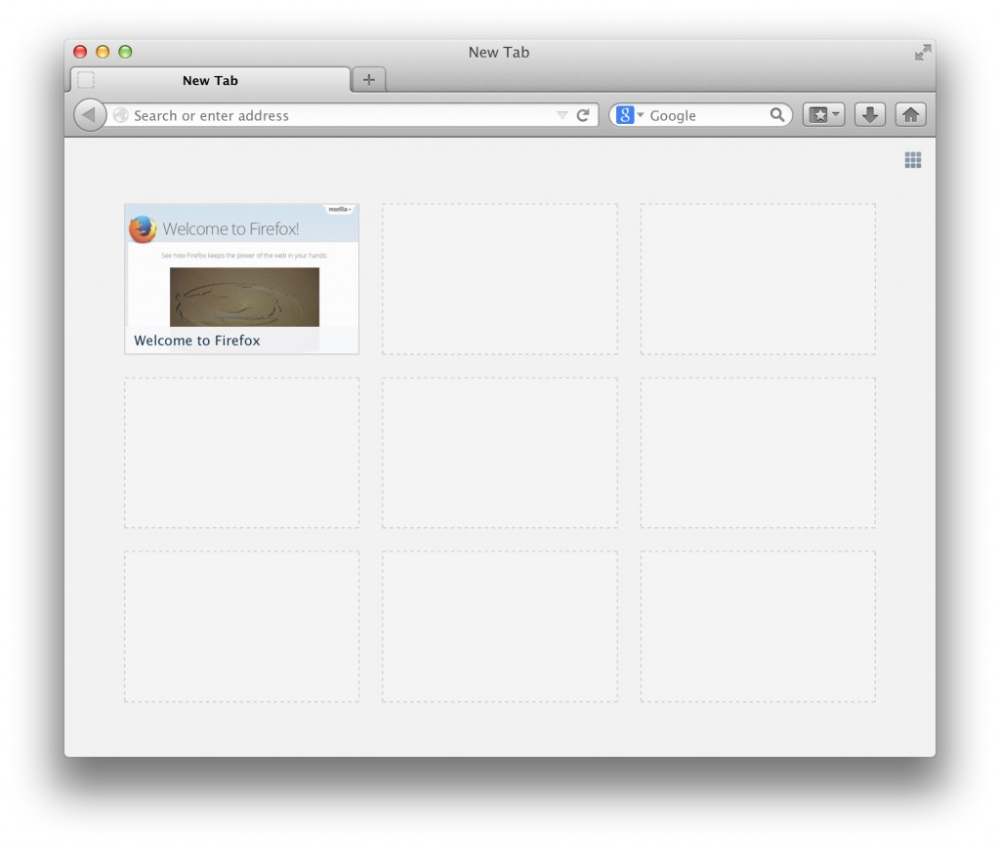

Mozilla 相信只要時時將使用者擺在第一位，就能敦促自己提供更豐富、更有意義的 Web 經驗。而 Content Services 團隊更奉此概念為圭臬。今天我們就要跟大家分享某些想法，並解釋我們為實踐此理念所邁出的第一步。

只要廠商真正重視使用者，那麼網站內容供應商 (發佈商或廣告商皆然) 都能跟著受惠。數位內容現已擴及於所有產業之中，而絕大部分歸功於數位內容可為使用者提供更多選擇與更完善的個人化。數位媒體的挑戰即在於其快速更迭的環境，昨天還有用的可能今天就失效了。

雖然 Mozilla 與數位內容團體 (特別是 IAB) 的看法不見得都一致，但我們認為 IAB 等團體也都同意「使用者的興趣」應納入首要考量。Mozilla 也樂意協助 IAB 會員提供更引人入勝的內容，進而強化整個 Web 生態系統。因此，在 IAB 主席[Randall Rothenberg](https://twitter.com/r2rothenberg) 本週邀請 Mozilla 參與其[年度領袖會議 (Annual Leadership Meeting)](https://www.iab.net/events_training/2014/alm/overview) 並分享理念時，我們當然不會錯過這個機會。而會議討論的主題之一就是〈內容服務的轉變 (Publisher Transformation)〉。我也在今早的一場演講中，向與會者說明了 Mozilla 最近的構想與行動。

#### 分類首頁磚 (Directory Tile) 方案

Mozilla 剛剛開始了相關研究活動，將藉由二項方案轉換使用者的網頁內容經驗。你可能已經看過其中一項稱為「User Personalization (UP)」的方案 (可參閱[第一](https://blog.mozilla.org/labs/2013/07/a-user-personalization-proposal-for-firefox/)、[第二](https://blog.mozilla.org/labs/2013/12/user-personalization-update)篇文章，或本篇[中文文章](https://blog.mozilla.com.tw/posts/3301))。我將來還會透過部落格文章更新相關訊息。

而我們將另一項最新方案稱為「分類首頁磚 (Directory Tile)」，旨在提升使用者對 Firefox 的首次接觸經驗。現在若是剛接觸 Firefox 的使用者開啟新分頁之後，就會看到：

開啟 Firefox 新分頁所出現的首頁磚，本來會填滿使用者「最近」與「最常」瀏覽的網站。但剛開始接觸 Firefox 的使用者一旦開啟新分頁，卻只會看到空白一片。對新使用者來說，這種首頁磚沒有任何意義或價值。

針對這類使用者，分類首頁磚方案將提供預先包裝過的建議內容。首頁磚內的某些內容可能取自於 Mozilla 的生態系統；可能是使用者所在地的高人氣網站；可能是與 Mozilla 關係密切的夥伴，為了協助推廣 Mozilla 使命所贊助的內容。而受贊助的首頁磚除了將清楚標示相關資訊之外，也將提供使用者會感興趣的內容。

Mozilla 很高興分類首頁磚將為使用者呈現更多 Firefox 的內在價值，並可透過我們一直強調的信賴感與透明性，進一步體現我們打造更美好網際網路的願景。最後協助 Mozilla 能永續經營更多元的專案。我們尚未建構出完整的產品藍圖，但已經開始與合作夥伴洽談可能的機會。一旦我們掌握到正確的使用者經驗，就會立刻讓新加入 Firefox 的使用者看到分類首頁磚的成果。

我們將透過此部落格持續更新分類首頁磚與其他新專案的資訊。記得把這裡加入你的書籤，以便隨時獲得最新消息。

原文連結：[Publisher Transformation with Users at the Center](https://blog.mozilla.org/advancingcontent/2014/02/11/publisher-transformation-with-users-at-the-center/)
