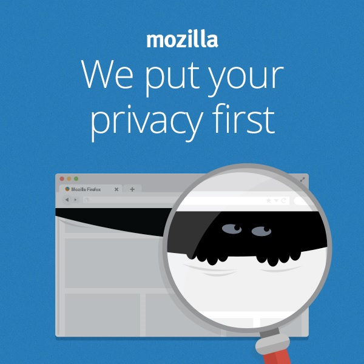

捍衛資料的隱私性深植於 Mozilla 基因中 ─ 大家都要能知道自己的資料有誰在存取、流向為何、能夠更全盤掌握並做出選擇。而在建構大家的網際網路之時，隱私權更是不可或缺的必要基礎。

“Individuals’ security and privacy on the Internet are fundamental and must not be treated as optional.”

「使用者的網路安全及隱私為基本要求，不能妥協。」─ 節錄自《[Mozilla 宣言](https://www.mozilla.org/zh-TW/about/manifesto/)》的「理念」第四點

全世界在每年的 1 月 28 日都會慶祝資料隱私權日 (Data Privacy Day)。這個國際性的紀念日，旨在強化大家對個人線上資訊的意識並推動相關的管理教育，並已獲得美國、加拿大，以及二十七個歐洲國家列為官方節日。

Mozilla 針對今年的資料隱私權日，特別提出開發者所應注意的隱私權陷阱：

### 1. 越多不見得越好

一般觀念都認為資料蒐集越多越好。但這樣也會對隱私權造成更高的風險，並需耗費更多心力進行額外作業。舉例來說，隱私權政策就會要求開發者公開：

- 你的 App 到底蒐集了哪些個人資訊

- 蒐集這些個人資訊的理由

- 在何處儲存這些個人資訊 (裝置上或其他地方)

- 基於哪些理由，會與哪些人共享這些個人資訊

- 保留這些個人資訊的期限

- 使用者該如何移除自己的資料

此外，開發者也必須確實執行曾向消費者告知的事項。

關鍵在於：開發者只要蒐集自己所需的資料就好。在 App 的規劃階段，就應確實列出資料的蒐集、使用、流向等要點。開發者應該要能逐筆整理個人資訊，並說明資訊的使用方式。如果你蒐得的個人資訊將用於 App 核心功能之外的附加功能，或未來可能會有的功能，就應該讓使用者選擇是否退出。

最後，開發者必須知道在蒐集何種類型的資料時，必須先取得使用者的同意。例如你想透過聲音、裝置相機、位置/位移感測器，獲得使用者的移動與活動資訊時，就應該先徵求使用者同意。

### 2. 不要把使用者的聯絡人資訊挪為私用

現在的 App 與網站幾乎都有「分享」按鈕，也都附上社交媒體的登入小程式。此類按鈕雖可讓使用者輕鬆分享資訊，但並不代表開發者能藉此任意存取使用者的聯絡人資訊。

開發者應尊重自己軟體的使用者，讓他們自行決定要和誰分享、所要分享的事/物，藉此建立使用者對開發者的信賴感，以及對產品的忠誠度。「信賴感」與「忠誠度」這二項東西的價值，絕對凌駕你是否能取得另一個陌生人的聯絡資料。

如果你就是 App 開發者，那麼除了研發作品之外，當然也必須兼顧消費者的隱私權。可別錯過《[App 開發者的五大隱私權潛在陷阱 (下)](https://blog.mozilla.com.tw/posts/4962/)》繼續了解其他三個陷阱！

原文連結：[Five Potential Privacy Pitfalls for App Developers](https://hacks.mozilla.org/2014/01/five-potential-privacy-pitfalls-for-app-developers/)
