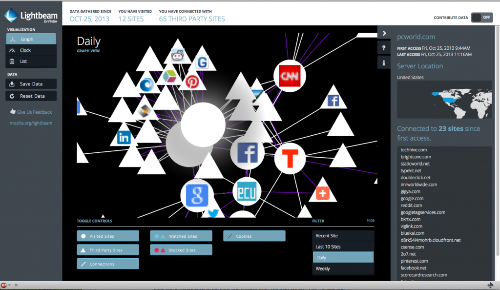

你就是 App 的開發者，早已有許多自豪的作品準備大展身手嗎？不論你現在是開發哪種平台的 App，都一定必須知道有關隱私權的問題。可別錯過了《[App 開發者的五大隱私權潛在陷阱 (上)](https://blog.mozilla.com.tw/posts/4957/)》所闡述的 Mozilla 隱私權概念與前二個潛在陷阱，才能完整了解五大隱私權潛在陷阱喔！

### 3. 公平交易你所蒐集的資料

使用者資料絕對是貴重資產，任誰都想蒐集個人資料。尤其在獲得使用者的許可之後，開發者更能進行正規的資料蒐集作業。雖然廠商常常要求消費者交出自己寶貴的個人資料，消費者卻很少獲得對等的回報 (如同本文[《上》篇](https://blog.mozilla.com.tw/posts/4957/)提到第二點的聯絡人資料為例，消費者可能根本不知道自己交出資料了)。

開發者若能抱持公平交易的心態來蒐集資料，可讓貢獻出本身資訊的使用者也取得對等回報 (如好用的功能、個人化的經驗等)，讓使用者感到自己受到尊重並確實掌握了己身資訊，開發者也能獲得無價的信任感與忠誠度。

### 4. 了解自己同意的所有隱私權條件

如果開發者採用了第三方服務 (如分析或廣告網站)，則由於第三方可能影響你的消費者，因此開發者除了自己的資料蒐集作業之外，也應該要了解第三方的資料蒐集作業。第三方程式碼或軟體開發套件，均可能內含你所不知道的程式碼。開發者的隱私權政策中，理應讓消費者知道第三方蒐集資料時的確切資訊。如果開發者自己也蒐集資料，當然也該告知消費者。

開發者最好能清楚知道第三方的公司名稱，與其對手上資料進行修改或刪除等的相關資訊。開發者最好也能讓消費者選擇是否拒絕類似的追蹤作業。

### 5. 談到隱私權時，絕對沒有單一政策能通用所有情況

即使開發者真的尊重使用者隱私權，但各地的法律規範和使用者的期待又多所不同。由於全世界的消費者都能接觸到 App，相關挑戰又更為複雜。Mozilla 無法給所有開發者完整的法律意見，但可以先分享幾項我們目前對不同國家消費者的研究結果：

- 在美國，無技術背景的消費者更關心社交圈是否追蹤自己的線上行為，其關注程度甚至超過對公司或政府的顧慮。

- 在泰國，親戚之間常常共用裝置，很少人會建立自己的帳戶或清除個人資料。

- 在德國與大多數的歐洲國家，消費者對於「個人資訊是否會分享給公司或政府」特別敏感。很多國家也基於此特性制定了嚴格法律。

- 在巴西，中產階級特別重視小偷竊取實體資產 (特別是行動電話) 的問題，甚至超越自己的線上隱私權。

基本上，若能[先與真正的消費者對談](https://blog.mozilla.org/privacy/2013/05/21/exploring-the-emotions-of-security-privacy-and-identity/)，絕對有助於建構 App 時實際兼顧到消費者對隱私權的顧慮。在與消費者交流溝通之後，不僅將能得知他們的特殊需求，也能了解形成這些喜好的動機與情緒。

就 Mozilla 的經驗而言，消費者較難以清楚表達自己對隱私權的概念。而對較重視隱私權的國家/個人來說，「隱私權」三個字又不見得「最」能打中他們心中的想法。與其使用「隱私權」這個詞，還不如詢問特定問題更能夠得到全面性的答案。舉例來說，與「單純找到某個受訪者，再抽象的討論隱私權」的方式相較，「消費者比較不排斥向哪些人分享個人資訊？理由為何？」這種問題的效果絕對更好。

你有類似上述陷阱的相關經驗嗎？或者曾經在工作上發生其他案例呢？歡迎到原文網站留言，或在下方直接以中文和我們討論！

原文連結：[Five Potential Privacy Pitfalls for App Developers](https://hacks.mozilla.org/2014/01/five-potential-privacy-pitfalls-for-app-developers/)
