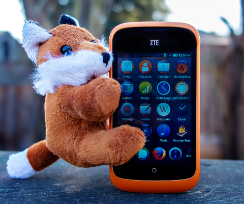
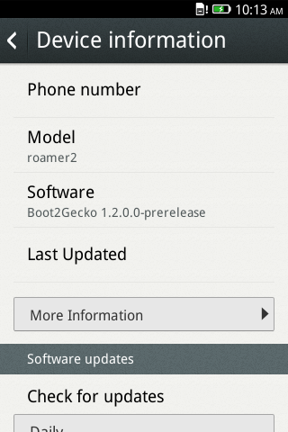

如果你手上有 ZTE Open，你可能已經[根據這篇文章](https://blog.mozilla.com.tw/posts/4730/)把手機升級到 Firefox OS 1.1 了吧？如果你真的完成升級，應該也已經知道 ZTE 釋出的 1.1 版本有個問題：fastboot 根本無法啟動。只要你是因為這個問題而暫時未升級，現在就到 ZTE 的網站上取得新版 1.1 吧。

依照你所購買的手機版本，必須另外注意該使用美國版 (US) 或英國版 (UK，也是歐洲版)的 Firefox OS。請先到 ZTE 支援網站的[美國版](https://www.ztedevices.com/support/smart_phone/b5a2981a-1714-4ac7-89e1-630e93e220f8.html)或[英國版](https://www.ztedevices.com/support/smart_phone/cba40ed6-d3ab-44c0-bdee-3a15803dc187.html)之一，進入「Downloads」分頁即可下載檔案。所下載的壓縮檔案即內含軟體升級說明文件。或可參閱我們[之前提供的說明](https://blog.mozilla.com.tw/posts/4730/)。

### 升級到 Firefox 1.2

Mozilla 很高興宣佈 ZTE 日前也提供 Firefox OS 1.2 版本了。如果你想跟著升級到 1.2 版，就必須先安裝正確的 1.1 版 (就是正確啟動了 fastboot 的版本；或是正確啟動 fastboot 的舊版 OS 也可)。接著你必須確認能以 USB 建立手機與電腦之間的連線。[本篇文章](https://blog.mozilla.com.tw/posts/3732/)則說明應如何針對 USB 連線而設定 Windows、Linux、Mac 等裝置 (如果你想在開發期間將 App 送進手機，就必須完成特定幾項條件)。

最後必須在自己的桌機上安裝 [Android Developer Toolkit](https://developer.android.com/sdk/index.html)，並透過此工具包取得 fastboot。你不需安裝完整工具包，只要將 /platform-tools/ 資料夾下的 adb 與 fastboot 複製到 Linux 或Mac OS X 裡的 /usr/bin 下即可；或者將其他資料夾新增至 $PATH 之後，亦可將此二者複製到該資料夾下。

在正確設定自己的手機與桌上型電腦之後，就用 USB 線銜接手機與電腦，並在主控台 (即Windows 的命令提示字元視窗) 中透過下列指令重新開機：

fastboot reboot

					1

						fastboot reboot

如果手機可自行重新開機，就能順利進行升級作業了。接著透過 ZTE 的 Dropbox 帳戶下載[美國版](https://www.dropbox.com/sh/rnj3rja7gd54s98/32KXfFmedN/P752D04_DEV_US_20131212_v1.2.7z)或[英國版](https://www.dropbox.com/sh/rnj3rja7gd54s98/_twgXEkMFH/P752D04_DEV_EU_20131212_v1.2.7z)。如果你正使用 Windows，亦可[下載特定說明](https://www.dropbox.com/sh/rnj3rja7gd54s98/6ZoJwmlRjn/Installation%20Instruction.docx)以及[升級工具](https://www.dropbox.com/sh/rnj3rja7gd54s98/-fyi2XHFPG/upgrade_tool)，讓自己輕鬆安裝新版作業系統。但本篇文章所提的步驟可適用於所有作業系統 ─ Linux、OS X、Windows，且不需其他的特殊工具。

下載檔案之後，即可將檔案解壓縮並開啟主控台。請注意這些步驟均會清除你的個人資料，所以請確實先行備份，再找到上述檔案所在的資料夾。同樣請於主控台中鍵入以下指令：

adb reboot bootloader

					1

						adb reboot bootloader

這時等手機重新開機即可。在重新開機期間，可執行下列指令：

fastboot flash boot boot.img
fastboot flash userdata userdata.img
fastboot flash system system.img
fastboot flash recovery recovery.img
fastboot erase cache
fastboot reboot

					123456

						fastboot flash boot boot.imgfastboot flash userdata userdata.imgfastboot flash system system.imgfastboot flash recovery recovery.imgfastboot erase cachefastboot reboot

升級之後即可看到軟體版號

如果一切順利，那你的手機這時應該重新開機了。你可發現 ZTE 提供的 1.2 版還包含許多測試用 App。就依照自己的喜好決定是否留用吧。

恭喜！現在你的手機已經執行 Firefox OS 1.2 版了！現在即可享受最新版 Firefox OS 所有已修復的錯誤、[給使用者的新功能](https://www.mozilla.org/en-US/firefox/os/notes/1.2/)、[給開發者的新功能](https://developer.mozilla.org/en-US/Firefox_OS/Releases/1.2)。

如果你對升級作業有任何問題，歡迎到 [StackOverflow Q&A](https://stackoverflow.com/questions/tagged/firefox-os) 上提出你的疑問。你將享有數千名開發者的專業意見，包含我們的技術傳教士團隊在內都樂於為大家釋疑。

### 2014-02-05 更新

由於某些使用者在升級到 1.2 之後遇到開機問題，因此我們修改了特定步驟。也有使用者反應說 fastboot 測試 (fastboot 重新開機) 無法運作，但卻仍可執行指令碼；這點我就無法確認了。只能請大家多多嘗試並讓我們知道結果。

原文連結：[Upgrading your ZTE Open to Firefox 1.1 or 1.2 (fastboot enabled)](https://hacks.mozilla.org/2014/01/upgrading-your-zte-open-to-firefox-1-1-or-1-2-fastboot-enabled/)
