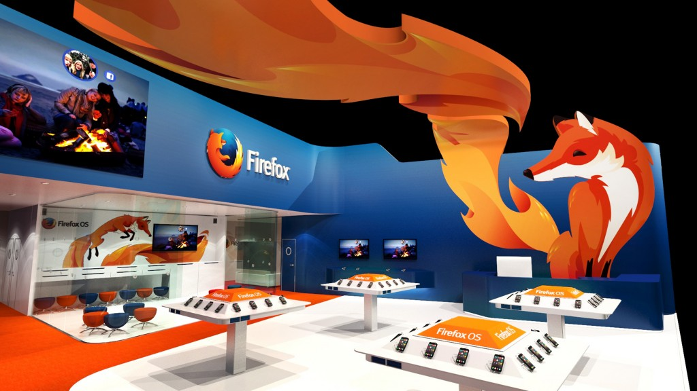

### 會場將發表新一代 HTML5 平台與多項合作夥伴行動裝置

【2014 年 2 月 19 日，台北訊】一年一度的全球行動通訊大會 (MWC 2014) 2 月 24 日起即將於西班牙巴塞隆納登場，以推動網路、平等、開放為宗旨的美商謀智 (Mozilla)，將在 4 天會期中發表 Firefox OS 首年發展成果。本次盛會 Mozilla 除了將展出包含中興通訊 (ZTE)、阿爾卡特 (TCL)、樂金 (LG) 等合作夥伴搭載 Firefox OS 的嶄新行動裝置，同時也將與 LINE、YouTube、Facebook、Pinterest 等內容發佈夥伴合作展示最新 HTML5 App。

Mozilla 位於 MWC 2014 的展區

經過 1 年的努力，以台灣為研發重鎮、完全以 Open Web 的標準所打造而成的 Firefox OS 已獲致亮眼成果。Firefox OS 行動裝置已迅速在拉丁美洲搶下一席之地，並且已在包含歐洲9國在內的全球 14 國家市場中現身。同時目前 Firefox OS 已擁有來自全球性與地區性的兩家營運商與 3 家手持裝置製造商的支援與合作。任何本地化客戶若要從功能性手機轉用智慧型手機，均可透過 Firefox OS 的靈活性輕鬆完成自訂，進而滿足自己的獨特需求。

Mozilla 展區位於 Fira Gran Via 的 3 號展場 (Hall 3) 3C30 區，將展示由中興通訊 (ZTE)、阿爾卡特 (TCL)、樂金 (LG) 提供最新 Firefox OS 硬體，另也將讓大家搶先預覽最新 Firefox OS 所提供的新世代使用者經驗。同時，Mozilla 也會與包含 LINE、YouTube、Facebook、Twitter、Napster、Aviary、Soundcloud、Pinterest、Evernav 等內容合作夥伴共同展示 HTML5 App，達成消費者對智慧型手機所期待的功能與效能。

此外，[Firefox Marketplace](https://www.mozilla.org/en-US/apps/) 與 [Firefox for Android](https://www.mozilla.org/en-US/mobile/) 最新版本產品也將在大會中亮相：

- Ÿ[Firefox Marketplace](https://www.mozilla.org/en-US/apps/)：此開放環境將兼顧 Web 使用者與開發者的需求，納入最頂尖與地方特色的 App。

- Ÿ[Firefox for Android](https://www.mozilla.org/en-US/mobile/)：為可自訂的解決方案，將進一步整合經銷夥伴與第三方服務，並得以讓更多人與裝置之間發生互動。

#### 更多 Mozilla MWC 2014 相關訊息

Ÿ2014 MWC Mozilla 展區資訊：西班牙巴塞隆納 Fira Gran Via, Hall 3, Stand 3C30

Mozilla 專題演講：

- Mozilla 技術長 Brendan Eich 將於 2 月 26 日參與大會「The Future of Voice」座談會，將針對變化中的跨產業語音服務，和大家討論最新的策略與技術。

- Mozilla 隱私長 [Alex Fowler](https://blog.mozilla.org/press/bios/alex-fowler/) 將主持 2 月 27 日的「Mobile and Privacy: Building Trust Through Transparency, Choice and Control」研討會。席間將討論行動 OS 所能提供的隱私選擇、愈受重視的 App 隱私權規範、隱私權對企業的意義、所在位置分析與隱私權等主題。

了解更多 Mozilla 在 MWC 的內容：[http://www.mozilla.org/mwc](https://www.mozilla.org/mwc)

Ÿ即時 Mozilla 訊息，請參閱美商謀智部落格：[http://blog.mozilla.com.tw/main](https://blog.mozilla.com.tw/main)

最新 Mozilla 新聞發佈，請參閱美商謀智新聞室：[http://blog.mozilla.com.tw/press](https://blog.mozilla.com.tw/press)

原文連結：[Mozilla Showcases First Year of Success with Firefox OS at Mobile World Congress 2014](https://blog.mozilla.org/blog/2014/02/18/mozilla-showcases-first-year-of-success-with-firefox-os-at-mobile-world-congress-2014/)
