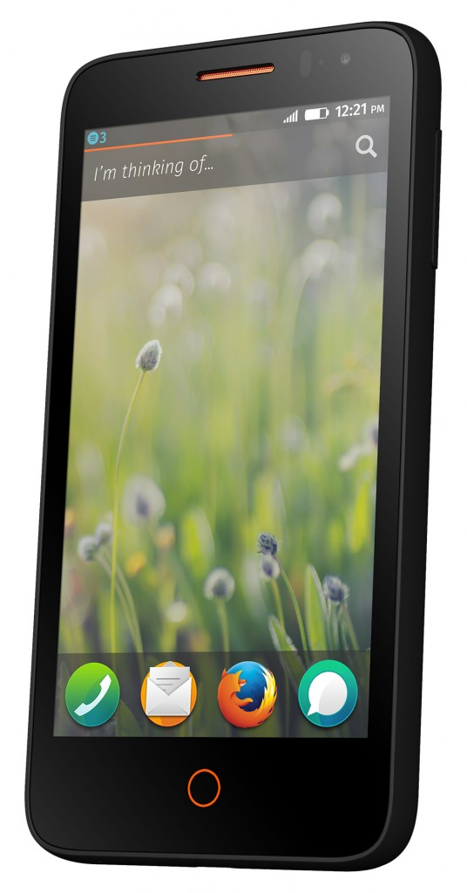

#### 新的 WebAPI、PhoneGap 整合、新款參考平台手機發表 鴻海、威盛均加入平板電腦 Contribution Program 行列

【2014年2月23日，西班牙巴塞隆納訊】以推動網路、平等、開放為宗旨的美商謀智 (Mozilla)，於今日發表新款參考平台硬體與工具，除了將加速強化 Firefox OS 生態系統外，也能讓 OEM 廠商、開發者、電信廠商使用更快速、更簡單、更經濟的裝置，建置創新的 Web App 並打造個人化 Firefox OS 經驗。繼鴻海 (Foxconn) 之後，威盛電子 (VIA) 也加入 Mozilla 在今年 1 月啟動的 Firefox OS 平板電腦 Contribution Program，為全球開發者提供 7 吋螢幕「Vixen」參考平台平板電腦 (Reference tablet)，Firefox OS 平板電腦 與支援用生態系統將可望更加強化。

Mozilla 本次發表 4.5 吋螢幕的雙核心參考平台手機 (Reference phone)，期望協助開發者測試新版 Firefox OS的功能，並了解 App 是否能因應不同的記憶體容量而順利運行。Mozilla同時也擴大平板電腦Contribution Program，以期協助開發者測試 App 並帶動 Firefox OS 平板電腦版本的開發。

Firefox OS 新開發者工具與硬體帶起生態系統之動能

再者，Mozilla 也宣佈新的 Firefox OS PhoneGap 整合計畫，可讓眾多 PhoneGap 開發者快速將現有 App 移植到 Firefox OS 上。新的 WebAPI 另將持續縮短原生 App 與 Web App 之間的差距。在今年全球行動通訊大會 (MWC 2014) 上，Mozilla 也發表了即將推出的開發者工具，OEM 廠商與電信業者能對應不同客戶層輕鬆自訂所須 Firefox OS。

開發者一直是引領 Web 創新、讓 Web 成為 App 開發與散佈平台的關鍵。透過這些新的 WebAPI、工具、參考平台裝置，將有利 Mozilla 催化 Web App 的成長，並繼續弭平其他 App 生態系統所設下的限制。Web 不僅能簡化 App 開發過程、減少目前雜亂的分化 (Fragmentation) 情形，也賦予開發者選擇托管自己 App 的權力，或透過 Firefox Marketplace 銷售 App，藉此直接掌握與消費者之間的關係。

最近由 Vision Mobile 所發佈的[報告](https://www.developereconomics.com/reports/q1-2014/)顯示，開發者對 Firefox OS 有興趣的比例在短短半年內已達 7%。此份報告另外強調在 2014 年 Q1，已有 52% 的行動開發者使用 HTML5 開發行動網站或 Web App，另外還有 16% 的開發者表達其加入意願。

另由 Strategy Analytics 所提出的調查結果也指出，要為 Firefox OS 開發行動 App 的開發者人數，在今年[可望達成 3 倍](https://www.strategyanalytics.com/default.aspx?mod=pressreleaseviewer&a0=5437)以上成長，在在顯示開發者對 Firefox OS 的興趣大幅超越其他行動平台。

業界的成長動力，是來自於目前數百萬名 Web 開發者均透過 HTML5 進行程式設計，而這些開發者也渴望不需要再學習新的程式語言，或不須針對特定行動平台雇用工程師，即可大步邁入行動產業。

下列不斷擴充的 WebAPI、工具、參考平台硬體，均將帶領 Firefox OS 生態系統不斷茁壯，並證明 Web 確實是 App 開發與佈建的強大平台。

#### 新款參考平台手機 (Reference Phone)

在 MWC 2014 上，Mozilla 將為大家呈現嶄新開發者參考平台手機 ─ Firefox OS Flame，讓開發者能在實際環境中搭配行動網路與真正的硬體特性參數 (如 NFC、Accelerometer、相機)，確實測試 Firefox OS 的效能。如同目前已上市的 Firefox OS 手機，Flame 參考平台手機同樣搭載高通 (Qualcomm) 製造的 1.2GH 雙核心處理器，讓開發者能輕鬆測試高處理器需求的 App 與遊戲。若要針對較小記憶體的特定 Firefox OS 手機設計 App，開發者可調整 Flame 的 RAM 容量 (256MB ~ 1GB)，確認 App 可在較低規格的手機上執行。Flame 亦搭載最新版的 Firefox OS，以利開發者或初期使用者測試每夜更新 (Nightly) 版，並發佈至整體開發平台之上。

Firefox OS Flame (參考平台手機) 規格一覽：

- Qualcomm MSM8210 Snapdragon ─ 1.2GHZ 雙核心處理器

- 4.5 吋螢幕 (FWVGA 854×480 畫素)

- 相機：機背鏡頭 5MP / 前方鏡頭 2MP

- 3G UMTS 四頻 (850/900/1900/2100)

- 8GB 記憶體

- 256MB ~ 1GB RAM (開發者可自行調整)

- A-GPS、NFC

- 電池容量：1,800 mAh

- WiFi: 802.11 b/g/n、Bluetooth、Micro USB

 

#### 眾多 PhoneGap 使用者現可開發 Firefox OS

於 3 月初發佈的下一版本 PhoneGap ，將[開始支援 Firefox OS](https://hacks.mozilla.org/2014/02/building-cordova-apps-for-firefox-os/)。廣受跨平台 App 開發者所喜愛的PhoneGap，是基於 Cordova 的領導開發工具。Cordova 是Apache 基金會知名的開放源碼專案，可將 HTML5 App 封裝為原生 App。Firefox OS 與[Cordova](https://cordova.apache.org/) 完成整合後，PhoneGap 即能順利支援 Firefox OS 的 App 與相關開發。

PhoneGap 屬於行動 App 開發框架，已擁有許多忠實的開發者。該框架是以 Apache Cordova 開放源碼專案為架構。開發者只要以 HTML、CSS、JavaScript 撰寫 App 一次，即可將之佈署至多款行動裝置中，且其功能與原生 App 完全相同。在整合 Firefox OS 後，開發者僅須再進行最低程度的作業，即可將現有的 PhoneGap App 迅速移植到 Firefox OS 之中。如須更多資訊，可參閱[本篇 Mozilla Hacks 文章](https://hacks.mozilla.org/2014/02/building-cordova-apps-for-firefox-os/)。

#### 應用程式管理員 ( App Manager ) 可即時製作原型並除錯 簡化 App 開發過程

「應用程式管理員 (App Manager)」可讓行動 App 開發者也能使用 Firefox 開發者工具。應用程式管理員將展現 Web 力量，協助開發者透過自己的桌上型電腦，直接於 Firefox OS 手機上進行 Web

App 測試、佈署、除錯等作業。目前已有數百萬名 Web 開發者是以 Firefox 的 Web 開發工具來撰寫網頁。現更能搭配應用程式管理員而延伸相關功能，以熟悉的相同流程順利開發行動 App。開發者不須再下載其他 SDK 即可使用應用程式管理員，一如 Firefox 瀏覽器已整合的其他開發工具。

由於應用程式管理員與 Firefox OS 都使用了 Open Web 技術，所以除錯、即時編輯、製作原型等作業均極為簡單。舉例來說，若有 OEM 廠商或電信商想針對不同客戶，設計出不同商標的首頁主題，只要使用應用程式管理員，即可在桌上型電腦上開發主題，且在連上 Firefox OS 手機之後，就能即時觀看手機上的顯示效果，不需額外的編譯時間。可參閱[此篇 MDN 文章](https://developer.mozilla.org/zh-TW/docs/Mozilla/Firefox_OS/Using_the_App_Manager)以進一步了解。

#### 新的 WebAPI 與產業普及度

包含 2013 年發佈的至少 8 個 API 在內 (包含 [WebNFC](https://wiki.mozilla.org/WebAPI/WebNFC) 與 [Data Store API](https://airpingu.github.io/data-store-api/index.html))，Mozilla 現已率先提供超過 30 個 [WebAPI](https://wiki.mozilla.org/WebAPI)。針對 App 的開發活動，這些新的 API 已為 Web 建構了更多功能與特色。隨著這些 API 逐漸完成標準化的同時，相關產業的普及度也越來越高。三星電子 (Samsung) 已將 Vibration API 與 Battery Status API 添增至 WebKit 中；如 Apache Cordova 與奧多比 (Adobe) 的 PhoneGap 等工具，現亦已納入 6 個最常用的 WebAPI。

#### 鴻海 與威盛電子 加入平板電腦 Contribution Program

Mozilla 於 1 月[啟動平板電腦 Contribution Program](https://blog.mozilla.com.tw/posts/4679/)，旨在加速建構平板電腦版本的 Firefox OS 與支援用的生態系統。計畫啟動後，鴻海科技集團也率先加入成為首位硬體合作夥伴。緊接在鴻海之後，[威盛電子](https://apc.io/blog/2014/02/21/apc-takes-part-in-informational-sessions-inside-mozillas-booth-mwc-2014/)也加入 Firefox OS 平板電腦 Contribution Program 的行列，為全球開發者提供 7 吋螢幕的「Vixen」參考平台平板電腦 (Reference tablet)。開發者現可透過[本篇 Mozilla Hacks 文章申請加入此計畫](https://hacks.mozilla.org/2014/02/open-applications-tcp/)。

參考平台平板電腦 (Reference Tablet) 規格一覽：

威盛 Vixen:

- 7 吋 1024×600 HD LCD 螢幕

- 1.2 GHz 雙核心 Cortex-A9 處理器

- ARM Mali-400 雙處理器 GPU

- 8GB 儲存容量

- 1GB RAM

- 相機：前方鏡頭 0.3 MP / 機背鏡頭 2.0 MP

- 802.11 b/g/n WiFi

鴻海 InFocus:

- 10 吋螢幕 (1280 x 800 像素、24 位元高彩)

- A31 (ARM Cortex A7) 四核心 1.0GHz，內含 PowerVR SGX544MP2 GPU

- 16GB儲存容量

- 2GB RAM

- 相機：機背鏡頭 5MP / 前方鏡頭 2MP

- A-GPS

- 電池容量：7,000 mAh

- WiFi: 802.11 b/g/n、Bluetooth、Micro USB

Mozilla 技術長 Brendan Eich 表示：「很明顯的，由於原生 App 與 Web App 之間的技術差距，有越來越多開發者選用 Web 作為行動 App 開發平台。我們聽見開發者想把 Web 作為主要開發平台的訴求，也認為這些新進開發者所關注的 WebAPI、硬體、工具，現已由 Mozilla 與其合作夥伴完成大幅進展。很高興能在 2014 年看到更多、更精采的行動創新成果。」

#### 更多 Mozilla at MWC 2014 相關訊息

Mozilla 展區資訊：西班牙巴塞隆納 Fira Gran Via, Hall 3, Stand 3C30

Ÿ了解更多 Mozilla 在 MWC 的內容：[http://www.mozilla.org/mwc](https://www.mozilla.org/mwc)

Ÿ即時 Mozilla 訊息，請參閱美商謀智部落格：[http://blog.mozilla.com.tw/main](https://blog.mozilla.com.tw/main)

Ÿ最新 Mozilla 新聞發佈，請參閱美商謀智新聞室：[http://blog.mozilla.com.tw/press](https://blog.mozilla.com.tw/press)

原文連結：[New Developer Hardware and Tools Show Firefox OS Ecosystem Momentum](https://blog.mozilla.org/press/2014/02/developer-momentum-2/)
