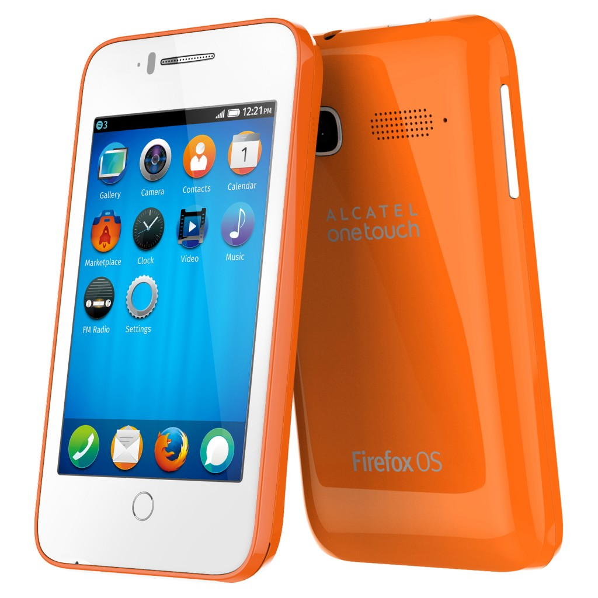
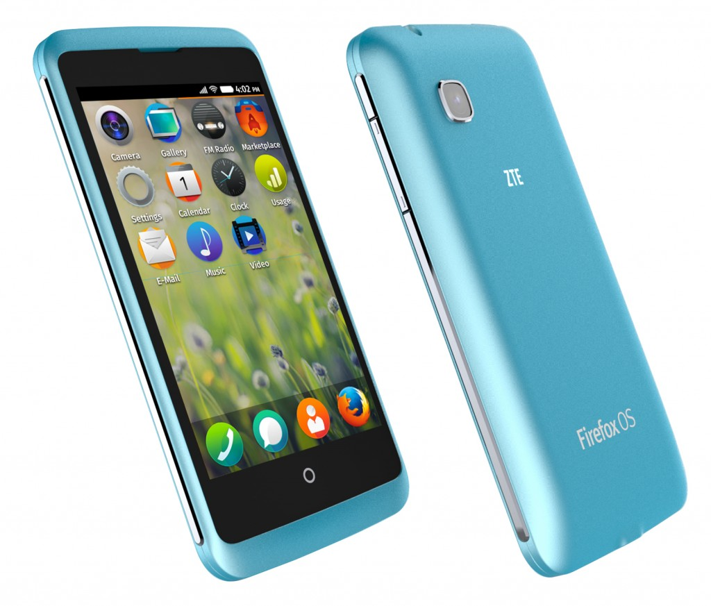

#### 獨有自訂技術催生多項高人氣 App 與服務內容 Firefox Marketplace 已達數百萬次下載

【2014 年 2 月 23 日，西班牙巴塞隆納訊】以推動網路、平等、開放為宗旨的美商謀智 (Mozilla)，於 2014 全球行動通訊大會 (MWC 2014) 發表包含中興通訊 (ZTE) 、華為 (Huawei) 與阿爾卡特 (ALCATEL ONETOUCH) 等合作夥伴搭載雙核心處理器的多款 Firefox OS 行動裝置，將 Firefox OS 裝置推向更高效能。同時 ，Mozilla 也公布 Firefox OS 未來版本將提供包含直覺的新瀏覽功能、強大的通用搜尋 (Universal search) 功能、支援 LTE 網路與雙 SIM 卡、輕鬆分享內容、Firefox Accounts 等有趣且創新的功能與服務，即將改寫入門級智慧型手機的定義。

#### 擴充生態系統

目前如 阿爾卡特 (ALCATEL ONETOUCH)、華為 (Huawei)、樂金 (LG)、中興通訊 (ZTE) 等行動裝置合作夥伴，均為不同消費族群量身打造多款智慧型手機，再將 Firefox OS 帶入這些裝置之中。今天發表的 Firefox OS 裝置則搭載了雙核心處理器，可提供更好的效能、更高的螢幕解析度，還有更多特色功能。最新款 Firefox OS 裝置已加入 ZTE 的 Open C 與 Open II；Alcatel ONETOUCH 的 Fire C、Fire E、Fire S，以及 Fire 7 平板電腦的產品行列，這些產品均使用高通 (Qualcomm) 所製造的 Snapdragon™ 處理器。

阿爾卡特、華為、LG與與中興通訊皆針對不同消費者推出多樣化搭載 Firefox OS 智慧型手機。

Firefox OS 智慧型手機在初次發表的幾個月內，已現身於 15 個重要市場中。而今日宣佈新加入的 3 家電信營運商與新拓展的全球市場，將使 Firefox OS 更加茁壯。Firefox OS 生態系統已如燎原之火，將催生智慧型手機以外更多規格的裝置。而 Mozilla 也正透過 Web 的開放特性，全力為該生態系統打造公平競爭的環境。舉例來說，松下電器 (Panasonic) 即將推出 Firefox OS 的智慧電視 (Smart TV)；鴻海科技集團 (Foxconn) 與威盛電子 (VIA) 正積極參與研發 Firefox OS 平板電腦。此外，Mozilla 更和多家供應商合作，為所有客層巿場提供更多選擇。

基於 Web 有潛力成為全球最大的巿集，Firefox OS 的相關 App 與服務內容也正蓬勃發展。Firefox OS 提供了 Firefox Marketplace 與隨使用者情境調適的 App 搜尋功能 (Adaptive App Search) 等兩種方式，能確實發掘並運用 App 與服務內容 。此種創新的搜尋方式可在發現並取得 App 之後，供使用者選擇單次使用或下載保存，進而更有效的運用資料與儲存容量。

Firefox Marketplace 現已有數千名開發者的 App 上架，具高人氣的全球性 App 與本地特色 App 亦已達數百萬次下載。最高排名的全球性 App 包含迪士尼 (Disney) 的《小鱷魚愛洗澡 (Where’s My Water)》、Cut the Rope、Facebook、EverNav、HERE、Line、Pinterest、SoundCloud、The Weather Channel、TimeOut、Twitter、Yelp、YouTube。

搭載最新 Firefox OS 的中興通訊 Open C 將第今年第 2 季於委內瑞拉與烏拉圭上巿。

由於開發者均使用基本 Web 技術，且 Firefox Marketplace 的上架限制也不多，因此催生更多本地化與小眾市場的 App，為消費者提供更具當地特色的內容。目前最高人氣的新本地化 App 包含 Despegar.com 旅遊預訂服務、Capp World Cup 焦點訊息、Captain Rogers 遊戲、Manana 閱讀器、Napster、SurfTime，還有更多 App。

#### Firefox OS 的未來

在今年全球行動通訊大會 (MWC 2014) 上，Mozilla 說明對 Firefox OS 的來年期待，也分析 Web 作為平台的諸多可能性。

Firefox OS 將隨著消費者的使用習慣進化，透過如離線使用、用量統計 (Cost Control)、上述的 Adaptive App Search 等功能，進而配合個人的興趣與需求。Firefox OS 可提供其他平台或裝置所無法比擬的自訂功能，就是因為 Firefox OS 是以 Web 的彈性技術所打造，也是用所有人都能自訂的「模組化」基礎要件設計出使用者介面。

未來版本的 Firefox OS 將提供有趣且創新的功能與服務，包含直覺的新瀏覽功能、強大的通用搜尋 (Universal search) 功能、支援 LTE 網路與雙 SIM 卡、輕鬆分享內容、自訂喜歡的鈴聲、更換主畫面、Firefox Accounts，以及更多進階功能。

新版 Firefox OS 將強化多項效能，可大幅提升使用者經驗，包含啟動時間更短、捲動更順暢、點擊鍵盤更精確。

以下為 Firefox OS 即將提供的其中幾項功能：

- 不論是營運商與製造商，或是開發者與使用者，都能享受更多自訂選項。如自訂自己喜歡的鈴聲、更換主畫面等功能，都是因應 Firefox OS 使用者的要求而設計。

- 新的通用搜尋功能，幾乎將顛覆手機搜尋網頁內容的方法。此功能可用於任何畫面之中－ 只要從頂端往下滑動，即可找到新的 App；亦可瀏覽 Web 或手機上任何內容。

- 全新的使用者操作介面能進行直覺、順暢、智慧的多工作業，就像使用者與 Web 的互動方式。使用者可輕鬆由左滑至右側，即可於多個 App、網頁、內容之間切換；有趣又節省時間。

- 不再需要 Wifi 或數據連線，只需 NFC 即可安全、輕鬆、直接分享內容甚至軟體更新檔。

- 支援 LTE 之後，可達到更高速的行動體驗。

- Firefox OS 亦將納入 Firefox Accounts 與相關服務。Firefox Accounts 可讓使用者安全且輕鬆建立帳戶，往後亦可隨時登入 Firefox。Mozilla 另將透過 Firefox Accounts 整合更多服務，包含 Firefox Marketplace、Firefox Sync 同步、備份、儲存等功能。即使手機遺失或遭竊，也可透過服務將手機定位、傳送訊息，甚至清除內部資訊。

隨著平台的演變，Firefox OS 將針對行動產業導入新的技術。Mozilla 現正引領如遊戲、隱私與安全以及 WebRTC 及其他更多服務。若合作夥伴想提供額外服務，以滿足個人或各地區客戶的需求，Firefox OS 絕對是最佳平台。

先期範例包含：

- Telefonica 提供極實用的用量統計 App，讓客戶可管理帳戶的數據流量。

- Deutsche Telekom 剛宣佈自家公司妥善利用 Firefox OS 的自訂特性，針對「Future of Mobile Privacy」專案開發了新的隱私功能。此專案亦獲得 Mozilla 鼎力襄助，針對行動裝置建置高效率、可因應使用者隱私需求的相關功能。

- WebRTC 開放的標準技術，可進行如語音與視訊電話的即時通訊作業，以用於聊天、圖片/檔案分享，或電信營運商想為消費者提供的其他高階服務。使用者透過 WebRTC，不論是選用哪種平台或服務供應商，均可撥打電話到任何桌機或行動裝置。

Mozilla 行動副總裁 Andreas Gal 表示：「我們很高興看到 Firefox OS 生態系統成長如此迅速，並讓消費者、開發者、合作夥伴能一同建構行動經驗的未來。Firefox OS 將更加成熟並增添更多功能，提供其他智慧型手機望塵莫及的選擇與自訂特色。Mozilla 更高興能看到由全球社群、開發者、合作夥伴所貢獻的開放平台，並建構出諸多功能與服務。」

#### 更多 Mozilla at MWC 2014 相關訊息

Mozilla 展區資訊：西班牙巴塞隆納 Fira Gran Via, Hall 3, Stand 3C30

Ÿ了解更多 Mozilla 在 MWC 的內容：[http://www.mozilla.org/mwc](https://www.mozilla.org/mwc)

Ÿ即時 Mozilla 訊息，請參閱美商謀智部落格：[http://blog.mozilla.com.tw/main](https://blog.mozilla.com.tw/main)

Ÿ最新 Mozilla 新聞發佈，請參閱美商謀智新聞室：http://blog.mozilla.com.tw/press

原文連結：[Firefox OS Expands to Higher-Performance Devices and Pushes the Boundaries of Entry-Level Smartphones](https://blog.mozilla.org/press/2014/02/firefox-os-news-2/)
