### 支援 CSS 原始檔對應、網路效能分析，還有更多功能

Firefox 29 現已進入[曙光版 (Aurora) 釋放頻道](https://www.mozilla.org/en-US/firefox/aurora/)了。依照慣例，讓我們來看看此版本的開發者工具有哪些重大變化吧！

#### 更美觀的工具

除了新功能之外，這次也更新了暗 (Dark)、亮主題 (Light theme) 的外觀與視覺感受。我們徹底翻修過亮主題，並讓此二種主題在整個工具箱中達到更一致的設計。現在可透過[工具箱選項](https://developer.mozilla.org/en-US/docs/Tools_Toolbox#Settings)更改目前的主題。[(可參閱此開發討論記錄)](https://bugzilla.mozilla.org/show_bug.cgi?id=957117)

[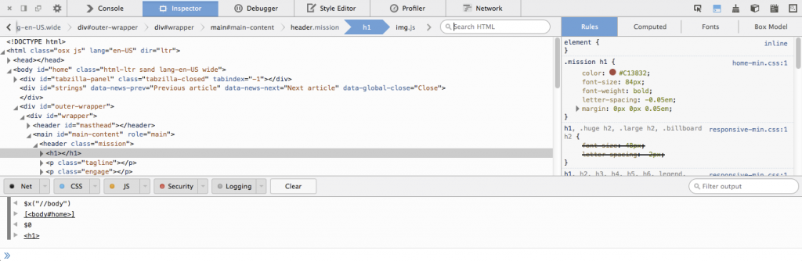](https://hacks.mozilla.org/wp-content/uploads/2014/02/theme-light-inspector.png)

[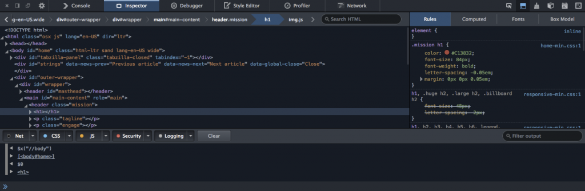](https://hacks.mozilla.org/wp-content/uploads/2014/02/theme-dark-inspector.png)

#### 網路監測器

網路監測器 (Network Monitor) 現可顯示瀏覽器載入頁面不同部位時所需的時間。如此不論是首次執行或已有快取的情況，均可協助測得 App 的網路效能。[(可參閱此開發討論記錄)](https://bugzilla.mozilla.org/show_bug.cgi?id=946601)

[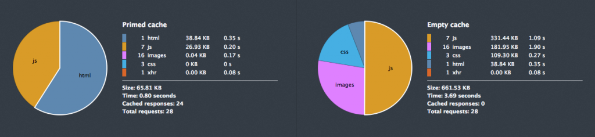](https://hacks.mozilla.org/wp-content/uploads/2014/02/network-piechart.png)

若要開啟效能分析工具，只要點選「網路 (Network)」面板中的碼錶圖示即可。若需更多相關資訊，可觀看下方短片或[參閱本篇MDN 文章](https://developer.mozilla.org/en-US/docs/Tools/Network_Monitor#Performance_analysis)。

現在也能以 Data URI 的格式複製圖片請求。只要對圖片請求按下滑鼠右鍵，在右鍵選單中點選「以Data URI 複製圖片 (Copy Image as Data URI)」，就可將 Data URI 複製到剪貼簿中。[(可參閱此開發討論記錄)](https://bugzilla.mozilla.org/show_bug.cgi?id=964014)

[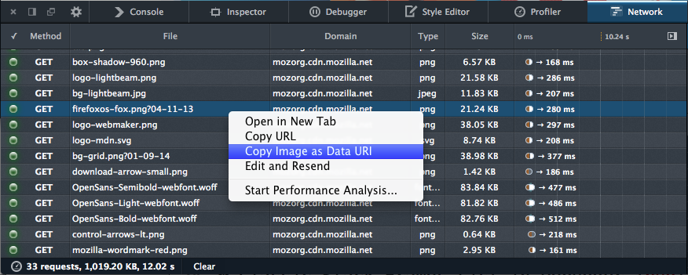](https://hacks.mozilla.org/wp-content/uploads/2014/02/copy-as-data-uri-network.png)

#### 檢測器

我們[更新了檢測器 (Inspector) 的內容強調行為](https://hacks.mozilla.org/2014/01/upcoming-changes-to-the-firefox-developer-tools-node-picker/)，讓更多工具都具備此強調功能。[(可參閱此開發討論記錄)](https://bugzilla.mozilla.org/show_bug.cgi?id=916443)

CSS 的 transform 屬性預覽工具提示功能，現已新增到 CSS 規則檢視之中了。現在只要將滑鼠游標停留在 CSS 的 transform 之上，就會看到工具提示並搭配 transform 的視覺呈現效果。快去下載 Firefox Nightly 或 Aurora 即可體驗某些[現成的 CSS transfom 範例](https://developer.mozilla.org/en-US/docs/Web/CSS/transform#Live_examples)。[( 可參閱此開發討論記錄 )](https://bugzilla.mozilla.org/show_bug.cgi?id=726427)

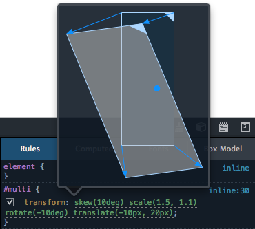

CSS 規則檢視現支援一次貼上多個 CSS 宣告，例如

background: #ccc; color: red

[( 可參閱此開發討論記錄 )](https://bugzilla.mozilla.org/show_bug.cgi?id=913630)

如同「網路」面板中的功能，開發者現可用 Data URI 的格式複製  元素。[( 可參閱此開發討論記錄 )](https://bugzilla.mozilla.org/show_bug.cgi?id=964014)

#### 樣式編輯器

樣式編輯器 (Style Editor) 現已新支援 CSS 原始檔對應功能 (Source map) [( 可參閱此開發討論記錄 )](https://bugzilla.mozilla.org/show_bug.cgi?id=926014)，且可於樣式編輯器中自動完成 CSS 屬性與數值。[( 可參閱此開發討論記錄 )](https://bugzilla.mozilla.org/show_bug.cgi?id=717369)

想了解更多相關資訊嗎？可參閱本篇《[Live Editing Sass and Less in the Firefox Developer Tools](https://hacks.mozilla.org/2014/02/live-editing-sass-and-less-in-the-firefox-developer-tools/)》。

[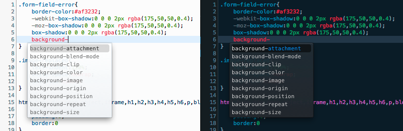](https://hacks.mozilla.org/wp-content/uploads/2014/02/style-editor-autocompletion.png)

#### 除錯器

除錯器 (Debugger) 中，我們在資源清單旁邊新增了典型的呼叫堆疊 (Call stack) 清單。[(可參閱此開發討論記錄)](https://bugzilla.mozilla.org/show_bug.cgi?id=905981)

[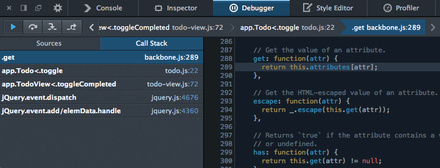](https://hacks.mozilla.org/wp-content/uploads/2014/02/debugger-call-stack-list.png)

除錯器現具備新的「啟用/停用所有中斷點 (Enable/disable all breakpoints)」按鈕，可一次啟用現有的全部中斷點，進而迅速切換一般用途或除錯作業。[(可參閱此開發討論記錄)](https://bugzilla.mozilla.org/show_bug.cgi?id=815280)

[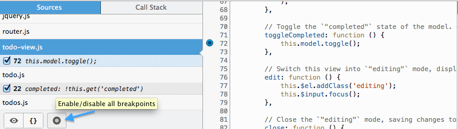](https://hacks.mozilla.org/wp-content/uploads/2014/02/enable-disable-breakpoints.png)

現在也能在除錯器中強調並檢視 DOM 節點。如果將滑鼠游標置於變數清單中的 DOM 節點上，就會強調顯示網頁上的節點。如果點擊「檢測」圖示，隨即會在檢測器分頁中開啟該節點。現亦能在主控台的輸出結果中找到此功能。[(可參閱此開發討論記錄)](https://bugzilla.mozilla.org/show_bug.cgi?id=952277)

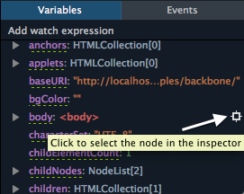

Pretty printing 現也可用於程式碼註解之上了。我們現在用上了開放源碼的 [pretty-fast](https://github.com/mozilla/pretty-fast) 工具，所以很快就能獲得漂亮的畫面。因為此工具標榜了「快 (fast)」，如果你發現速度還是跟以前一樣慢，請別忘了通知我們。[(可參閱此開發討論記錄)](https://bugzilla.mozilla.org/show_bug.cgi?id=921163)

#### 主控台

我們強化過了 console.trace。此呼叫堆疊可將輸出結果整理到同區塊之內顯示，並包含連結以存取除錯器中的每一行。[( 可參閱此開發討論記錄 )](https://bugzilla.mozilla.org/show_bug.cgi?id=790309)

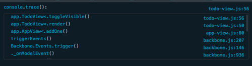

我們也強化了主控台物件輸出功能，可根據物件類型而顯示其他資訊。[( 可參閱此開發討論記錄 )](https://bugzilla.mozilla.org/show_bug.cgi?id=843004)

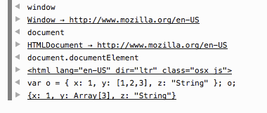

#### 程式碼編輯器

在如除錯器、程式碼速記本 (Scratchpad)、樣式編輯器 (Style Editor) 等所有工具之中，現在都能看到程式碼編輯器 (Code editor) 了。開發者可在此版本中看到其中幾項更新：

- 可於編輯器中摺疊程式碼。[( 可參閱此開發討論記錄)](https://bugzilla.mozilla.org/show_bug.cgi?id=734439)

- 程式碼編輯器現可提供 Emacs 與 VIM keybindings。若要啟動此二項功能，可開啟 about:config 並將「devtools.editor.keymap」設定為「vim」或「emacs」，最後重新啟動開發者工具即可。[( 可參閱此開發討論記錄)](https://bugzilla.mozilla.org/show_bug.cgi?id=941725)

- 現支援 ES6 語法強調功能 [( 可參閱此開發討論記錄)](https://bugzilla.mozilla.org/show_bug.cgi?id=960704)

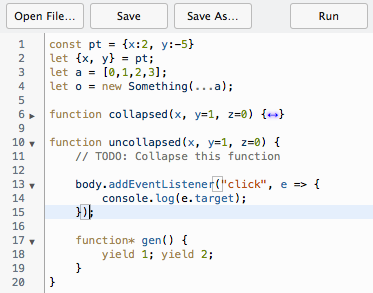

另外很感謝此版開發者工具共 43 位貢獻者！並可參閱 [Firefox 29 開發者工具所修正的錯誤清單](https://mzl.la/1jpYhzy)。

你有任何建議要讓我們知道？發現錯誤想回報？需要其他功能？或有任何問題嗎？當然歡迎你透過 [@FirefoxDevTools](https://twitter.com/firefoxdevtools) 聯絡我們團隊。

原文連結：[CSS source map support, network performance analysis & more – Firefox Developer Tools Episode 29](https://hacks.mozilla.org/2014/02/css-source-map-support-network-performance-analysis-more-firefox-developer-tools-episode-29/)
