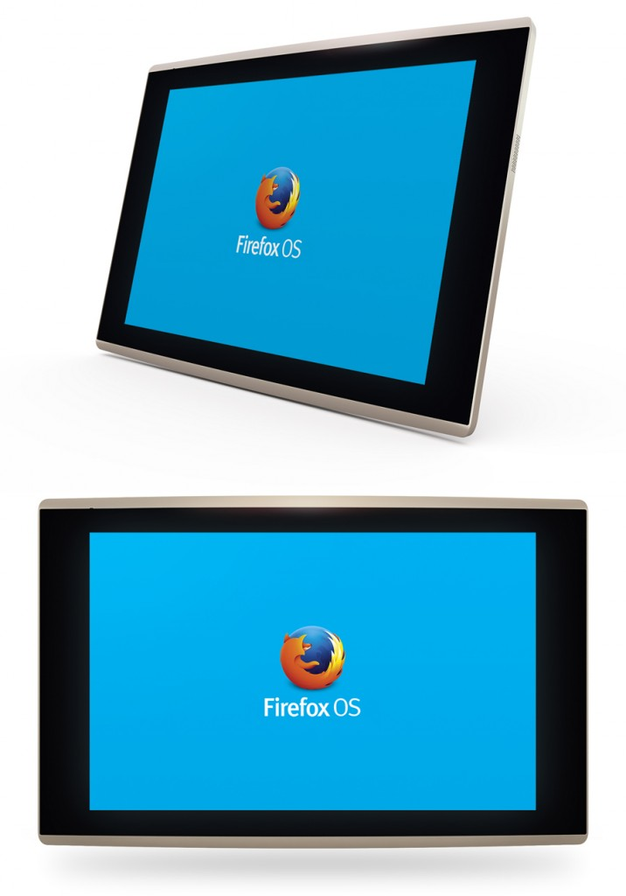
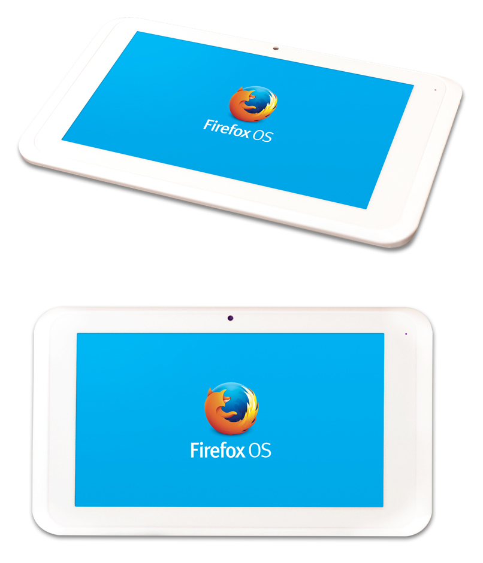

Mozilla 才在 1 月發表[平板電腦的 Contribution Program](https://blog.mozilla.com.tw/posts/4679/)，希望加速開發 Firefox OS 的平板電腦版本。我們很高興能接著啟動[硬體申請方案](https://www.surveygizmo.com/s3/1552323/Firefox-OS-Tablet-Contribution-Program)。全世界的 Mozillian 只要來這裡申請，就能對Firefox OS 的測試、本地化、產品規劃、程式碼撰寫等作業做出貢獻。

本方案的第一款裝置，是由鴻海科技集團 (Foxconn) 所提供的「InFocus」─ 10 吋平板電腦，搭載1.0GHz 四核心 Cortex-A7 處理器。

型號：Foxconn InFocus

處理器：A31 (ARM Cortex A7) 四核心 1.0GHz，內含 PowerVR SGX544MP2 GPU

RAM：2GB

儲存容量：16GB

螢幕：10.1 吋 IPS 電容多點觸控 @ 1280×800

相機：前/後鏡頭各為 2MP/5MP 像素

Wireless：802.11b/g/n

通訊埠：Micro SD、Micro USB、headphone

其他：GPS、Bluetooth、Gyroscope

電池容量：7000mAh

我們也很高興有新的生力軍加入此方案：由威盛電子 (VIA) 提供的「Vixen」─ 7 吋平板電腦，搭載1.2Ghz 雙核心 Cortex-A9 處理器。

型號：VIA Vixen

處理器：WM8880 (ARM Cortex A9) 雙核心 1.2Ghz，內含雙核心Mali 400 GPU

RAM：1GB

儲存容量：8GB

螢幕：7 吋電容式多點觸控 @ 1024×600

相機：前/後鏡頭各為 0.3MP/2.0MP 像素

Wireless：802.11b/g/n

通訊埠：Micro SD、Micro USB、Mini HDMI、耳機埠

其他：Bluetooth、Accelerometer

電池容量：4000mAh

由於這些開發裝置數量有限，Mozilla 希望能確實提供給熱血的貢獻者所用，以進行完整測試並回報瑕疵；比較他牌平板電腦，找出並記錄所缺的功能；翻譯使用者介面 (UI)；列出開發作業的優先順序與後續方向；深入了解現有功能並修正錯誤；定義新的功能與使用經驗；及其他更多規劃。

如果你對本方案躍躍欲試，而你也有時間、有技術能滿足 Mozilla 的需求，更想在平板電腦領域闖出一片天，就[立刻申請](https://www.surveygizmo.com/s3/1552323/Firefox-OS-Tablet-Contribution-Program)免費的開發用平板電腦吧。

原文連結：[Applications Open for Expanded Tablet Contribution Program](https://hacks.mozilla.org/2014/02/open-applications-tcp/)
