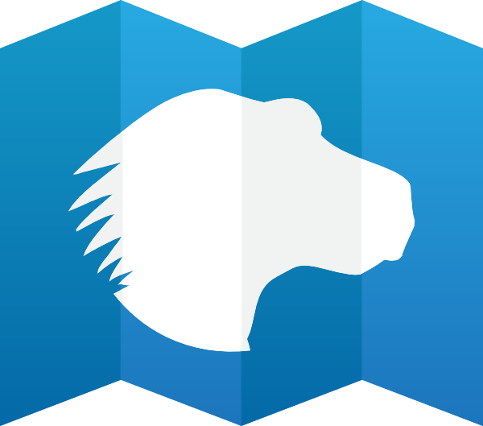

約莫幾個禮拜前，我在 [Mozilla 開發者社群網站 (MDN)](https://developer.mozilla.org/) 的貢獻者討論群組 (之前就稱為 [dev-mdc](https://lists.mozilla.org/listinfo/dev-mdc) 並沿用到現在) 上提出幾個問題。

- 你為 MDN 貢獻的理由？你從中獲得什麼？我們該如何協助你能收獲更多？

- 如果你加入這個郵件群組但尚未開始貢獻，也完全無傷大雅。但我想知道你為何還沒對 MDN 貢獻呢？既然沒想要貢獻，那又為何加入郵件群組？這個群組有什麼值得你持續了解 (或忽略) 的地方，讓你不願意退出呢？

我提出這些問題的意圖很明顯 ─ 我想了解 MDN 貢獻者的動機，以利 MDN 團隊能提供更完整的支援，也想鼓勵更多人加入貢獻的行列。很多人回應了自己的想法並和我們互相溝通之後，也讓我們進一步了解 MDN 社群，還有 Mozilla 所能提供的支援。

### 動機

貢獻者最普遍回應的動機，就是 MDN 本身已具備的品質與曝光率。

MDN 擁有固定的閱讀群 (且最近幾年很努力提升搜尋引擎的功能，改善尋找功能與使用者經驗)，所以我知道我寫的內容放上 MDN 所獲得的點閱率，絕對比放在自己部落格上的點閱率要高出許多。

— David Bruant

也很多人提到喜歡把內容翻譯成自己的語言。

能根據大家的期待來翻譯內容，對我是很重要的動力。「我在這裡幫得上忙 :)」。還有助於推廣 Mozilla 並對別人說：「你來看看這篇文章吧。MDN 上已經翻好囉！」(附加效果：可幫剛入門的人降低語言門檻)

— Sphinx

另外也提到幾次開放的授權。

文章都是創用 CC 授權 (CC-licensed) 的，所以內容可轉載到其他文章 (如果提到可轉載、重複使用內容，就不能忘了 Dochub.io 這個範例)。

— David Bruant

另外還有人說為 MDN 貢獻很簡單。如果和其他為 Mozilla 貢獻的方法相比更是明顯。

我不太清楚一般要為 Mozilla 貢獻時，都應該具備何種程度的程式設計知識，但我覺得 MDN 的「休閒型」貢獻相對比較沒負擔。MDN 不用版本或原始碼的管理程序，而且相對可以比較快完成作業，讓我能妥善利用時間。

— Scott Michaud

### 收獲

為 MDN 貢獻所獲得的利益比較難說明。有許多人提到可透過貢獻過程學到更多東西。

在翻譯文章時，我本身也必須徹底閱讀該篇文章並了解其中的意思，所以我每天都在學習。

— Shiaful Azam

有些人提到 MDN 的社群與組成份子。

可以認識許多有趣的人。我聽過 Jimmy Wales 談論 Wikipedia 的誕生：《[那些因為好玩而寫百科全書的人，也可能比較聰明](https://www.google.com/url?q=http%3A%2F%2Fwww.ted.com%2Ftalks%2Fjimmy_wales_on_the_birth_of_wikipedia.html%23646000&sa=D&sntz=1&usg=AFQjCNH-2Jaz8QTvgOCz2HXCWZOnVdOhAg) (中文字幕)》。我覺得 MDN 貢獻者也算吧。

— Thierry Regagnon

最後就是貢獻時正面、積極的感覺 (「施」所帶來的成就感、滿足感)。

即便只是小小修正或補註某一頁，都能帶給我滿足感。看到我的名字列進「Contributors to this page」就更有成就感了。

— Saurabh Nair

### 為什麼不一起貢獻呢？

目前尚未貢獻 MDN 的幾則回覆中，大部分都是因為沒時間。

我很想支援此專案，所以我一直在注意郵件群組，隨時提醒自己只要有時間就馬上貢獻。

— Dan Scott

### 需求與建議

只要是回答我問題的人，都提出許多要求與建議，期待能更妥善支援貢獻者。

- 規劃相關活動，以推廣 MDN 並吸引新的貢獻者加入

- 以會議的形式，更完整支援遠端貢獻者

- 更好的翻譯工具，另註明哪些頁面很需要翻譯指定的語系

- 頒發「聲望」點數給貢獻者，或其他類似的系統

- 設立導師制度，可協助新加入的貢獻者

- 針對負責撰寫文章的工程團隊，提供更好的溝通與合作模式

有些建議牽涉 MDN 平台本身的提升，其他就必須改變參與的「人」才能產生效果。不論是人或是平台，都需要或長或短的時間才能完成改變。以貢獻點數為例，MDN 開發團隊現已能支援[開放徽章 (Open Badge)](https://openbadges.org/)，接著就必須定義各個階段的徽章，確保這些徽章可讓貢獻者保有熱情與動力；這也是比較困難的部份。改善翻譯工具是對 MDN 最常見的期許之一。我們很快就會寄出相關問卷，進一步了解翻譯的相關需求與偏好。

雖然我沒辦法逐一列出姓名，但很感謝參與這次討論的所有人。讓 MDN 團隊了解貢獻的社群並規劃可能的支援方式，這才是真正無價的資源。

原文連結：[Why contribute to MDN?](https://blog.mozilla.org/community/2014/02/18/why-contribute-to-mdn/)
