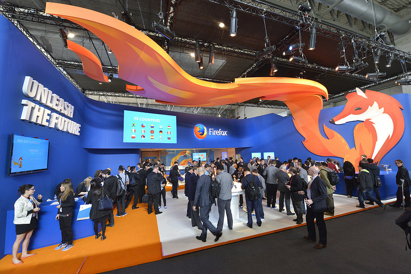

今年世界行動通訊大會 (MWC) 與會者只要到 Mozilla 的展位參觀時，我們都會闡述 Web 架構平台所構成的整個行動生態系統，並希望大家都能透過此平台加入「釋放未來 (Unleash the Future)」的行列。這句話不僅呈現在我們展位的主題牆上，也是我們在 MWC 2014 的核心要素，更出現在 Mozilla 展館 (Hall 3) 入口的巨幅旗幟上。

### 到底「Unleash the Future」是什麼意思？

對電信營運商和裝置製造商而言，「釋放未來」代表一條獨立的道路。之前主導公司走向的業務合作關係與平台依賴性，往後可能都不復存在。對行動開發者而言，他們可更輕鬆開發 App 與使用者經驗、觸及更多的新消費者，甚至能與使用者構成新型態的財務關係。

Firefox 展位在 MWC 2014 的第一天

但對大部分的關鍵消費者 (也就是使用 Firefox OS 裝置的消費者) 來說，「釋放未來」不僅是上述的意義，還代表了更多價值。行動裝置將會是 Web 本身與其所能提供的一切資源。若想要銜接當前的世界，就等於要取得不斷推動生活前進的相關資訊、技術、機會。行動裝置同時代表了消費與創造的能力。聆聽他人也要讓別人能聆聽自己；接觸他人也要讓別人能接觸你。

「釋放未來」對身為 Mozillians 的我們更是意義不凡。Mozilla 整個組織不再侷限於單一瀏覽器，進而透過多樣產品為更多人實踐我們的價值。「釋放未來」改變了我們與夥伴之間的合作方式；而使用者只要相信並選擇 Mozilla 作為自己進入虛擬世界的媒介，也將因「釋放未來」享受到更完善的服務與功能。

位於巴塞隆納的 Mozilla 團隊錄製了以下短片，其中提及多項概念與意見回饋：

[Why does mobile matter?](https://www.youtube.com/watch?v=TMP45DupbhI&feature=youtu.be/)

大家在看過影片之後，也請試著問問自己：「釋放未來」將會如何改變你在 2014 年的作為呢？

原文連結：[MWC Update – Unleashing the Future](https://blog.mozilla.org/blog/2014/02/26/mwc-update-unleashing-the-future/)
