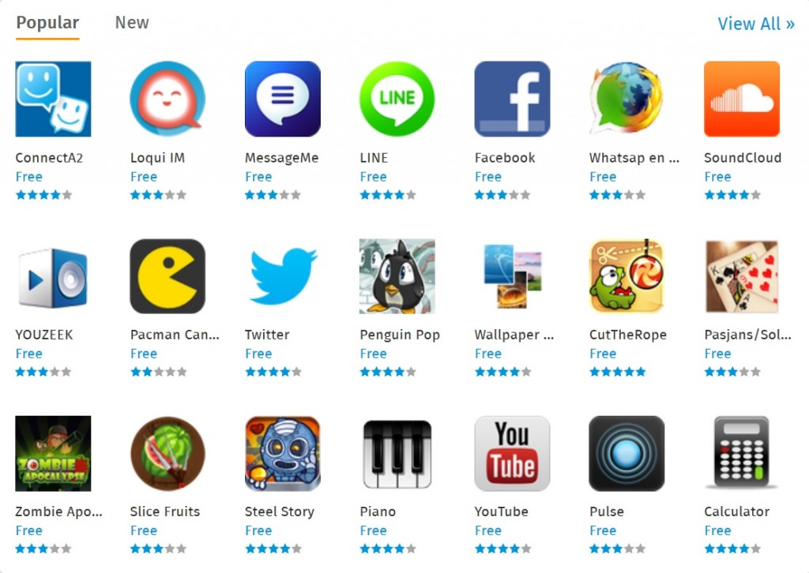

你是熱血的 Firefox OS 開發者，而且早已設計了許多 App 準備大展身手嗎？在推銷自己的 App 之前，你可能對 Firefox Marketplace 還有些疑問吧？先來這裡看看大家對 Marketplace 的常見問題，讓自己的開發作業更順利。

## 帳戶管理

### 我該如何變更開發者帳戶的資訊？

進入 Firefox Marketplace 並登入自己的帳戶，將滑鼠游標置於齒輪圖示 (即設定選單) 之上，點選「Edit Account Settings」即可。

### 我該如何變更開發者付款的資訊？

進入 Firefox Marketplace 並登入自己的帳戶，將滑鼠游標置於齒輪圖示 (即設定選單) 之上。點選「My Apps」之後，找到你想變更付款資訊的 App，再點擊「Set Up Payments」即可。

### 我該到哪找到自己的銷售報表與對帳資訊？

進入 Firefox Marketplace 並登入自己的帳戶，將滑鼠游標置於齒輪圖示 (即設定選單) 之上。點選「My Apps」之後，找到你需要相關資料的 App 即可。

### 如果我們是多人組成的開發團隊或公司，該如何管理帳戶資訊？

進入 Firefox Marketplace 並登入自己的帳戶，將滑鼠游標置於齒輪圖示 (即設定選單) 之上。點選「My Apps」之後，找到你想變更團隊細節的 App 即可。

### 我該如何重新命名 App？

如果你想在 Marketplace 審查之後變更 App 的名稱，就必須再次提交 App 通過審查才行。請參閱[更新 App](https://developer.mozilla.org/en-US/Marketplace/Publishing/Updating_apps) 以進一步了解。

### 我該如何進入 Firefox Marketplace 除錯設定？

登入之後進入 Firefox Marketplace，在搜尋列中輸入「:debug」。

接著你就會看到自己 Marketplace 帳戶的除錯畫面。你可在此畫面中清除 Marketplace 網站、提交記錄、檢視設定、活動記錄等等相關的 cookies 與 localStorage。

### 如果我把 App 提交到自己目前所在地以外的地方，我該如何檢視這些 App？

如果你自己目前所在之處或擁有手機 SIM 卡的地區，和你 App 發佈地區並不相同，則可透過下列步驟檢視該 App：

- 進入 Firefox Marketplace 除錯設定 (可參閱上一題)。

- 透過「Region Override」與「Carrier Override」選項，選出自己的所在地區或營運商 (只要選完就會立刻更新這些設定)。

- 重新整理/載入 Marketplace。

你可以先試著為 App 隨便選個分類，確認系統更新過了相關設定。

## App 提交與審查程序

### 我該如何提交新的 App？

可參閱《[將 App 提交至 Firefox Marketplace](https://developer.mozilla.org/zh-TW/docs/%E6%87%89%E7%94%A8%E7%A8%8B%E5%BC%8F-840092-dup/Publishing/Submitting_an_app)》中的詳細步驟。

### App 核准程序為何？

請參閱《[Marketplace 審查準則](https://developer.mozilla.org/zh-TW/docs/Mozilla/Marketplace/Submission/Marketplace_review_criteria)》以了解審查程序的相關準則。

### 是否有快速審查程序？所採用的準則是否不同？

如果開發者正好有絕佳的商機需求，或必須儘快釋出重要修復檔案，即可申請快速審查 App。若需 Marketplace 進行快速審查，可寄發電子郵件到 [app-reviewers@mozilla.org](mailto://app-reviewers@mozilla.org)，或加入 [irc.mozilla.org](https://wiki.mozilla.org/IRC) 中的「#app-reviewers」IRC 頻道。我們會儘快完成快速審查，但不保證審查人員能配合任何特定時間。

注意：對 App 審查團隊來說，「App 快速審查」也算是額外的工作之一。若你有興趣協助我們的審查作業，歡迎透過 [Firefox App 審查者申請表](https://docs.google.com/spreadsheet/viewform?formkey=dEdVWVhWUzdIZ1hWTzRvdkJiLXF5dHc6MQ)申請。

### 我的 App 需要遵守內容政策嗎？

當然！請參閱[《Marketplace 審查準則》中的〈內容〉一章](https://developer.mozilla.org/zh-TW/docs/Mozilla/Marketplace/Submission/Marketplace_review_criteria#.E5.85.A7.E5.AE.B9)，了解 Mozilla 的內容政策。

### 如果 App 遭退回或移除，我該如何上訴？

如果想為遭退回的 App 上訴，則可直接回覆 App 退回通知的電子郵件 (所有 Marketplace 通知郵件的末端，均告知開發者可直接回覆該電子郵件以提出問題)；或可透過 [irc.mozilla.org](https://wiki.mozilla.org/IRC) 上的「#app-reviewers」IRC 頻道向我們溝通。

## 付款

### Firefox Marketplace 如何運作付款作業？

Mozilla 提供多種付款方式，包含付費 App、免費增值 (Freemium) App、App 內部付費機制 (In-app payments)。若需進一步資訊，可參閱《[Marketplace Payments guide](https://developer.mozilla.org/en-US/Marketplace/Monetization/Marketplace_Payments)》。

### 開發者收益的拆帳方式為何？

開發者將收到預扣增值稅 (Value Added Tax，VAT) 與費用之後金額的 70%。我們先假設美金訂價 $.99 (Tier 10)，歐元訂價則為 €.89；而增值稅率為 20% (根據英國標準增值稅率) 為例，則預扣增值稅之後的價格為 €.74，亦約為 $.99 (有時匯兌之後的價格點數可能變高，有時也會變低)。開發者最後將收到 €.74 的七成金額。

若需價格點數與訂價的相關資訊，可參閱《[制定 App 的價格](https://developer.mozilla.org/zh-TW/docs/Mozilla/Marketplace/Monetization/App_pricing)》。

### Mozilla 也會拆得一部分的帳嗎？

會。為了維持 Firefox Marketplace 的運作、持續強化 App 平台、支付每次購買行為所產生的交易費用。Mozilla 將收取預扣增值稅後金額的三成，再拆分給 Mozilla、行動網路營運商、付款服務供應商 (如 Bango) 共三方收取。

### 我一定要使用 Firefox Marketplace 的付款系統嗎？

若要讓消費者從 Firefox Marketplace 下載付費 App，就必須使用 Firefox Marketplace 付款系統。我們不會要求 In-app payments 也同樣使用 Marketplace 付款系統，但目前 Firefox OS 中僅建構了 [navigator.mozPay()](https://developer.mozilla.org/en-US/docs/Web/API/navigator.mozPay) 函式 (用於 In-app payments)，而該函式就採用 Firefox Marketplace 付款系統。我們以後會讓開發者針對 In-app payments 選用任何付款系統。

### 將自己的 App 放上 Firefox Marketplace 後的交易費用？

需支付預扣稅額訂價的 30%。換句話說，因為 Marketplace 提供的含稅價格點數已經納入了增值稅 (針對需課增值稅的地區)，所以在完成交易之後隨即扣除增值稅，讓開發者取得訂價金額的 70%。

### 我需要自行設定銷售稅或增值稅率嗎？

不用。針對需課稅的地區，Marketplace 的價格點數均已包含了增值稅。而銷售稅的部分，均另由付款服務供應商列入帳單之中。

### 我該如何分開付款？

Firefox Marketplace 目前尚未提供分開付款的功能。

### 我能提交免費 App 嗎？會向我收費嗎？

當然。歡迎開發者在 Firefox Marketplace 中提交免費 App，且 Mozilla 不會對免費 App 收取任何費用。

### 付費 App 還能搭配 In-app payments 嗎？

可以。

### 退款程序為何？

根據付款方式的不同，退款程序可能由電信營運商、信用卡公司，或付款服務供應商 (如 Bango) 進行。若消費者選用電信帳單代繳的方式，則依照電信營運商的退款政策處理。目前尚無營運商提供退款服務。Bango 則是針對信用卡提供前端支援服務。任何退款均將從開發者的收益之中扣除。

服務條款與[開發者協議](https://developer.mozilla.org/en-US/Marketplace/Submission/Submitting_an_app#Step_1.3A_Agreement)均提供了退款政策。一般來說，Marketplace 不會支付退款，但會要求 Bango 進行退款程序。若消費者選用電信帳單代繳的方式，就必須要求電信營運商退款並修正電信帳單。

### 如何處理詐騙的購買行為？

尚待完善討論。

### Marketplace 如何處理多樣的幣別？

根據消費者所選的所在地區，即顯示該地區的預設幣別。另針對付款作業，若消費者目前身處於原本設定的地區之外，就會根據他們收取帳單的地區 (即 SIM 卡所在地)，或根據其所在位置收款。如此可避免詐欺行為。

### 付款時程為何？開發者多久能收到銷售 App 的應得款項？

根據付款服務供應商而有所不同；而目前仍由 Bango 負責所有地區的付款作業。開發者可直接與 Bango 洽詢，且每個月均會收到自行對帳用的發票。因為行動服務營運商必須向消費者收取並匯出相關款項，所以支付日期也各有差異。各個國家又會有所不同。而消費者 如果採用信用卡付款，都能讓開發者迅速收取款項。若選用電信帳單代繳方式，可能需時 30 ~ 90 天不等。

### 開發者應如何處理退款？

請參閱《[Marketplace payments](https://developer.mozilla.org/en-US/docs/Web/Apps/Publishing/Marketplace_Payments)》中的〈[Refunds](https://developer.mozilla.org/en-US/docs/Web/Apps/Publishing/Marketplace_Payments#Refunds)〉一章。

### Firefox Marketplace 可進行臨時銷售或變更訂價嗎？

我們正規劃價格點數的變更功能，讓開發者能針對「試用期」或「正式銷售」而設定不同的價格。

### 開發者能銷售 Firefox 的附加元件 (add-ons) 嗎？

目前 Firefox Marketplace 僅供銷售 App。我們希望很快就能提供其他內容的銷售服務。

## 技術問題

### 有誰能托管 App？

開發者可在自己的伺服器上托管 App 的所有檔案。但將 App 提交到 Firefox Marketplace 之後，就必須提供 App 的 manifest 檔案網址，以利 Marketplace 進行讀取並檢驗。開發者另可上傳圖示、截圖等元素，以能順利在 Firefox Marketplace 推銷自己的 App。可參閱《[將 App 提交至 Firefox Marketplace](https://developer.mozilla.org/zh-TW/docs/%E6%87%89%E7%94%A8%E7%A8%8B%E5%BC%8F-840092-dup/Publishing/Submitting_an_app)》進一步了解。

### 如何從 App 直接啟動 Marketplace？

開發者可透過 [Web Activities](https://developer.mozilla.org/en-US/docs/WebAPI/Web_Activities)，從自己的 App 或網站啟動 Marketplace。而 Marketplace 所支援的 activities 均[記錄於 Github 之上](https://github.com/mozilla/fireplace/wiki/Web-Activities)。

Mozilla 開發者社群網站 (MDN) 原文連結：[Firefox Marketplace FAQ](https://developer.mozilla.org/en-US/Marketplace/FAQ)

你也可參閱中文版《[Firefox Marketplace 常見問題](https://developer.mozilla.org/zh-TW/docs/Mozilla/Marketplace/FAQ)》；並參閱 MDN 的更多 Firefox OS 或 Marketplace 相關文章。
