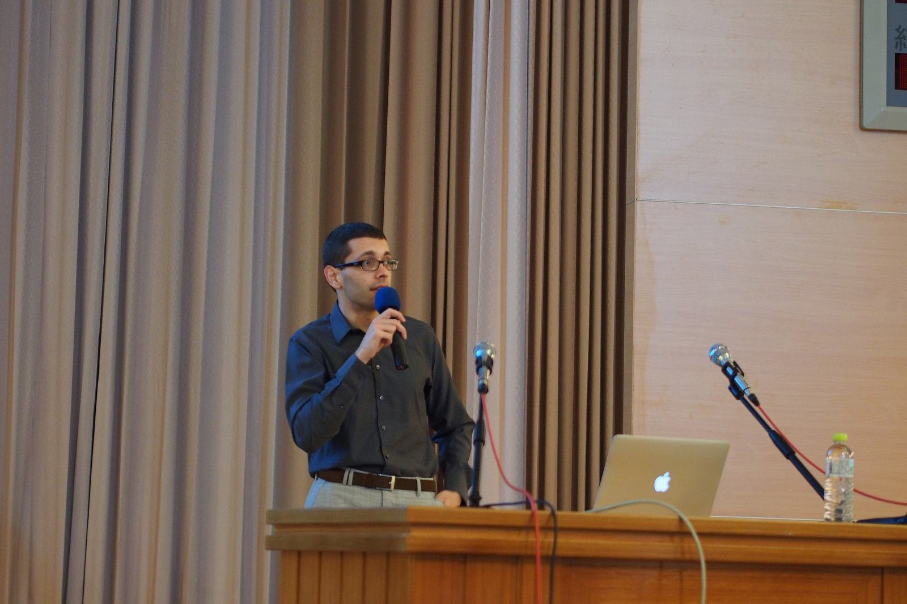
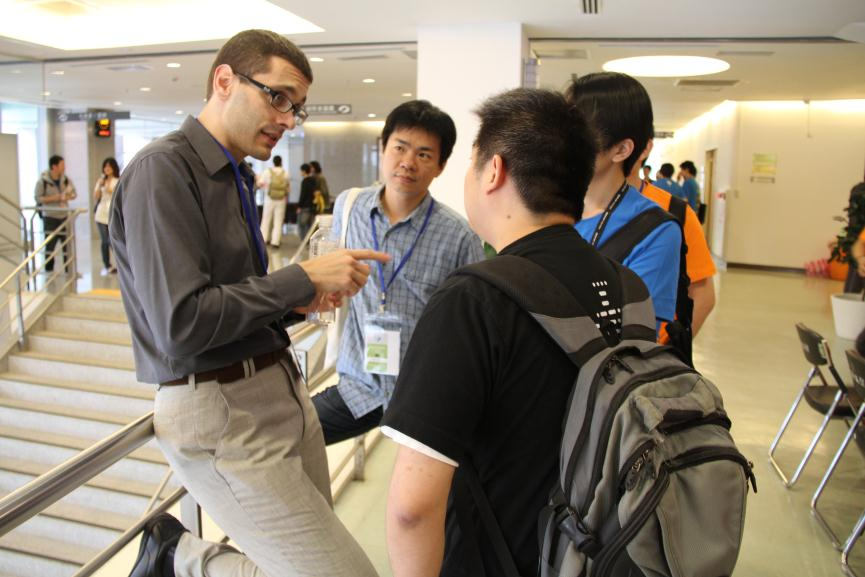
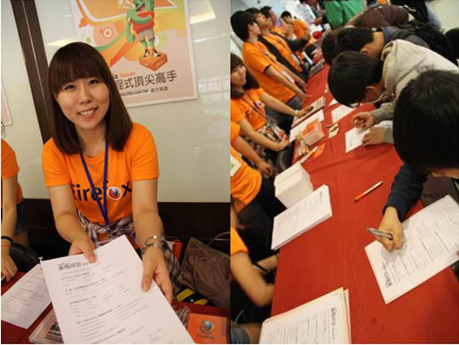
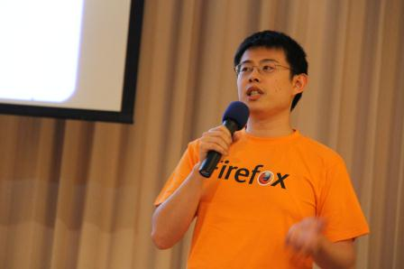
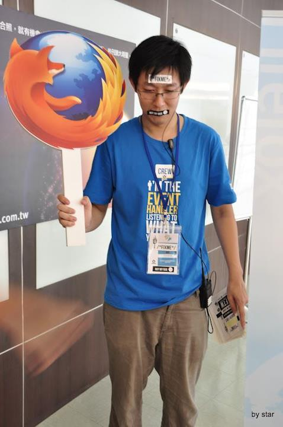

2012年第一屆JSDC 於5/19 順利落幕！Mozilla Taiwan 身為共同主辦單位，很高興可以一起參與此次盛會。此次活動的成功，也表示JavaScript 技術在台灣不容忽視的實力和成長。為響應活動，Mozilla 除了特別遠從美國總部邀請到研究總監Andreas Gal 到場，和與會者討論Mozilla 對手機前端的想法，使Web 開發者親身參與手機介面的設計與製作；下午時段由Mozilla 工程師陳侃如 (Kanru) 帶來用JavaScript 寫WebAPIs 的分享，最真實的交流，最熱烈的討論。同時，Mozilla Taiwan 攤位的火熱程度也不亞於內場，實體B2G 手機操作、I ♥ MOZILLA 創意照片比賽、填問卷拿好禮等互動活動熱力一整天！

Mozilla 研究總監Andreas Gal 帶來的精彩演講！

圖片引用：[http://www.flickr.com/photos/othree/7227464848/](https://www.flickr.com/photos/othree/7227464848/)

最熱烈的討論一路持續到攤位

想體驗B2G 實機嗎？

麻煩幫我們填個問卷，可以獨家拿好禮呦！

Mozilla 工程師陳侃如分享如何使用JavaScript 撰寫WebAPIs

I ♥ MOZILLA 創意照片比賽，「今日我最跳」之結果公佈，恭喜[Ryan](https://www.facebook.com/photo.php?fbid=10150843140033271&set=o.229264713799595) & [魏銘廷](https://www.facebook.com/photo.php?fbid=128802837255579&set=o.229264713799595)，我們會在近期內與您聯繫！

Mozilla Taiwan 參與的台灣首次 JavaScript 研討會，在一片歡樂與技術交流的氣氛中結束，期待下次再見喔！

更多照片請見 Flickr：[MozillaTaiwan](https://www.flickr.com/photos/mozillataiwan/sets/72157629844062218/)，而 Mozilla 的講者 Andreas 及侃如的投影片也已經上傳，[請見活動資訊](https://blog.mozilla.com.tw/events/jsdc-2012)。

Mozilla 相關資訊都會透過[Mozilla Taiwan 訊息中心](https://blog.mozilla.com.tw/)、[FB 粉絲頁](https://fb.me/MozillaTaiwan)和[G+ 專頁](https://plus.google.com/u/0/114653167240123163859/posts)第一手傳達給Mozilla 的好朋友們，大力歡迎大家加入並關注訊息！
