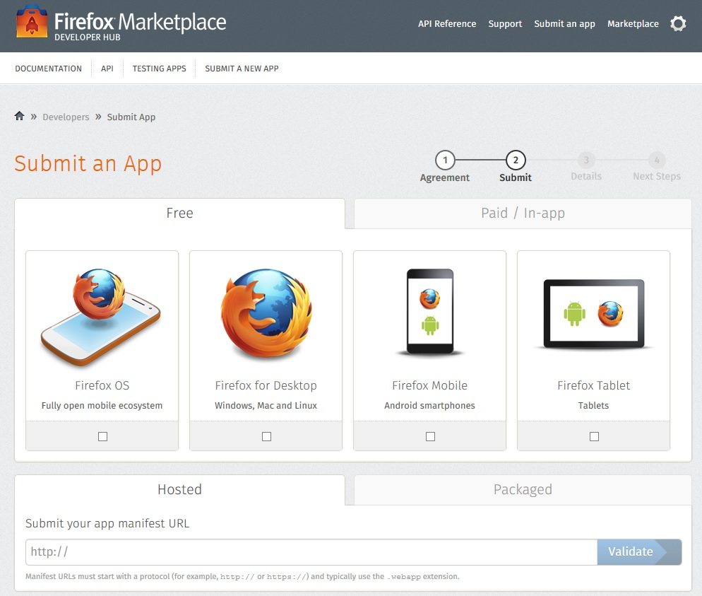

你是熱血的 Firefox OS 開發者，而且早已設計了許多 App 準備大展身手嗎？在推銷自己的 App 之前，你一定得先了解 App 有哪些發佈管道。先來這裡看看 Mozilla 為大家說明的 App 發佈方式，讓自己的開發作業更順利。

在開發 App 完畢之後，就必須佈署並發佈 App 了。完整的「發佈」包含：

- 將 App 提供給消費者 (不論消費者只是在瀏覽器中把 App 當做一般網頁，或是將 App 下載到如 Firefox OS 的裝置並進行安裝)

- 讓大家知道現在有新的 App 上市

- 提供如使用說明和協助等支援資訊

本篇文章將簡略說明可能的發佈方式。

### 在 Firefox Marketplace 發佈

[Firefox Marketplace](https://marketplace.firefox.com/) 是 Mozilla 專屬的 App 商城，可供開發者發佈免費與付費的 App。[將 App 提交至 Firefox Marketplace](https://developer.mozilla.org/zh-TW/docs/%E6%87%89%E7%94%A8%E7%A8%8B%E5%BC%8F-840092-dup/Publishing/Submitting_an_app) 很簡單，其中必須上傳 App 與其相關資訊，並等待 Mozilla 完成審查以確保其為高品質且非惡意的 App。提交 App 到 Firefox Marketplace 還有其他優點，如可享有較高的能見度，不需在自己的網站上建構特殊 API，並能更輕鬆發佈付費 App。而且托管式 (Hosted) 與封裝式 (Packaged) App 均可提交到 Firefox Marketplace 之中。

#### 托管式 (Hosted) App

托管式 App 基本上就是將 App 托管於伺服器之上，如同一般網頁。如果開發者想讓大家直接透過網站安裝托管式 App，就必須在自己的網站上[建構某些 JavaScript 程式碼](https://developer.mozilla.org/en-US/Apps/Developing/JavaScript_API)，才能管理 App 在消費者瀏覽器上的安裝與更新作業，而且 App 程式碼需具備有效的 manifest 檔案。請參閱《[manifest 檔案](https://developer.mozilla.org/zh-TW/docs/Web/Apps/Developing/Manifest/Manifest-840092-dup)》與《[Install API functionality](https://developer.mozilla.org/en-US/docs/Web/Apps/Introduction_to_open_web_apps#Install_API_functionality)》以了解相關步驟。

開發者可自行決定 App 托管之處。接著建議兩個最常見又簡單易用的地方。

GitHub

如果 Web App 屬於純靜態的網頁 (HTML/CSS/JavaScript，但沒有伺服器端的處理)，那就建議可托管於 [GitHub Pages](https://pages.github.com/)。如果 App 的附檔名為「.webapp」，則 GitHub 將以[正確的 MIME 型態](https://developer.mozilla.org/en-US/Apps/Developing/Manifest#Serving_from_GitHub)管理你的 manifest 檔案。

常見托管解決方案

針對動態網站，應使用內含正確功能的一般托管選項 (即如開發者自己架設或可存取的 Web 伺服器)，或針對自己 App 需求而量身打造的托管服務供應商 (如 [Heroku](https://www.heroku.com/) 或 [Google App Engine](https://code.google.com/appengine))。

注意：可安裝的 Open Web App 均有「Single app per origin」安全政策；即開發者僅限在一處來源網域托管一個可安裝的 App，因此測試作業比較複雜，但仍有其他測試方式可行。例如為 App 建立不同的子網域；以 Firefox OS 模擬器 (Firefox OS Simulator) 測試 App；或透過 Firefox Aurora/Nightly 測試所要安裝的功能，就能將可安裝的 Web App 安裝於桌機上。可參閱《[FAQs about apps manifests](https://developer.mozilla.org/en-US/docs/Web/Apps/FAQs/About_app_manifests)》以進一步了解來源。

#### 封裝式 (Package) App

封裝式 App 即是 Open Web App 將自己的所有資源 (HTML、CSS、JavaScript、App 的 manifest 檔案等等) 納入 zip 壓縮檔中，而不是將資源置於 Web 伺服器上。封裝式 App 就是單純的 zip 檔案，並將 [manifest 檔案](https://developer.mozilla.org/zh-TW/docs/Web/Apps/Developing/Manifest/Manifest-840092-dup)放在根目錄中。此 manifest 檔案必命名為「manifest.webapp」。

與托管式 App 不同的一點在於，封裝式 App 必須在 manifest 檔案中指定「[launch_path](https://developer.mozilla.org/en-US/docs/Web/Apps/Manifest#launch_path)」；但托管式 App 的「launch_path」則為選填欄位。可參閱《[封裝式 App](https://developer.mozilla.org/zh-TW/docs/Web/Apps/Developing/Packaged_apps/Packaged_apps)》進一步了解。

### 自行發佈 App

開發者亦可自行發佈 App。若是托管式 App，只要將之托管於 Web 上即可，細節如上所述。

另可將封裝式 App 托管於伺服器上，且在相同目錄下放置 mini-manifest 檔案以利識別該 App。下列為相關步驟：

- 先備妥封裝式 App 的壓縮檔並命名為「 package.zip 」。此檔案必須包含 App 的所有資源檔案，當然 manifest 檔案亦在內。

- 另建立名為「 package.manifest 」檔案，其內容必須同下列所示。此即 mini-manifest 檔案，可供封裝式 App 的安裝作業之用；且該檔案並非 App 壓縮檔中的主要 manifest 檔案。 { "name": "My sample app", "package_path" : "http://my-server.com/my-app-directory/my-app.zip", "version": "1", "developer": { "name": "Chris Mills", "url": "http://my-server.com" } } 1 2 3 4 5 6 7 8 9 { "name" : "My sample app" , "package_path" : "http://my-server.com/my-app-directory/my-app.zip" , "version" : "1" , "developer" : { "name" : "Chris Mills" , "url" : "http://my-server.com" } }

- 另建立名為「 index.html 」的檔案，其內容必須同下列所示。其中包含 JavaScript 範本，用以呼叫封裝式 App 的安裝作業 ([installPackage()](https://developer.mozilla.org/en-US/docs/Web/API/Apps.installPackage))，並針對安裝作業的成功與否進行回呼 (Callback)。   Packaged app installation page

  // This URL must be a full url. var manifestUrl = 'http://my-server.com/my-app-directory/package.manifest'; var req = navigator.mozApps.installPackage(manifestUrl); req.onsuccess = function() { alert(this.result.origin); }; req.onerror = function() { alert(this.error.name); };    1 2 3 4 5 6 7 8 9 10 11 12 13 14 15 16    Packaged app installation page   // This URL must be a full url. var manifestUrl = 'http://my-server.com/my-app-directory/package.manifest' ; var req = navigator . mozApps . installPackage ( manifestUrl ) ; req . onsuccess = function ( ) { alert ( this . result . origin ) ; } ; req . onerror = function ( ) { alert ( this . error . name ) ; } ;

- 將「 package.zip 」、「 package.manifest 」、「 index.html」 複製到 App 的根目錄中 (在此範例中則為 my-app-directory )。

- 以相容設備 (如 Firefox OS 手機) 瀏覽到伺服器上的範例檔案路徑，確認進行 App 的安裝。接著將顯示安裝作業是否成功。

注意：開發者並無法自行托管 Privileged 或 Certified App。此二種 App 必須經由 Firefox Marketplace 提交程序完成簽章。

注意：開發者甚至可[設立自己的 App 商店](https://developer.mozilla.org/en-US/docs/Web/Apps/Creating_a_store)，且同樣有多種方法可供選擇。

Mozilla 開發者社群網站 (MDN) 原文連結：[App publishing options](https://developer.mozilla.org/en-US/Marketplace/Publishing/Publish_options)

你也可參閱中文版《[App 發佈方式](https://developer.mozilla.org/zh-TW/docs/Mozilla/Marketplace/Publishing/Publish_options)》；並參閱 MDN 的更多 Firefox OS 或 Marketplace 相關文章。
