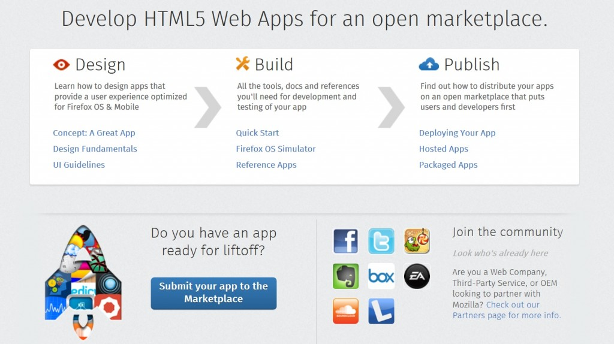

你是熱血的 Firefox OS 開發者，而且早已設計了許多 App 準備大展身手嗎？開發者除了能在 [Firefox Marketplace](https://marketplace.firefox.com/) 上推銷自己的 App 之外，其實也能自己設立 App 商店。如果你想在自己的市集上推銷自己的 App，可先來看看這一篇概略說明，並讓自己的開發作業更順利。

任何 Web 網站若具備豐富的圖片與互動經驗，則 Web 瀏覽器可透過 Mozilla 的 App 專案平台，將這類網站識別為「Web App」，進而能跨裝置安裝並同步這些網站。開發者現可透過此項特性，將已發佈的 App 整理到目錄與商店中。接著說明相關步驟。

###

### 與瀏覽器整合

App 平台即提供「[navigator.mozApps](https://developer.mozilla.org/en-US/docs/Web/API/navigator.mozApps)」這個 JavaScript 物件，可作為商店與瀏覽器之間的溝通橋樑。

Web App 是根據其網域所辨識而得。而一個來源網域就只會有一個 App。針對目錄或商店，開發者可透過 [App Installation API 與 App Management API](https://developer.mozilla.org/en-US/Apps/Developing/JavaScript_API)，讓瀏覽器觸發 [apps.install](https://developer.mozilla.org/en-US/docs/Web/API/apps.install) 函式並提示 App 的安裝作業，另提供 App 的 manifest 檔案網址，以及任何想要補充的後設資料 (metadata)。開發者可存取此筆後設資料，以查閱消費者的購買資訊、確認單一登入狀態 (SSO)，或其他服務。

#### 使用 getInstalled()

只要 App 是根據你的網域而安裝於目前的瀏覽器上，均可透過 [navigator.mozApps.getInstalled()](https://developer.mozilla.org/en-US/docs/Web/API/Apps.getInstalled) 函式取得此類 App 的清單。另請注意，開發者不會看到其他網域所安裝的 App，只會看到放在自己網域中的 App。

開發者可透過此函式而了解消費者安裝的 App 是否符合你的預期。即使消費者是以新帳戶登入你的網站，亦可透過「resync」功能而再次安裝既有的 App。

###

### 到底該不該托管？

針對托管式 App，商店只需該網站的 manifest 網址，即可觸發 App 的安裝作業 ([apps.install](https://developer.mozilla.org/en-US/docs/Web/API/apps.install))。該 App 檔案不一定要儲存於商店或目錄之下。

如果 App 沒有伺服器的邏輯元件 (也就是完全以用戶端 JavaScript、HTML、CSS 所建構的 App)，開發者就可能會想建構出托管功能。此時必須為各 App 指派不同的網域名稱，並針對各 App 的 manifest 檔案建構伺服邏輯，才能使用托管功能。

如果你現在正自行托管 App 邏輯，則可輕鬆維護和消費者之間的會話 (Session)，進而追蹤消費者的喜好、購買證明，或其他服務。如果你要針對遠端網站提供服務，就必須完成額外作業，才能支援分散式的認證系統。

注意：[Firefox Marketplace API](https://firefox-marketplace-api.readthedocs.org/en/latest/) 內含的功能，讓開發者只耗費最小程度的心血，即可迅速設立自己的 App 商店。

Mozilla 開發者社群網站 (MDN) 原文連結：[Creating your own store](https://developer.mozilla.org/en-US/Marketplace/Publishing/Creating_a_store)

你也可參閱中文版《[設立自己的 App 商店](https://developer.mozilla.org/zh-TW/docs/Mozilla/Marketplace/Publishing/Creating_a_store)》；並參閱 MDN 的更多 Firefox OS 或 Marketplace 相關文章。
