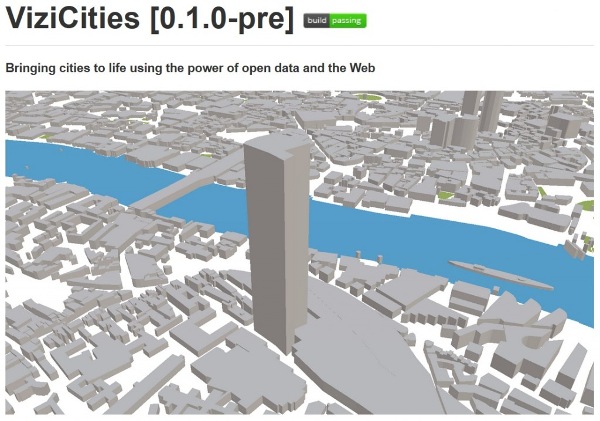

莫約二週前，[Peter Smart](https://twitter.com/petewsmart) 與 [Robin Hawkes](https://twitter.com/robhawkes) 釋出了開放源碼的 [ViziCities 第一版](https://github.com/robhawkes/vizicities)，並透過 MIT 授權條款提供給大家免費使用。

我將透過這篇文章跟大家說說 ViziCities 的開發心得。從整個 App 架構直到詳細的 [WebGL](https://developer.mozilla.org/en/WebGL) 繪圖功能強化，我們在過去這一年來學到很多，也希望能與大家分享自己的經驗，讓其他人不用再遭遇相同的錯誤。

#### ViziCities 是什麼？

用比較技術性的說法，ViziCities 就是 WebGL 的應用程式，可用 3D 視覺效果呈現世界上任何一個地點。主要目的是能初步了解市區的結構。如果 OpenStreetMap 亦已納入該城市的圖資，就能獲得更好的效果。

了解 ViziCities 的最佳方式就是[自己親身體驗](https://vizicities.apps.rawk.es/)。首先你需要[可支援 WebGL 的瀏覽器](https://get.webgl.org/)，且請你了解ViziCities 目前是連測試版都還算不上的軟體，所以請別太苛求整體品質。在 ViziCities 中，點擊/拖曳滑鼠即可來回移動；用滑鼠滾輪即可縮放畫面；點擊滑鼠滾輪，或按著 Shift 不放並點擊/拖曳，均可旋轉相機視點。

如果目前無法體驗此 Demo，亦可先觀看此短片：

#### ViziCities 的重點為何？

當初有許多原因促使我們開始此專案。其中一點就是我們很喜歡這個技術與設計方面的挑戰。我們愛探索自己還不了解的事物，並藉以測試自己的極限。

另一個原因則是我們受到遊戲《模擬城市 (SimCity)》的啟發，想知道遊戲是如何進行這種視覺效果。結果《模擬城市》的開發公司「Maxis」竟然連絡上我們，並表示他們都很喜歡 ViziCities 專案！

我們呈現的是實際世界，而不是遊戲中的虛擬城市。而且最讓人開心的是，ViziCities 往後可能隨時以最新資料建構出城市的 3D 視覺效果。試想，你能看到你居住地區的人口資料、教育資料、健康資料、犯罪資料、不動產資訊、即時運輸情形。大家都能進一步了解自己所居住的地方！

這才剛開始而已，我們還有更多無窮無盡的可能。

#### 為何要用 3D 視點？

我們自己最常聽到的問題就是「為何要用 3D 視點？」

簡單來說，除了「3D 視點可趣味觀察一座城市」這個理由之外，也能達到 2D 所無法呈現的效果與資料分析。譬如 3D 可納入城市的高度與深度，並能進一步呈現城市地面上、下的素材，如天橋、橋樑、天氣概況、地下管線、高聳建築，甚至飛機！這些素材在 2D 地圖上只能顯示成一團東西，但 3D 地圖就能清楚呈現城市的真實面貌，也能看到城市中的物件是如何彼此相接。

#### 核心技術

ViziCities 大部分的基礎都是用 [Three.js](https://threejs.org/) 所建構。Three.js 就是 WebGL 函式庫，可為瀏覽器代勞複雜的 3D 繪圖作業。我們也使用[其他多項技術](https://github.com/robhawkes/vizicities#libraries-and-resources-used) (如 Web Workers)，以因應開發作業所需的特定功能並解決相關問題。

#### 開發心得

過去一年來，我們從「對 3D 繪圖與地理資料視覺化作業幾乎一無所知」，進步到「至少了解到這些資料本身的重要性與危險性」。我們一路上遇到許多障礙，也耗費許多心血找出問題所在並確實建構了解決方案。

解決問題的過程讓我獲益良多，但不是每個人都喜歡常時間耗在除錯上面。所以我提供相關心得以能協助其他人避免類似的問題，讓大家都能節省更多時間並專注於其他要務之上。

如果你正打算開發用到大量 WebGL 技術的 App (尤其是遊戲)，而且也對 3D 構圖有著無比興趣，那就不能錯過原文《[Lessons learnt building ViziCities](https://hacks.mozilla.org/2014/03/lessons-learnt-building-vizicities/)》內提到的許多開發細節與程式碼。

貼心提醒：原文所提到的相關技巧，並沒有依照開發過程中所遇到的問題而排序。

原文連結：[Lessons learnt building ViziCities](https://hacks.mozilla.org/2014/03/lessons-learnt-building-vizicities/)
