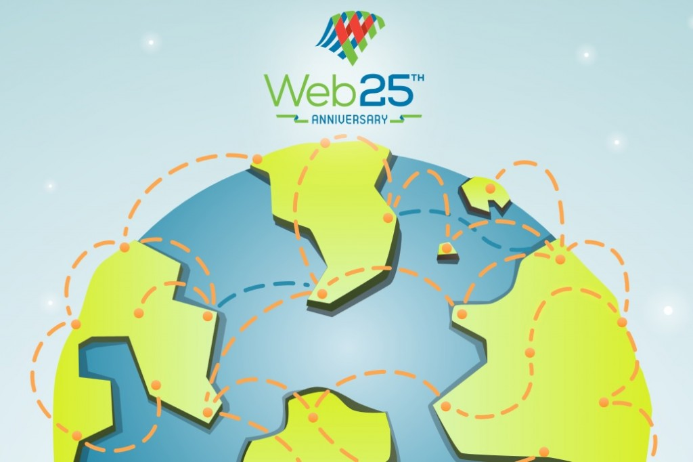

全球資訊網 (World Wide Web，WWW) 是目前知識分享與合作的最佳利器。在 Web 誕生二十五年 (也不過是現代人平均壽命的三分之一) 之後，就已經深入了多數人的日常生活，而未來幾年內勢必也將影響更多的人。

Web 展現出人類的巧思、創造力、多樣性，也不斷激發出許多人的創新想法，且不需徵求他人許可即能傳播給全世界。創新的快速腳步未曾稍歇，也讓我們知道只要人類能公平擁有強大的工具，就會展現出己身的無窮潛能。

在接下來的二十五年內，我們將知道 Web 是否仍保有極高的開放性，或只是依照「一般的商業化走向」繼續發展。現今有許多組織正企圖駕馭 Web 隨時可能爆發的潛能與開放性。某些機構有其合法且可理解的理由；政府機關則是著眼於犯罪活動或文化規範的角度，期望能限制或控制 Web 以保護自己的公民；另有某些政府則是希望能控管網際網路，以鞏固並宣示自己的統治權；許多公司則想藉由 Web 打造自己的業務規模，並能對股東有所交代。

Mozilla 相信只有 Web 能全面激發人類的潛能，也認為 Web 應該是開放並易於取用的全球公用資源。

當然，Mozilla 亦將繼續打造我們心中所期望的 Web 與線上生活。

在 Web 二十五歲生日當天，Mozilla 加入了《[Web at 25](https://www.webat25.org/)》與《[Web We Want](https://webwewant.org/)》二大活動，志在確保網路社群能持續發聲且讓所有人都能聽到。請大家踴躍前往 [www.webat25.org](https://www.webat25.org/) 並寫下你對 Web 的生日祝福。也請到 Mozilla [互動式拼布留言板](https://mozilla.makes.org/thimble/web-we-want-quilt_)分享自己心中的 Web 願景。

你也可點擊下列連結，看看 Mozilla 工程團隊首席技術長與資深副總裁 Brendan Eich 對 Web 二十五歲生日的感言：

[https://brendaneich.com/2014/03/the-web-at-25/](https://brendaneich.com/2014/03/the-web-at-25/)

原文連結：[25 Years of Human Potential](https://blog.mozilla.org/blog/2014/03/12/25-years-of-human-potential/)
