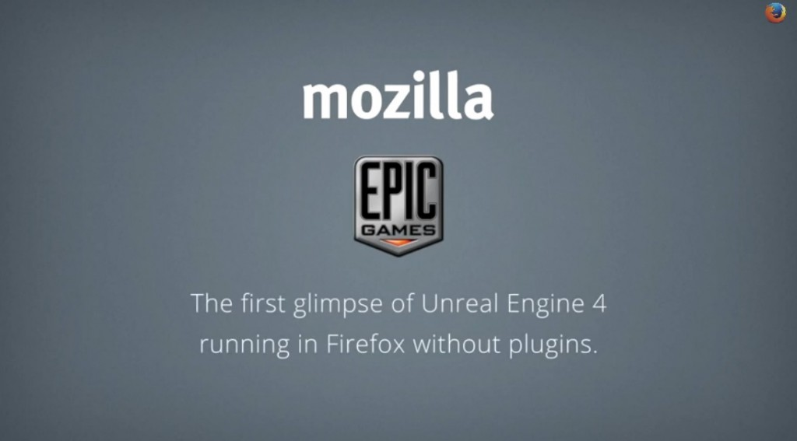

### 於 Firefox 上的執行效能更接近原生 App

《戰爭機器 (Gears of War)》遊戲製作公司 Epic Games 在今天初步展示了《Soul》與《Swing Ninja》，並在 Firefox 中達到更接近原生 App 的速度；在在證明 Web 絕對可成為強大的遊戲製作平台。本影片也是 Unreal Engine 4 首次在未搭載其他外掛程式的情況下，就直接在 Web 上順利執行。

Mozilla 與 Epic Games 之前就曾透過 asm.js (由 Mozilla 率先開發的 JavaScript 子集)，[將 Unreal Engine 3 移植到 Web 上而打造出網頁版《Epic Citadel》](https://blog.mozilla.com.tw/posts/2196)，藉以展現 Web 作為遊戲平台的強大力量。而在不到一年的時間內，相關最佳化作業再度提升 asm.js 架構的 Web App 效能，從等同於原生 App 效能的 40% 一舉提升到 67%。我們當然可預見此效能比例將越來越高，也讓使用者在選擇自己愛用的 Web 瀏覽器之餘，能有機會獲得更愉快、更讓人眼睛為之一亮的使用經驗。雖然任何新版瀏覽器都能執行 asm.js，但目前僅有 Firefox 具備其專屬的最佳化優勢，確保最一致且順暢的經驗。

Mozilla 工程團隊的首席技術長與資深副總裁 Brendan Eich 就說：「這項技術可讓玩家透過 Web 連結而直接暢玩遊戲，而不需再經歷冗長的下載與安裝作業。開發者透過 Emscripten 將 C 與 C++ 跨平台編譯為 asm.js 之後，其執行速度更接近原生 App 的速度，讓 Web 達到其他平台的效能水準。」

Unreal Engine 4 是專為下一代遊戲所打造，並將目前以個人電腦與家用遊戲機為大宗的遊戲平台，順利轉移到 Web 與行動裝置上讓玩家繼續享受。在開發者能夠取得針對 asm.js 與 Web 所撰寫的 Unreal Engine 4 程式碼之後，我們很快就能看到令人振奮的遊戲新突破。

Epic Games 創辦人兼執行長 Tim Sweeney 也說道：「我們早就對 Mozilla 率先開發的技術留下深刻印象，並訝異於 asm.js 搭配 Unreal Engine 3 所能在 Web 上達到的效果。也因為如此，我們二話不說就與 Mozilla 合作移植 Unreal Engine 4。我們相信 Web 絕對會在未來的遊戲開發與佈署作業上扮演重要角色，而 Mozilla 也證明 asm.js 絕對是其中的催化劑。」

由 NomNom Games 公司所開發的《Monster Madness》，正是[第一款使用 asm.js 並發佈於 Web 上的 Unreal Engine 3 商業遊戲](https://blog.mozilla.org/blog/2013/12/12/first-3d-commercial-web-game-powered-by-asm-js-unveiled/)。該公司即代表 Web 將為傳統遊戲開發作業所帶來的商機，並已計畫將其他高人氣的遊戲移植到 Web 之中。

NomNom Games 的首席技術長 Jeremy Stieglitz 接著表示：「透過 asm.js，我們在一天之內就移植 Monster Madness 完畢並開始執行。很高興能藉由 Web 拓展自己的客戶群，也促使我們規劃將這項技術納入公司的遊戲藍圖中。只要透過[簡單的 Web 連結](https://www.playverse.com/Anonplayer/0-a2aadd1b76e14d0e848ea1de18dca4e8)，即可利用如社交網站的通路而輕鬆推銷產品，玩家也僅需輕點滑鼠就能開始遊戲。」

如果想在遊戲開發者大會 (Game Developer Conference，GDC) 上看到這些遊戲，請記得前往 [South Hall 的 #205 展位](https://meetings.gdconf.com/index.php?page=cat_par&params%5bid%5d=192)，或 [Epic 的 #1224 展位](https://meetings.gdconf.com/index.php?page=cat_par&params%5bid%5d=136)參觀。Mozilla 也將展示多位合作夥伴的解決方案，以協助解決開發者對 Web 遊戲平台的多樣需求。另外敬邀大家[參與 Mozilla 其中一項議程](https://schedule.gdconf.com/session-id/828313)，期間我們將展現 asm.js 與其他 Web 技術，並深入討論 Web 的技術架構與商業案例。

請隨時注意更多遊戲的相關消息。

原文連結：[Mozilla and Epic Preview Unreal Engine 4 Running in Firefox](https://blog.mozilla.org/blog/2014/03/12/mozilla-and-epic-preview-unreal-engine-4-running-in-firefox/)
