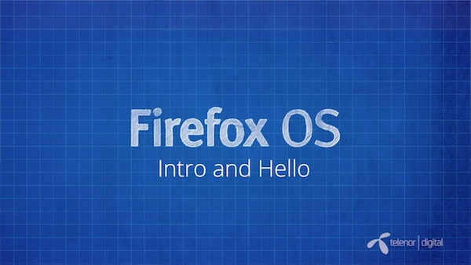
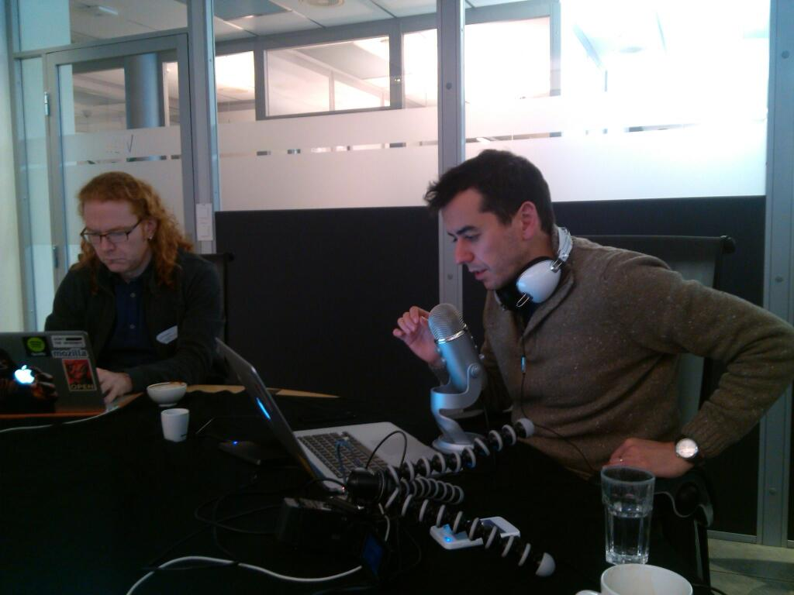
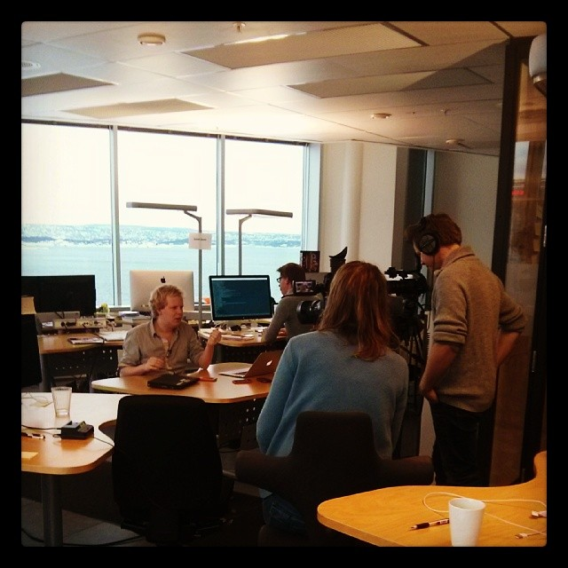

我們接下來將透過一系列短片，為開發者說明該如何著手設計自己的第一個 Open Web App，並針對 Firefox OS 進行開發。

每部短片均極為精簡扼要，讓你在短暫的休息時間也能觀賞，一口氣看完整個系列也不會超過一個小時。此系列短片是由 Telenor Digital 的 [Jan Jongboom (@janjongboom)](https://twitter.com/janjongboom) 與 [Sergi Mansilla (@sergimansilla)](https://twitter.com/sergimansilla)，以及 Mozilla 的 [Chris Heilmann (@codepo8)](https://twitter.com/codepo8) 於 2014 年 2 月所錄製。地點位於挪威首都奧斯陸的 Telenor Digital 辦公室內。

接著為大家簡述本系列短片的內容：

[Firefox OS](https://www.mozilla.org/en-US/firefox/os/) 就是要將 Web 帶入行動裝置的作業系統。但 Firefox OS 並非用新技術或新開發環境所建構，卻是以行之有年的標準 Web 技術所打造而成。如果你就是 Web 開發者並打算設計行動 App，則不需改變自己熟悉的流程，也不用重頭學習新的開發環境，即可立刻享受 Firefox OS 所帶來的便利。在此系列短片中，Mozilla 與 Telenor 的開發者相聚在奧斯陸，一同向大家解釋該如何著手建構 Firefox OS 的 App。你將了解：

- 如何開發自己的第一個Firefox OS 應用程式

- 如何在桌機與實際裝置上測試自己的 App 並除錯

- 如何將 App 提交到 Marketplace 中

- 如何使用 API 與 Firefox OS 針對 JavaScript 開發者所提供的特殊介面，進而存取智慧型手機的硬體

除了系列短片之外，你也能[從 GitHub 下載範例程式碼](https://github.com/comoyo/fxos-video-script/)。如果要親自體驗範例程式碼，需另外設定簡單的開發環境。必備條件如下：

- 最新版本的 [Firefox](https://mozilla.com.tw/firefox/new/) (內含現成的開發工具) ─ 如果你真的要把玩最新技術，那我們建議可下載 [Firefox Aurora](https://www.mozilla.org/en-US/firefox/aurora/) 或 [Nightly](https://nightly.mozilla.org/) 版本

- 文字編輯器 ─ 短片中使用了 [Sublime Text](https://www.sublimetext.com/)，但其實任何文字編輯器均可。如果你想直接在 Web 上編輯程式，則可嘗試 [Adobe Brackets](https://brackets.io/)

- 可供你推播自己 Demo 檔案的伺服器。某些展示用 App 需要 HTTP 連線，而不適用本地伺服器

而後續系列短片將涵蓋下列主題：

- [好的 HTML5 App 之構成要素？](https://www.youtube.com/watch?v=fBJmUreevRU) – Wrapper 中不單單是網站而已

- [App 的 Manifest 檔案](https://www.youtube.com/watch?v=txyux8RZrxY) ─ 透過簡單的 JSON 物件，將網頁轉為 App

- [應用程式管理員 ( App manager ) 與 Firefox OS 模擬器 (Firefox OS S imulator )](https://www.youtube.com/watch?v=wiROpnExj-A) ─ 看看 App 在 Firefox OS 裝置上所呈現的樣子，並了解 App 封裝格式

- [用實際裝置測試](https://www.youtube.com/watch?v=OIUQwqQMVZM) ─ 如何將手機接上電腦，並進行 App 遠端除錯

- [發佈至 Marketplace](https://www.youtube.com/watch?v=gipaEJTM3TU) ─ 如何讓 App 上架，並使消費者能透過 Web 與自己的裝置看到 App

- [Web API](https://www.youtube.com/watch?v=p0DWpWNTd7w) ─ 如何透過 JavaScript 存取 Firefox OS 裝置上的硬體

- [Web Activities](https://www.youtube.com/watch?v=CQODL9AGKv0) ─ 如何在裝置上建構 App 生態系統，並依自己需要而利用其他 App 的功能

- [推播通知](https://www.youtube.com/watch?v=qpgNIsJ2pg4) ─ 當發生新的資訊，應如何於遠端喚醒 App

- [離線作業](https://www.youtube.com/watch?v=dnuoUM_bIQM) ─ 如何使用 AppCache、LocalStorage、[IndexedDB](https://developer.mozilla.org/en/IndexedDB)，給予消費者實際的 App 經驗

- [了解更多](https://www.youtube.com/embed/Z2yVFXEYnnc/) – 和我們聯繫並取得更多資源

除了影片之外，你也能到[系列影片的 Wiki 頁面](https://developer.mozilla.org/en-US/Firefox_OS/Screencast_series:_App_Basics_for_Firefox_OS)取得相關資訊與連結。請隨時回來查看是否有新的連結，或在 Twitter 上追蹤 [@mozhacks](https://twitter.com/mozhacks) 以獲得新發佈短片的相關資訊。

在本系列短片發佈完畢之後，我們會再統整到 Wiki 頁面上。Telenor 也正努力為系列短片配上不同語言。敬請隨時注意相關訊息。

另外感謝 Telenor 公司的 Sergi、Jan、Jakob、Ketil、Nathalie、Anne 等人鼎力協助。

原文連結：[App basics for Firefox OS – a screencast series to get you started](https://hacks.mozilla.org/2014/03/app-basics-for-firefox-os-a-screencast-series-to-get-you-started/)
