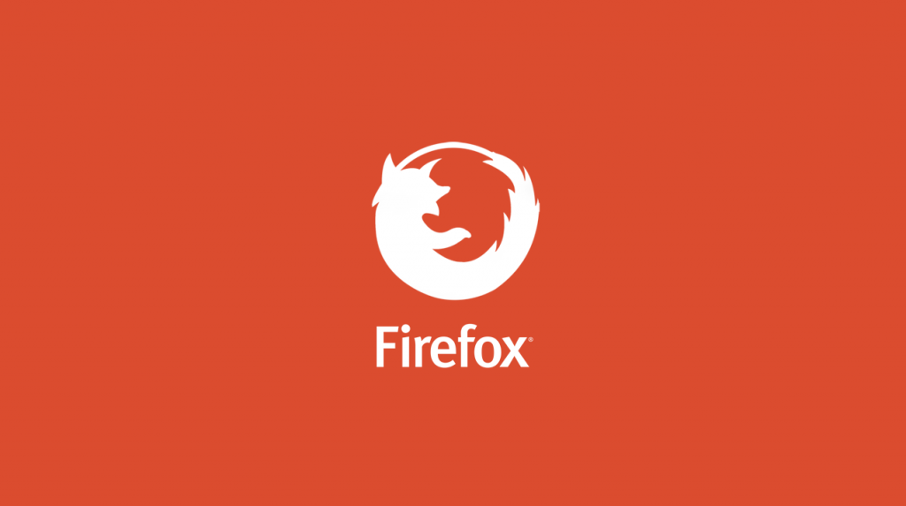

稍早我曾要求工程專案主管與版本釋出經理停止開發 Firefox 的 Windows Metro 版本 (即 Windows 8 的動態磚版本)。該團隊工作努力，所獲得的成果也有目共睹。但在進一步了解整個平台之後，我們發現當初開發 1.0 版本是個錯誤決定。

我們為了讓世界更美好而打造多款軟體，但有時也必須知所進退。Mozilla 今日的規模已不是當初發佈 Firefox 1.0 時所能相比，但我們仍需專心開發某些能對 [Mozilla 使命](https://www.mozilla.org/zh-TW/about/manifesto/)產生影響力的專案。看到競爭對手握有的龐大資源，以及許多等待我們完成的任務，都讓我們必須更精確分配現有的人力與物力。

當我在 2012 年底召集 Firefox for Metro 團隊時 (我知道微軟並非這樣稱呼，但我們在 Mozilla 裡習慣如此稱呼)，就已經將此版本視為 Web 的新戰場。Windows 一直是龐大的生態系統，而微軟 (Microsoft) 也努力提升自己的新平台。我們剛開始還以為整個專案將不得其門而入。儘管此專案不屬於 ARM-based 產品的 RT 產線，但我們最後仍啟動了 Metro 並進行開發。

根據過去這幾個月內的觀察，我們發現 Metro 的普及率一直沒有起色。隨便抓一天的數據為例，當天大約有上百萬人搶先測試了 Firefox 桌面預覽版本，但是 Metro 版卻從未看過單日超過一千名活躍的使用者。

這種情形讓 Mozilla 陷入兩難。我們當然可以發佈 Metro 版，但卻無法獲得有效的測試結果，也代表未來會有越來越多的錯誤，也需要更多後續的開發、設計、品管作業。Mozilla 絕對不會只顧著發佈軟體卻不提供應有的維護。只要我們發佈了任一產品，就該持續相關服務直到該產品退出市場。一旦打算加入戰場，也就意味著必須投入大量資源並減低可能的衝擊，進而做好長期抗戰的準備。

經過審慎評估之後，我們決定先行退出。也許 Metro 明天受到大家青睞而一飛沖天，到時我們也會再著手追上進度。但 Mozilla 目前更在乎成本是否投資於使用者不太用的平台之上。姑且不論其市場表現為何，我們基於對產品的情感而將[繼續保留程式碼](https://hg.mozilla.org/projects/metro)。但 Mozilla 將投入能接觸到更多人的產品，而且同樣有很長的一段路要走。

#### ─ Firefox 副總 Johnathan Nightingale

原文連結：[Update on Metro](https://blog.mozilla.org/futurereleases/2014/03/14/metro/)
