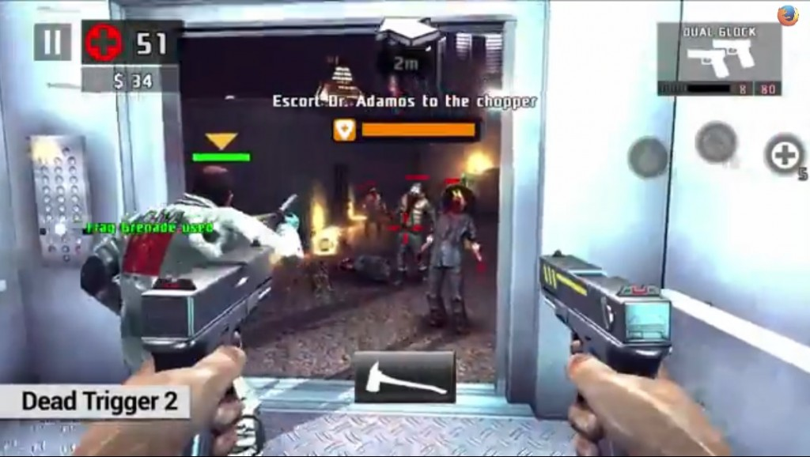

#### Mozilla 與合作夥伴再次證明 Web 作為遊戲平台的威力

在去年遊戲開發者大會 (Game Developers Conference，GDC) 中，Mozilla 開發了[JavaScript 的高度最佳化版本 ─ asm.js](https://blog.mozilla.org/luke/2013/03/21/asm-js-in-firefox-nightly/)，讓開發者能將 C/C++ 遊戲移植進 Web 並接近原生 App 的速度，[進而解放 Web 成為強大的遊戲製作平台](https://docs.google.com/)。此項技術另可搭配 WebGL 與 Web Audio 而在 Web 上達到更快、更豐富的 3D 遊戲體驗；且不須任何外掛程式。

在今年的 GDC 盛會上，Mozilla 正與遊戲產業的多家大廠，以及創新的 Web 工具供應商合作，帶領多款產品正式進入 Web，以期延續這股遊戲平台的前進動力。透過這些工具，開發者可更輕鬆開發、協作出新的遊戲，並直接將現有遊戲移植到 Web，且不需其他外掛程式即可享受 Web 分布廣度所帶來的規模優勢。

歸功於 asm.js 所達到近乎原生 App 的效能，Mozilla 已針對行動裝置而著手為 Web 架構的 3D 遊戲另闢新路。開發者利用 Web 足以作為行動遊戲平台的特性，能更靈活的接觸玩家並提供遊戲內容。這些技術均已能在 Firefox for Android 中運作無虞，另將於今年稍晚時登上 Firefox OS。

#### Unity 5

[Mozilla 與 Unity 共同發表新的佈署工具](https://blog.mozilla.com.tw/posts/5200/)，要將 Unity 授權的遊戲帶入 Web。該公司即將發佈的 Unity 5 遊戲引擎與 WebGL 附加元件，可讓開發者透過 asm.js 與 WebGL 而直接將遊戲內容匯出至 Web，且不需借助其他外掛程式即可接觸更多玩家。

#### Epic Unreal Engine 4

高人氣遊戲《戰爭機器 (Gears of War)》的製作公司 Epic Games，另與 Mozilla 合作[將 Unreal Engine 4 移植到 Web 之中](https://blog.mozilla.com.tw/posts/5174/)。該公司也初步展示自己的《Soul》與《Swing Ninja》，並能在 Firefox 中接近原生 App 的執行速度；在在證明 Web 正持續進化為強大的遊戲平台。Mozilla 與 Epic Games 去年就已[將 Unreal Engine 3 移植到 Web 上而打造出網頁版《Epic Citadel》](https://blog.mozilla.com.tw/posts/2196)，藉以展現 Web 作為遊戲平台的強大力量。

Nom Nom Games 公司也將於 GDC 上展示其《Monster Madness》遊戲。此遊戲即以 Mozilla 與 Epic 所合作的 Unreal Engine 3 為基底，是透過 WebGL 與 asm.js 所打造而成的多人遊戲絕佳範例。此遊戲在 GDC 展期將於 [www.monstermadness.com](https://www.monstermadness.com/) 上線，預計能在今年五月正式營運。

#### Web 架構的遊戲開發新工具

基於 Web 技術所打造的遊戲開發工具正不斷現身於市場之中，儼然已成為 HTML5 遊戲的新開發方式。只要開發者熟悉 Web 並愛用 JavaScript 可簡易開發的特性，都能透過這些工具而利用 asm.js 達到所需的效能目標；如使用 ams.js 移植常見的 Ammo 物理函式庫，進而加快物理演算功能。這種以 asm.js 函式庫搭配更傳統 JavaScript 的範例，就足以證明 Web 所擁有的多樣可能性。

PlayCanvas

[PlayCanvas](https://playcanvas.com/) 提供高階的協作工具，可開發 Web 遊戲並讓開發者進行遠端作業，更能即時編輯同一遊戲內容。而在GDC 的 Mozilla 展位上，PlayCanvas 另提供能於桌機與行動裝置上執行的《Swoop》，以展現工具本身的能耐。PlayCanvas 另外開發的《Dungeon Fury》更已能於 Firefox OS 上執行。

Goo Technologies

Goo 公司的遊戲平台也將於 Mozilla 展區現身。其中包含 Goo Engine ─ 完全以 WebGL/HTML5 打造的 3D JavaScript 遊戲引擎，以及 [Goo Create](https://www.gootechnologies.com/products/create/) ─ 以 Goo 引擎所建構的視覺編輯工具。從簡單的產品視覺呈現效果、互動式的廣告，乃至於完整的遊戲，都能透過 Goo Create 而建構在目前的 Web 之上。

如果想在3月17日至21日於美國舊金山 Moscone Center 開展的 GDC 大會上看到這些遊戲，請記得前往 Mozilla 位於 [South Hall 的 #206 展位](https://meetings.gdconf.com/index.php?page=cat_par&params%5bid%5d=192)、[Epic 的 #1224 展位](https://meetings.gdconf.com/index.php?page=cat_par&params%5bid%5d=136)、[Unity 的 #1402 展位](https://meetings.gdconf.com/index.php?page=cat_par&params[id]=11)參觀。Mozilla 也將展示多位合作夥伴的解決方案，以協助解決開發者對 Web 遊戲平台的多樣需求。另外敬邀大家[參與 Mozilla 其中一項議程](https://schedule.gdconf.com/session-id/828313)，期間我們將展現 asm.js 與其他 Web 技術，並深入討論 Web 的技術架構與商業案例。

原文連結：[GDC 2014: Mozilla and Partners Prove the Web is the Platform for Gaming](https://blog.mozilla.org/blog/2014/03/18/gdc-2014-mozilla-and-partners-prove-the-web-is-the-platform-for-gaming/)
