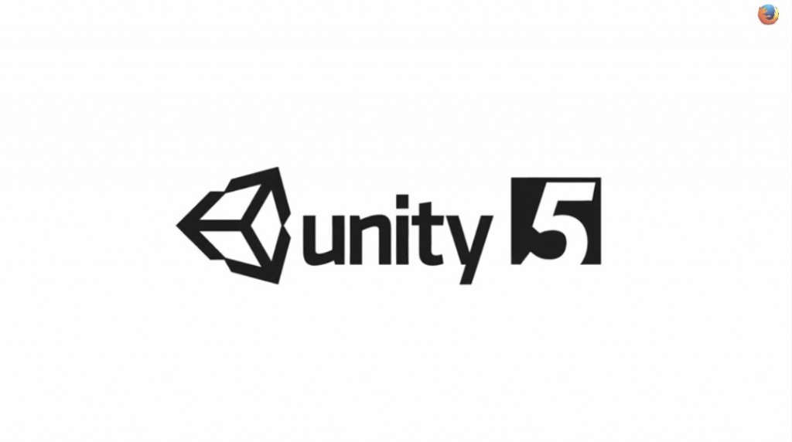

### 強大的 3D 遊戲開發引擎現可支援 WebGL

Mozilla 與 Unity 於今年遊戲開發者大會 (Game Developers Conference，GDC) 中發表新的佈署工具。歸功於 Mozilla 率先開發的技術 (如 WebGL ─ Web 繪圖函式庫；以及 asm.js ─ JavaScript 子集)，開發者不需要其他外掛程式即可將 Unity 授權的遊戲帶入 Web。而今年稍晚將發佈的 Unity 5.0，亦會一併提供 Unity 的 WebGL 附加元件。

數百萬名 Unity 開發者不須再借助外掛程式，即可把自己撰寫的 Unity 內容直接匯出至 Web 並保有順暢的遊戲體驗。為了展現此技術的運作情形，Unity 與 Mozilla 一同設計了高人氣遊戲《Dead Trigger 2》的預覽版本，可在 Firefox 中逼近原生 App 的執行速度。

Mozilla 工程總監與 WebGL 之父 Vlad Vukicevic 表示：「Unity 是最具創造力的遊戲開發公司之一。該公司對 WebGL 與 asm.js 的承諾，無疑是 Mozilla 願景的一劑強心針，並將強力協助打造高效能、免外掛程式的 Web。此開發成果即將為 Unity 開發者解放 Web 的所有潛能。」

現在能完整支援 WebGL 的桌面版瀏覽器，即可順暢執行 Unity 所開發的遊戲；而特別針對 asm.js 最佳化的 Firefox 將能達到更高效能。

Unity Technologies 資深開發工程師 Ralph Hauwert 說道：「我們相信 WebGL 與 asm.js 將主導 Web 遊戲的未來。很高興看到平台逐漸成熟，也希望能協助 Web 不斷進化。我們和 Mozilla 合作的效率極高，且克服了許多困難，也才有今天適用於 Unity 的 WebGL 佈署附加元件，並將提供開發者所期待的最佳使用經驗。」

Mozilla 遊戲平台策略師 Martin Best 另外表示：「遊戲開發者最常詢問的問題之一，就是 Unity 到底會不會支援 WebGL 與 asm.js。我們很高興答案成真且將造就 Web 高品質遊戲的新境界。」

Unity 提供的外掛程式，是目前 Web 上最普遍安裝的外掛程式之一，也因此將對開發者產生正面的影響。透過 WebGL 技術，開發者不須下載額外的外掛程式，只要提供一個 Web 連結即可接觸更多玩家並推銷自己的遊戲。而搭配 Open Web 技術，另可跨多個平台而發佈遊戲，且能輕鬆更新並測試新功能。

這項成果代表 Mozilla 與 Unity 對 Web 的堅定信念。我們同時也感謝 Unity 對 WebGL 與 asm.js 所提供的支援。

今天是 Web 作為遊戲平台的大日子。Mozilla 也很開心能納入強大的 Unity 技術，並期待開發者所將打造的全新 Web 體驗。

原文連結：[Mozilla and Unity Bring Unity Game Engine to WebGL](https://blog.mozilla.org/blog/2014/03/18/mozilla-and-unity-deliver-award-winning-game-engine-to-the-web/)
