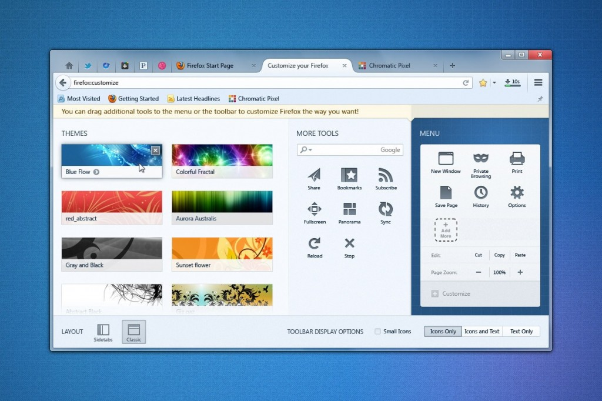

Firefox 29 (專案名稱 Australis) [在設計與自訂功能上大幅提升](https://blog.mozilla.com.tw/posts/4232)。我們現在正強力募集能在 Firefox 中讓人眼睛為之一亮的新附加元件 (Add-ons)。

從 2014 年 3 月 11 日到 4 月 15 日止，只要你開發出的附加元件能凸顯 Firefox 的全新外觀設計，並協助他人發掘新的自訂/客製化契機，進而提供更順暢的附加元件經驗。我們的[評審團](https://blog.mozilla.org/addons/australis-judges/)會針對三個獎項各選出一名優勝與二名佳作。

所有[得獎者](https://blog.mozilla.org/addons/australis-prizes/)均將獲得 Firefox OS 手機，而優勝者另可獲得 Mozilla 大禮包。

#### 獎項

- 最佳綜合附加元件 ─ 此附加元件能充分利用 Australis 的新功能，如新的[工具列](https://blog.mozilla.org/addons/2014/03/06/australis-for-add-on-developers-2/) Widget 與分頁外觀。

- 最佳完整佈景主題 ─ [完整佈景主題](https://addons.mozilla.org/firefox/complete-themes/)要能創意利用 Australis 外觀與感覺。

- 最佳書籤附加元件 ─ 創新的[書籤附加元件](https://addons.mozilla.org/firefox/extensions/bookmarks/)，能適切搭配 Australis 的主題。

#### Australis 中的附加元件

如果開發者想在本競賽中脫穎而出，就應該要隨時得知 Australis 的最新消息。可觀看我們在[《Add-ons》部落格](https://blog.mozilla.org/addons/)中發佈的相關摘要。

#### 變化

Australis 的工具列確實發生大幅改變。我們移除了底部的「附加元件」列，另以新的選單面板 (使用許多 Widget 與按鈕所擴充的工具列) 將之取代。只要點擊主工具列最右端的按鈕，即可啟動選單面板。使用者更能自訂新選單上的所有項目，當然也能添增 Widget 與附加元件按鈕。

主工具列中的圖示均為 18×18 像素。但我們預期會有 1px padding，所以開發者仍可續用現有 Firefox 版本上的 16×16 圖示而不會有任何影響。選單面板與自訂過程中的圖示均為 32×32 像素。也因為如此，如果你的附加元件本來就是依照一般規則 (先將按鈕覆蓋至面板上，等到初次執行時再透過 JS將按鈕添增到工具列之中)，將工具列按鈕添增到主工具列上，則所有物件應該都能照常運作無誤。而開發者僅需將 CSS 修改如下：

		
		

/* Original CSS */
#my-button {
  list-style-image: url(“chrome://my-extension/skin/icon16.png”);
}

/* Added for Australis support */
#my-button[cui-areatype="menu-panel"],
  toolbarpaletteitem[place="palette"] > #my-button {
  list-style-image: url(“chrome://my-extension/skin/icon32.png”);
}
			
				
					
				
					12345678910
				
						/* Original CSS */#my-button {  list-style-image: url(“chrome://my-extension/skin/icon16.png”);} /* Added for Australis support */#my-button[cui-areatype="menu-panel"],  toolbarpaletteitem[place="palette"] > #my-button {  list-style-image: url(“chrome://my-extension/skin/icon32.png”);}
					
				
			
		

另請注意，若要將 Australis 主題的按鈕置於 UI 中，就必須設定 cui-areatype 屬性為「menu-panel」或「toolbar」。透過此設定值，亦可讓 Australis 與 non-Australis 主題的按鈕擁有不同風格。

可透過《[Australis for Add-on Developers: Part 1](https://blog.mozilla.org/addons/2013/12/12/australis-for-add-on-developers-1/)》獲得更多資訊。

#### 新的 Customization API

Australis 另一個有趣的地方，就是能透過 [CustomizableUI 模組](https://developer.mozilla.org/docs/Mozilla/JavaScript_code_modules/CustomizableUI.jsm)建構工具列 Widget。不論開發者是用舊 (需重新啟動 Firefox) 或新 (不需重啟 Firefox) 的方式開發附加元件，都只需極少量的程式碼，就能輕鬆設計出簡單的按鈕和更有趣的 Widget。範例如下：

		
		

CustomizableUI.createWidget({
    id : "aus-hello-button",
    defaultArea : CustomizableUI.AREA_NAVBAR,
    label : "Hello Button",
    tooltiptext : "Hello!",
    onCommand : function(aEvent) {
      let win = aEvent.target.ownerDocument.defaultView;

      win.alert("Hello!");
    }
});
			
				
					
				
					1234567891011
				
						CustomizableUI.createWidget({    id : "aus-hello-button",    defaultArea : CustomizableUI.AREA_NAVBAR,    label : "Hello Button",    tooltiptext : "Hello!",    onCommand : function(aEvent) {      let win = aEvent.target.ownerDocument.defaultView;       win.alert("Hello!");    }});
					
				
			
		

《[Australis for Add-on Developers: Part 2](https://blog.mozilla.org/addons/2014/03/06/australis-for-add-on-developers-2/)》另提供二組 Demo 與許多可把玩的程式碼，讓開發者能順利使用此 API。

#### 動手吧！

- 有關此競賽的[完整細節](https://blog.mozilla.org/addons/australis-overview/)

- 到 [Aurora 釋放頻道](https://www.mozilla.org/firefox/aurora/)下載 Australis

- [附加元件開發說明](https://developer.mozilla.org/addons)

- [AMO 上的附加元件開發者交流中心](https://addons.mozilla.org/zh-TW/developers/)

- 給附加元件開發者的 Australis 說明： [CustomizableUI.jsm](https://developer.mozilla.org/docs/Mozilla/JavaScript_code_modules/CustomizableUI.jsm)

- [Australis 與附加元件的相容性](https://developer.mozilla.org/Firefox/Australis_add-on_compat)

原文連結：[Create Add-ons for Australis to Win a Firefox OS Phone](https://hacks.mozilla.org/2014/03/create-add-ons-for-australis-to-win-a-firefox-os-phone/)
