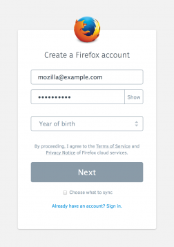
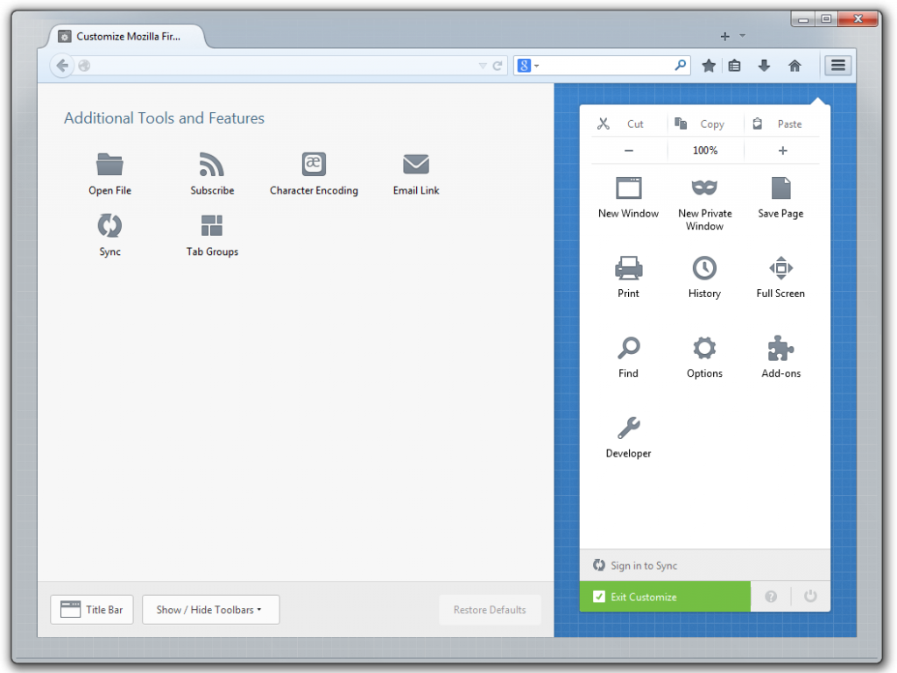
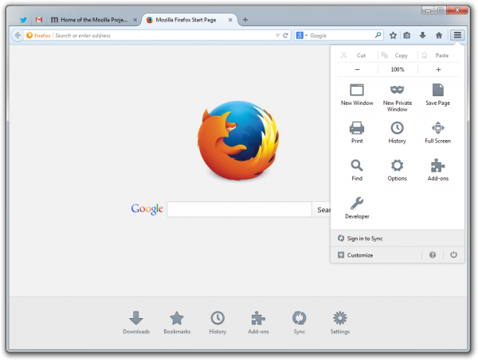

#### 新自訂模式協助用戶打造自我風格瀏覽器

Mozilla 今日釋出首度內建 Firefox Accounts 功能的 Firefox Beta 版供使用者下載測試。透過 Firefox Accounts 功能，使用者只須一組帳號即可將 Firefox 隨身帶著走。重新設計的 Firefox 使用者介面 (UI) 也提供更靈活的自訂選項、全新的流暢外觀，Firefox Sync 同步功能設定也更加簡易，Firefox 使用者將可獲得最佳專屬瀏覽體驗。

甫釋出的 Firefox Beta 版本，已透過 Firefox Accounts 提升了同步功能，並且具備新的自訂模式、新的 Firefox 選單、簡化的使用者介面。使用者現可透過 Windows、Mac、Linux、Android 測試新的 Firefox Sync 同步功能。使用者只要一組帳號即可安全且輕鬆的隨身帶著 Firefox 走。新的 Firefox Sync 具備[端點對端點 (End-to-end) 加密](https://blog.mozilla.com.tw/posts/4906)機制，可輕鬆設定並新增多組裝置。

Mozilla 也提供新的自訂模式，讓使用者能輕鬆打造自我風格的 Firefox。只要點擊新的「選單 (Menu)」按鈕，找到「自訂 (Customize)」即可進入自訂模式。使用者能根據自己的喜好，在瀏覽器中手動拖曳最愛用的工具、功能、附加元件 (Add-on)，進而更快、更輕鬆找到最常用的功能。

透過新的自訂模式，使用者即能設定本身專屬的瀏覽體驗。此外，新的選單面板已納入瀏覽器的所有控制設定、最愛功能、附加元件。你可找到如複製 (Copy)、貼上 (Paste)、列印 (Print)、儲存 (Save)、全螢幕 (Full Screen) 等熟悉的工具。下載新的 Firefox 附加元件之後，也能將該附加元件的圖示增添到同一選單面板，以利在瀏覽器中統一管理。

此一版本重新設計了 Firefox 的整體外觀與感覺，目的是要協助使用者能迅速取得所須 Web 內容。我們也更改了 Firefox 的分頁架構與功能，讓使用者能快速找到目前觀看中的分頁。此外，分頁也改用了更流暢的外觀、在瀏覽器中的位置變得較高，且只有使用中的分頁才會強調顯示。而「書籤管理」功能現已搬移到 Firefox 工具列上的「書籤星號」旁邊，只要簡單點擊即可輕鬆儲存自己最愛的網站。

Firefox 是受到全球 5 億名使用者所信賴的瀏覽器。Mozilla 也很高興能將新版 Firefox 呈現給 Beta 測試者。

原文連結：[Help Test the New Firefox Beta: Faster, Simplified and Easier to Customize](https://blog.mozilla.org/blog/2014/03/20/help-test-the-new-firefox-beta-faster-simplified-and-easier-to-customize/)
